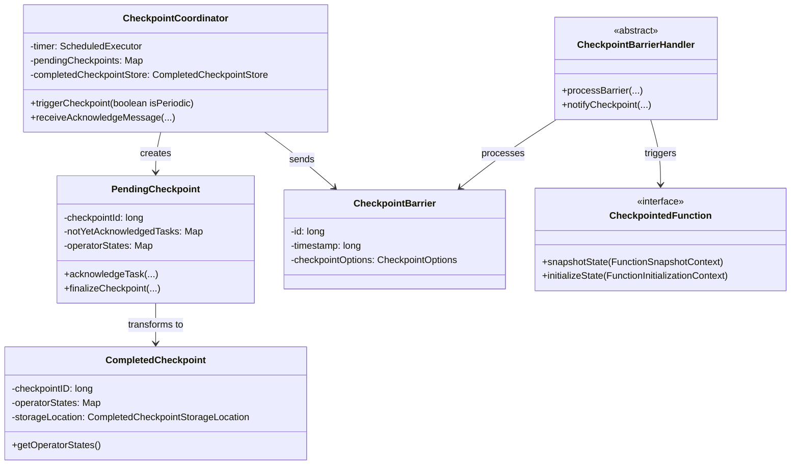
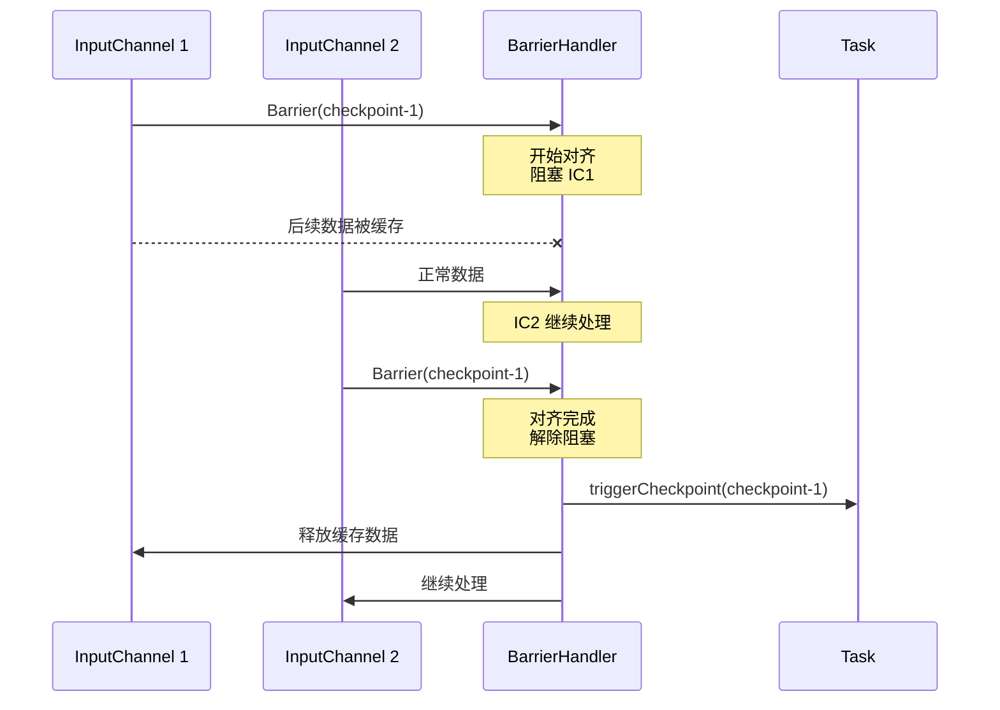
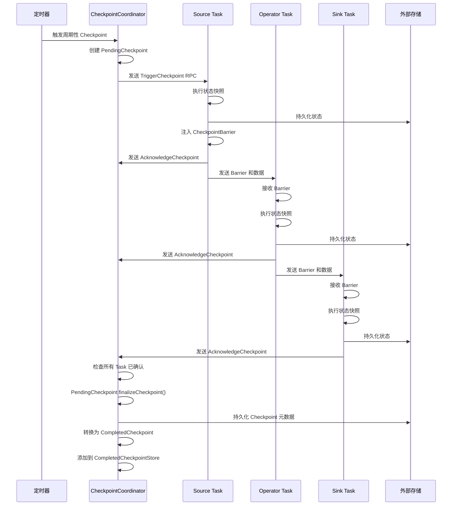
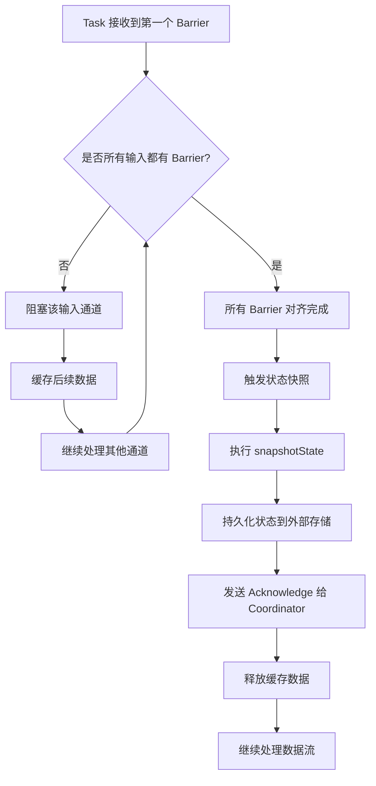

# Checkpoint 机制源码深度解析

## 一、机制概述

### 1.1 什么是 Checkpoint

Checkpoint 是 Flink 实现容错机制的核心，它通过定期对所有算子的状态进行快照，将状态持久化到外部存储（如 HDFS、S3 等），从而在作业失败时能够从最近的 Checkpoint 恢复，保证数据处理的一致性。

在 Flink 架构中，Checkpoint 机制位于运行时层（Runtime Layer），由 JobManager 中的 `CheckpointCoordinator` 统一协调，各个 TaskManager 上的 Task 负责执行具体的状态快照操作。

### 1.2 为什么需要 Checkpoint

**解决的核心问题**：
- **容错恢复**：在分布式环境中，节点故障不可避免，Checkpoint 提供了状态恢复的基础
- **Exactly-Once 语义**：通过 Checkpoint 和两阶段提交，实现端到端的精确一次处理
- **状态一致性**：确保所有算子的状态快照在逻辑上属于同一时间点

**设计目标**：
- **异步快照**：不阻塞数据处理流程
- **分布式协调**：确保所有算子的快照一致
- **轻量级**：最小化对作业性能的影响
- **可靠性**：快照数据持久化到可靠存储

## 二、核心类与接口

### 2.1 核心接口

#### CheckpointedFunction
- **路径**：`flink-streaming-java/src/main/java/org/apache/flink/streaming/api/checkpoint/CheckpointedFunction.java`
- **职责**：用户自定义函数实现状态管理的核心接口

```java
@Public
public interface CheckpointedFunction {
    // Checkpoint 时调用，用于将状态快照
    void snapshotState(FunctionSnapshotContext context) throws Exception;
    
    // 初始化或恢复时调用，用于初始化状态
    void initializeState(FunctionInitializationContext context) throws Exception;
}
```

#### CheckpointableTask
- **路径**：`flink-runtime/src/main/java/org/apache/flink/runtime/jobgraph/tasks/CheckpointableTask.java`
- **职责**：Task 级别的 Checkpoint 接口，定义了 Task 如何响应 Checkpoint 触发

### 2.2 核心实现类

#### CheckpointCoordinator
- **路径**：`flink-runtime/src/main/java/org/apache/flink/runtime/checkpoint/CheckpointCoordinator.java`
- **职责**：Checkpoint 的中央协调器，运行在 JobManager 上
- **核心功能**：
  - 周期性触发 Checkpoint
  - 收集各个 Task 的 Checkpoint 确认
  - 管理 Checkpoint 的完成和清理

#### CheckpointBarrier
- **路径**：`flink-runtime/src/main/java/org/apache/flink/runtime/io/network/api/CheckpointBarrier.java`
- **职责**：Checkpoint 屏障，用于在数据流中标记 Checkpoint 边界
- **核心字段**：
  - `id`：Checkpoint ID
  - `timestamp`：Checkpoint 触发时间戳
  - `checkpointOptions`：Checkpoint 配置选项

#### CheckpointBarrierHandler
- **路径**：`flink-streaming-java/src/main/java/org/apache/flink/streaming/runtime/io/checkpointing/CheckpointBarrierHandler.java`
- **职责**：处理 Checkpoint Barrier 的对齐逻辑
- **实现类**：
  - `SingleCheckpointBarrierHandler`：单输入流的 Barrier 处理
  - `CheckpointBarrierAligner`：多输入流的 Barrier 对齐（Exactly-Once）
  - `CheckpointBarrierTracker`：多输入流的 Barrier 跟踪（At-Least-Once）

#### PendingCheckpoint
- **路径**：`flink-runtime/src/main/java/org/apache/flink/runtime/checkpoint/PendingCheckpoint.java`
- **职责**：表示一个正在进行中的 Checkpoint，等待所有 Task 确认
- **核心功能**：
  - 跟踪哪些 Task 已经确认
  - 收集各个 Task 的状态句柄
  - 完成后转换为 `CompletedCheckpoint`

#### CompletedCheckpoint
- **路径**：`flink-runtime/src/main/java/org/apache/flink/runtime/checkpoint/CompletedCheckpoint.java`
- **职责**：表示一个已完成的 Checkpoint，包含所有算子的状态元数据
- **核心功能**：
  - 存储所有算子的状态句柄
  - 提供状态恢复的入口
  - 管理 Checkpoint 的生命周期

### 2.3 类图关系



## 三、源码深度分析

### 3.1 Checkpoint 触发流程

#### 3.1.1 周期性触发

`CheckpointCoordinator` 通过定时器周期性触发 Checkpoint：

```java
// CheckpointCoordinator.java
public CompletableFuture<CompletedCheckpoint> triggerCheckpoint(boolean isPeriodic) {
    return triggerCheckpointFromCheckpointThread(checkpointProperties, null, isPeriodic);
}

private CompletableFuture<CompletedCheckpoint> triggerCheckpointFromCheckpointThread(
        CheckpointProperties checkpointProperties, String targetLocation, boolean isPeriodic) {
    final CompletableFuture<CompletedCheckpoint> resultFuture = new CompletableFuture<>();
    // 在定时器线程中执行，避免竞争
    timer.execute(
            () -> triggerCheckpoint(checkpointProperties, targetLocation, isPeriodic)
                    .whenComplete((completedCheckpoint, throwable) -> {
                        if (throwable == null) {
                            resultFuture.complete(completedCheckpoint);
                        } else {
                            resultFuture.completeExceptionally(throwable);
                        }
                    }));
    return resultFuture;
}
```

**关键点**：
- 使用单独的定时器线程触发，避免与主线程竞争
- 返回 `CompletableFuture`，支持异步处理
- `isPeriodic` 标识是周期性触发还是手动触发

#### 3.1.2 Barrier 注入

CheckpointCoordinator 触发 Checkpoint 后，会向所有 Source Task 发送 Checkpoint Barrier：

```java
// CheckpointBarrier.java
public class CheckpointBarrier extends RuntimeEvent {
    private final long id;                          // Checkpoint ID
    private final long timestamp;                   // 触发时间戳
    private final CheckpointOptions checkpointOptions; // 配置选项

    public CheckpointBarrier(long id, long timestamp, CheckpointOptions checkpointOptions) {
        this.id = id;
        this.timestamp = timestamp;
        this.checkpointOptions = checkNotNull(checkpointOptions);
    }
}
```

**Barrier 的作用**：
- **分隔数据流**：Barrier 之前的数据属于 pre-checkpoint，之后的数据属于 post-checkpoint
- **对齐标记**：多输入流需要等待所有输入通道的 Barrier 到达后才能触发快照
- **携带元数据**：包含 Checkpoint ID、时间戳、配置等信息

### 3.2 Barrier 对齐机制

#### 3.2.1 Barrier 处理抽象

`CheckpointBarrierHandler` 定义了 Barrier 处理的抽象接口：

```java
// CheckpointBarrierHandler.java
public abstract class CheckpointBarrierHandler implements Closeable {
    private final CheckpointableTask toNotifyOnCheckpoint;
    private long startOfAlignmentTimestamp = OUTSIDE_OF_ALIGNMENT;
    
    // 处理接收到的 Barrier
    public abstract void processBarrier(
            CheckpointBarrier receivedBarrier, 
            InputChannelInfo channelInfo, 
            boolean isRpcTriggered) throws IOException;
    
    // 通知 Task 触发 Checkpoint
    protected void notifyCheckpoint(CheckpointBarrier checkpointBarrier) throws IOException {
        CheckpointMetaData checkpointMetaData =
                new CheckpointMetaData(
                        checkpointBarrier.getId(),
                        checkpointBarrier.getTimestamp(),
                        System.currentTimeMillis());

        CheckpointMetricsBuilder checkpointMetrics;
        if (checkpointBarrier.getId() == startAlignmentCheckpointId) {
            checkpointMetrics =
                    new CheckpointMetricsBuilder()
                            .setAlignmentDurationNanos(latestAlignmentDurationNanos)
                            .setBytesProcessedDuringAlignment(latestBytesProcessedDuringAlignment)
                            .setCheckpointStartDelayNanos(latestCheckpointStartDelayNanos);
        } else {
            checkpointMetrics =
                    new CheckpointMetricsBuilder()
                            .setAlignmentDurationNanos(0L)
                            .setBytesProcessedDuringAlignment(0L)
                            .setCheckpointStartDelayNanos(0);
        }

        toNotifyOnCheckpoint.triggerCheckpointOnBarrier(
                checkpointMetaData, checkpointBarrier.getCheckpointOptions(), checkpointMetrics);
    }
}
```

**关键点**：
- `startOfAlignmentTimestamp`：记录对齐开始时间，用于计算对齐耗时
- `notifyCheckpoint`：构造 Checkpoint 元数据并通知 Task 执行快照
- 收集对齐期间的指标（对齐时长、处理字节数等）

#### 3.2.2 对齐过程

对于 Exactly-Once 语义，需要等待所有输入通道的 Barrier 对齐：



**对齐的必要性**：
- 确保所有输入通道在逻辑上处于同一时间点
- 避免 Barrier 之后的数据被提前处理，导致状态不一致
- 对齐期间会缓存快速通道的数据，可能产生反压

### 3.3 状态快照流程

#### 3.3.1 用户函数快照

实现了 `CheckpointedFunction` 接口的用户函数会在 Checkpoint 时被调用：

```java
// CheckpointedFunction.java 示例
public class MyFunction<T> implements MapFunction<T, T>, CheckpointedFunction {
    private ReducingState<Long> countPerKey;
    private ListState<Long> countPerPartition;
    private long localCount;

    @Override
    public void initializeState(FunctionInitializationContext context) throws Exception {
        // 获取 Keyed State
        countPerKey = context.getKeyedStateStore().getReducingState(
                new ReducingStateDescriptor<>("perKeyCount", new AddFunction<>(), Long.class));

        // 获取 Operator State
        countPerPartition = context.getOperatorStateStore().getOperatorState(
                new ListStateDescriptor<>("perPartitionCount", Long.class));

        // 从 Operator State 恢复本地计数
        for (Long l : countPerPartition.get()) {
            localCount += l;
        }
    }

    @Override
    public void snapshotState(FunctionSnapshotContext context) throws Exception {
        // Keyed State 自动快照，无需手动处理
        // 更新 Operator State
        countPerPartition.clear();
        countPerPartition.add(localCount);
    }

    @Override
    public T map(T value) throws Exception {
        countPerKey.add(1L);
        localCount++;
        return value;
    }
}
```

**关键点**：
- `initializeState`：在 Task 初始化或从 Checkpoint 恢复时调用
- `snapshotState`：在 Checkpoint 触发时调用，用户需要确保状态数据结构是最新的
- Keyed State 由 Flink 自动管理，Operator State 需要用户显式更新

### 3.4 Checkpoint 确认流程

#### 3.4.1 Task 确认

每个 Task 完成状态快照后，会向 CheckpointCoordinator 发送确认消息：

```java
// PendingCheckpoint.java
public TaskAcknowledgeResult acknowledgeTask(
        ExecutionAttemptID executionAttemptId,
        TaskStateSnapshot operatorSubtaskStates,
        CheckpointMetrics metrics) {

    synchronized (lock) {
        if (disposed) {
            return TaskAcknowledgeResult.DISCARDED;
        }

        // 从未确认列表中移除
        final ExecutionVertex vertex = notYetAcknowledgedTasks.remove(executionAttemptId);

        if (vertex == null) {
            if (acknowledgedTasks.contains(executionAttemptId)) {
                return TaskAcknowledgeResult.DUPLICATE; // 重复确认
            } else {
                return TaskAcknowledgeResult.UNKNOWN; // 未知 Task
            }
        } else {
            acknowledgedTasks.add(executionAttemptId);
        }

        // 更新算子状态
        List<OperatorIDPair> operatorIDs = vertex.getJobVertex().getOperatorIDs();
        for (OperatorIDPair operatorID : operatorIDs) {
            updateOperatorState(vertex, operatorSubtaskStates, operatorID);
        }

        ++numAcknowledgedTasks;

        // 发布 Checkpoint 统计信息
        if (pendingCheckpointStats != null) {
            long alignmentDurationMillis = metrics.getAlignmentDurationNanos() / 1_000_000;
            long checkpointStartDelayMillis = metrics.getCheckpointStartDelayNanos() / 1_000_000;

            SubtaskStateStats subtaskStateStats =
                    new SubtaskStateStats(
                            vertex.getParallelSubtaskIndex(),
                            ackTimestamp,
                            metrics.getBytesPersistedOfThisCheckpoint(),
                            metrics.getTotalBytesPersisted(),
                            metrics.getSyncDurationMillis(),
                            metrics.getAsyncDurationMillis(),
                            metrics.getBytesProcessedDuringAlignment(),
                            metrics.getBytesPersistedDuringAlignment(),
                            alignmentDurationMillis,
                            checkpointStartDelayMillis,
                            metrics.getUnalignedCheckpoint(),
                            true);

            pendingCheckpointStats.reportSubtaskStats(
                    vertex.getJobvertexId(), subtaskStateStats);
        }

        return TaskAcknowledgeResult.SUCCESS;
    }
}
```

**确认结果**：
- `SUCCESS`：成功确认
- `DUPLICATE`：重复确认（可能是重试导致）
- `UNKNOWN`：未知的 Task（可能是过期的确认）
- `DISCARDED`：Checkpoint 已被丢弃

#### 3.4.2 Checkpoint 完成

当所有 Task、Operator Coordinator 和 Master Hook 都确认后，Checkpoint 完成：

```java
// PendingCheckpoint.java
public boolean isFullyAcknowledged() {
    return areTasksFullyAcknowledged()
            && areCoordinatorsFullyAcknowledged()
            && areMasterStatesFullyAcknowledged();
}

public CompletedCheckpoint finalizeCheckpoint(
        CheckpointsCleaner checkpointsCleaner, Runnable postCleanup, Executor executor)
        throws IOException {

    synchronized (lock) {
        checkState(!isDisposed(), "checkpoint is discarded");
        checkState(isFullyAcknowledged(), "Pending checkpoint has not been fully acknowledged yet");

        // 填充已完成 Task 的状态
        checkpointPlan.fulfillFinishedTaskStatus(operatorStates);

        // 写出元数据
        final CheckpointMetadata savepoint =
                new CheckpointMetadata(
                        checkpointId, operatorStates.values(), masterStates, props);
        final CompletedCheckpointStorageLocation finalizedLocation;

        try (CheckpointMetadataOutputStream out = targetLocation.createMetadataOutputStream()) {
            Checkpoints.storeCheckpointMetadata(savepoint, out);
            finalizedLocation = out.closeAndFinalizeCheckpoint();
        }

        // 创建 CompletedCheckpoint
        CompletedCheckpoint completed =
                new CompletedCheckpoint(
                        jobId,
                        checkpointId,
                        checkpointTimestamp,
                        System.currentTimeMillis(),
                        operatorStates,
                        masterStates,
                        props,
                        finalizedLocation,
                        toCompletedCheckpointStats(finalizedLocation));

        // 标记为已处理，但不删除状态
        dispose(false, checkpointsCleaner, postCleanup, executor);

        return completed;
    }
}
```

**完成步骤**：
1. 检查所有组件是否已确认
2. 将 Checkpoint 元数据序列化并持久化
3. 创建 `CompletedCheckpoint` 对象
4. 清理 `PendingCheckpoint`，但保留状态数据

### 3.5 Checkpoint 存储

#### 3.5.1 CompletedCheckpoint 结构

```java
// CompletedCheckpoint.java
public class CompletedCheckpoint implements Serializable, Checkpoint {
    private final JobID job;
    private final long checkpointID;
    private final long timestamp;                    // 触发时间
    private final long completionTimestamp;          // 完成时间
    private final Map<OperatorID, OperatorState> operatorStates; // 算子状态
    private final Collection<MasterState> masterHookStates;      // Master Hook 状态
    private final CheckpointProperties props;
    private final CompletedCheckpointStorageLocation storageLocation; // 存储位置
    private final StreamStateHandle metadataHandle;  // 元数据句柄
    private final String externalPointer;            // 外部指针（如文件路径）
    
    public long getStateSize() {
        long result = 0L;
        for (OperatorState operatorState : operatorStates.values()) {
            result += operatorState.getStateSize();
        }
        return result;
    }
}
```

**关键字段**：
- `operatorStates`：所有算子的状态句柄映射
- `storageLocation`：Checkpoint 存储位置（HDFS、S3 等）
- `externalPointer`：外部指针，用于恢复时定位 Checkpoint

## 四、执行流程图

### 4.1 完整 Checkpoint 流程



### 4.2 Barrier 对齐流程



## 五、关键设计模式与技巧

### 5.1 异步快照（Asynchronous Snapshot）

Flink 采用异步快照机制，将快照分为同步和异步两个阶段：

**同步阶段**：
- 复制状态数据（Copy-on-Write）
- 时间极短，对数据处理影响小

**异步阶段**：
- 将状态数据序列化并写入外部存储
- 在后台线程执行，不阻塞数据处理

**优势**：
- 最小化对作业吞吐量的影响
- 充分利用 I/O 和计算资源

### 5.2 Barrier 对齐优化

**Unaligned Checkpoint**（非对齐 Checkpoint）：
- 不等待所有 Barrier 对齐，直接触发快照
- 将 in-flight 数据（缓存的数据）也纳入快照
- 减少对齐时间，降低反压风险
- 适用于高吞吐、低延迟场景

**配置方式**：
```java
env.getCheckpointConfig().enableUnalignedCheckpoints();
```

### 5.3 增量 Checkpoint

对于 RocksDB State Backend，支持增量 Checkpoint：
- 只持久化自上次 Checkpoint 以来变化的数据
- 大幅减少 Checkpoint 时间和存储空间
- 基于 RocksDB 的 SST 文件机制实现

### 5.4 状态共享与引用计数

Flink 使用 `SharedStateRegistry` 管理共享状态：
- 多个 Checkpoint 可能共享相同的状态文件（如 RocksDB SST 文件）
- 通过引用计数管理状态生命周期
- 只有当引用计数为 0 时才删除物理文件

## 六、面试高频问题

### Q1: Flink Checkpoint 的触发流程是怎样的？

**答案**：

Flink Checkpoint 的触发流程分为以下几个阶段：

1. **触发阶段**：
   - `CheckpointCoordinator` 通过定时器周期性触发 Checkpoint
   - 创建 `PendingCheckpoint` 对象，记录需要确认的 Task
   - 向所有 Source Task 发送 `TriggerCheckpoint` RPC 消息

2. **Barrier 注入阶段**：
   - Source Task 接收到触发消息后，执行状态快照
   - 将 `CheckpointBarrier` 注入到输出数据流中
   - Barrier 随数据流向下游传播

3. **Barrier 对齐阶段**：
   - 下游 Task 通过 `CheckpointBarrierHandler` 处理 Barrier
   - 对于 Exactly-Once 语义，需要等待所有输入通道的 Barrier 对齐
   - 对齐期间，快速通道的数据会被缓存

4. **状态快照阶段**：
   - Barrier 对齐后，Task 触发状态快照
   - 调用用户函数的 `snapshotState` 方法
   - 将状态数据持久化到外部存储（异步执行）

5. **确认阶段**：
   - Task 完成快照后，向 `CheckpointCoordinator` 发送 `AcknowledgeCheckpoint` 消息
   - `PendingCheckpoint` 收集所有 Task 的确认和状态句柄

6. **完成阶段**：
   - 所有 Task 确认后，`PendingCheckpoint` 转换为 `CompletedCheckpoint`
   - 将 Checkpoint 元数据持久化到外部存储
   - 添加到 `CompletedCheckpointStore`，用于后续恢复

**源码支撑**：
- [`CheckpointCoordinator.triggerCheckpoint()`](file:///Users/wanghaofeng/IdeaProjects/flink/flink-runtime/src/main/java/org/apache/flink/runtime/checkpoint/CheckpointCoordinator.java#L499-L509)
- [`PendingCheckpoint.acknowledgeTask()`](file:///Users/wanghaofeng/IdeaProjects/flink/flink-runtime/src/main/java/org/apache/flink/runtime/checkpoint/PendingCheckpoint.java#L380-L458)
- [`PendingCheckpoint.finalizeCheckpoint()`](file:///Users/wanghaofeng/IdeaProjects/flink/flink-runtime/src/main/java/org/apache/flink/runtime/checkpoint/PendingCheckpoint.java#L313-L361)

### Q2: Checkpoint Barrier 对齐的作用是什么？为什么需要对齐？

**答案**：

**Barrier 对齐的作用**：
确保所有输入通道在逻辑上处于同一时间点，从而保证 Checkpoint 的一致性。

**为什么需要对齐**：

1. **保证状态一致性**：
   - 如果不对齐，快速通道的 Barrier 之后数据可能被提前处理
   - 这些数据会影响算子状态，但不属于当前 Checkpoint 的范围
   - 恢复时会导致数据重复或丢失

2. **实现 Exactly-Once 语义**：
   - Exactly-Once 要求每条数据恰好影响状态一次
   - Barrier 对齐确保 Checkpoint 前后的数据边界清晰
   - 恢复时从 Checkpoint 重新处理，不会重复计算

**对齐的代价**：
- 快速通道需要等待慢速通道，可能产生反压
- 需要缓存 Barrier 之后的数据，增加内存压力

**优化方案**：
- **Unaligned Checkpoint**：不等待对齐，将 in-flight 数据也纳入快照
- **At-Least-Once 模式**：不进行对齐，允许数据重复处理

**源码支撑**：
- [`CheckpointBarrierHandler.processBarrier()`](file:///Users/wanghaofeng/IdeaProjects/flink/flink-streaming-java/src/main/java/org/apache/flink/streaming/runtime/io/checkpointing/CheckpointBarrierHandler.java#L94-L96)
- [`CheckpointBarrierHandler.markAlignmentStart()`](file:///Users/wanghaofeng/IdeaProjects/flink/flink-streaming-java/src/main/java/org/apache/flink/streaming/runtime/io/checkpointing/CheckpointBarrierHandler.java#L167-L174)

### Q3: Flink 如何实现异步快照？

**答案**：

Flink 通过将快照过程分为**同步阶段**和**异步阶段**来实现异步快照：

**同步阶段**（在 Task 线程中执行）：
1. 调用用户函数的 `snapshotState` 方法
2. 对状态数据进行浅拷贝或 Copy-on-Write
3. 获取状态数据的引用或快照

**异步阶段**（在后台线程中执行）：
1. 将状态数据序列化
2. 写入外部存储（HDFS、S3 等）
3. 生成状态句柄（State Handle）
4. 向 CheckpointCoordinator 发送确认消息

**关键技术**：

1. **Copy-on-Write**：
   - 对于内存中的状态，使用 COW 机制快速复制
   - 原始数据继续被 Task 使用，快照数据在后台持久化

2. **RocksDB Snapshot**：
   - RocksDB State Backend 使用 RocksDB 的快照功能
   - 快照创建非常快速，不阻塞数据处理
   - 后台线程负责将快照数据上传到外部存储

3. **异步 I/O**：
   - 使用独立的线程池执行 I/O 操作
   - 不阻塞 Task 的数据处理线程

**优势**：
- 最小化对作业吞吐量的影响（同步阶段通常只需几毫秒）
- 充分利用 I/O 和 CPU 资源
- 支持大状态的快照（GB 甚至 TB 级别）

**源码支撑**：
- State Backend 的 `snapshot()` 方法实现了异步快照逻辑
- `CheckpointedFunction.snapshotState()` 在同步阶段被调用

### Q4: PendingCheckpoint 和 CompletedCheckpoint 的区别是什么？

**答案**：

**PendingCheckpoint**：
- **定义**：正在进行中的 Checkpoint，等待所有 Task 确认
- **生命周期**：从 Checkpoint 触发到所有 Task 确认完成
- **核心功能**：
  - 跟踪哪些 Task 已经确认（`notYetAcknowledgedTasks`）
  - 收集各个 Task 的状态句柄（`operatorStates`）
  - 超时管理（通过 `cancellerHandle`）
- **状态转换**：所有 Task 确认后，通过 `finalizeCheckpoint()` 转换为 `CompletedCheckpoint`

**CompletedCheckpoint**：
- **定义**：已完成的 Checkpoint，包含所有算子的状态元数据
- **生命周期**：从 Checkpoint 完成到被清理或用于恢复
- **核心功能**：
  - 存储所有算子的状态句柄（`operatorStates`）
  - 提供状态恢复的入口
  - 管理 Checkpoint 的生命周期（保留策略、清理等）
- **持久化**：元数据被持久化到外部存储，通过 `externalPointer` 定位

**关键区别**：

| 维度 | PendingCheckpoint | CompletedCheckpoint |
|------|-------------------|---------------------|
| 状态 | 进行中 | 已完成 |
| 可变性 | 可变（收集确认） | 不可变 |
| 持久化 | 未持久化元数据 | 元数据已持久化 |
| 用途 | 协调 Checkpoint 过程 | 用于恢复和保留 |
| 超时 | 有超时机制 | 无超时 |

**源码支撑**：
- [`PendingCheckpoint`](file:///Users/wanghaofeng/IdeaProjects/flink/flink-runtime/src/main/java/org/apache/flink/runtime/checkpoint/PendingCheckpoint.java#L70)
- [`CompletedCheckpoint`](file:///Users/wanghaofeng/IdeaProjects/flink/flink-runtime/src/main/java/org/apache/flink/runtime/checkpoint/CompletedCheckpoint.java#L74)

### Q5: Checkpoint 失败会怎样？Flink 如何处理 Checkpoint 失败？

**答案**：

**Checkpoint 失败的原因**：
1. Task 执行快照失败（如状态过大、I/O 错误）
2. Checkpoint 超时（部分 Task 未在规定时间内确认）
3. Checkpoint 被取消（如新的 Checkpoint 触发）
4. 网络问题导致确认消息丢失

**Flink 的处理策略**：

1. **失败容忍**：
   - Checkpoint 失败不会导致作业失败
   - 作业继续运行，等待下一次 Checkpoint
   - 配置 `tolerableCheckpointFailureNumber` 控制容忍次数

2. **失败清理**：
   - `PendingCheckpoint.abort()` 被调用
   - 清理已生成的状态文件（通过 `CheckpointsCleaner`）
   - 释放资源，避免泄漏

3. **失败统计**：
   - `CheckpointFailureManager` 记录失败次数和原因
   - 超过容忍次数后，作业失败
   - 通过 Web UI 和日志查看失败详情

4. **超时机制**：
   - `PendingCheckpoint` 创建时设置超时定时器
   - 超时后自动取消 Checkpoint
   - 默认超时时间：10 分钟

**配置示例**：
```java
env.getCheckpointConfig().setTolerableCheckpointFailureNumber(3); // 容忍 3 次失败
env.getCheckpointConfig().setCheckpointTimeout(60000); // 超时时间 60 秒
```

**源码支撑**：
- [`PendingCheckpoint.abort()`](file:///Users/wanghaofeng/IdeaProjects/flink/flink-runtime/src/main/java/org/apache/flink/runtime/checkpoint/PendingCheckpoint.java#L542-L557)
- `CheckpointFailureManager` 管理失败计数

### Q6: Checkpoint 和 Savepoint 的区别是什么？

**答案**：

**Checkpoint**：
- **目的**：自动容错恢复
- **触发方式**：周期性自动触发
- **保留策略**：默认作业结束后删除
- **格式**：内部格式，可能随版本变化
- **用途**：故障恢复

**Savepoint**：
- **目的**：手动备份和版本管理
- **触发方式**：用户手动触发
- **保留策略**：永久保留，需手动删除
- **格式**：标准格式，跨版本兼容
- **用途**：升级、迁移、A/B 测试

**核心区别**：

| 维度 | Checkpoint | Savepoint |
|------|-----------|-----------|
| 触发 | 自动 | 手动 |
| 保留 | 临时 | 永久 |
| 格式 | 内部 | 标准 |
| 兼容性 | 同版本 | 跨版本 |
| 性能 | 优化性能 | 优化兼容性 |

**源码体现**：
- `CheckpointProperties.isSavepoint()` 区分类型
- `SavepointType` 定义 Savepoint 类型
- Savepoint 不能被 `CHECKPOINT_SUBSUMED` 原因取消

## 七、最佳实践与注意事项

### 7.1 Checkpoint 配置建议

**1. Checkpoint 间隔**：
```java
// 设置 Checkpoint 间隔为 60 秒
env.enableCheckpointing(60000);
```
- 间隔太短：增加系统开销，影响吞吐量
- 间隔太长：故障恢复时丢失更多数据
- 推荐：根据业务对数据丢失的容忍度设置，通常 30-60 秒

**2. 最小间隔**：
```java
// 确保两次 Checkpoint 之间至少间隔 30 秒
env.getCheckpointConfig().setMinPauseBetweenCheckpoints(30000);
```
- 避免 Checkpoint 过于频繁
- 给系统留出恢复时间

**3. 超时时间**：
```java
// Checkpoint 必须在 10 分钟内完成
env.getCheckpointConfig().setCheckpointTimeout(600000);
```
- 根据状态大小和网络带宽设置
- 状态越大，超时时间应越长

**4. 并发 Checkpoint**：
```java
// 允许同时进行 1 个 Checkpoint
env.getCheckpointConfig().setMaxConcurrentCheckpoints(1);
```
- 通常设置为 1，避免资源竞争
- 只有在 `minPauseBetweenCheckpoints` 为 0 时才有意义

**5. Exactly-Once vs At-Least-Once**：
```java
// Exactly-Once 模式（默认）
env.getCheckpointConfig().setCheckpointingMode(CheckpointingMode.EXACTLY_ONCE);

// At-Least-Once 模式（性能更好，但可能重复）
env.getCheckpointConfig().setCheckpointingMode(CheckpointingMode.AT_LEAST_ONCE);
```

### 7.2 State Backend 选择

**1. MemoryStateBackend**：
- 适用于：开发测试、状态很小的作业
- 限制：状态存储在 JVM 堆内存，容易 OOM
- 不推荐生产使用

**2. FsStateBackend**：
- 适用于：中等状态大小（GB 级别）
- 特点：状态在内存中，Checkpoint 写入文件系统
- 推荐：状态 < 10GB 的作业

**3. RocksDBStateBackend**：
- 适用于：大状态（TB 级别）
- 特点：状态存储在 RocksDB（磁盘），支持增量 Checkpoint
- 推荐：状态 > 10GB 或需要增量 Checkpoint 的作业

**配置示例**：
```java
// 使用 RocksDB State Backend，启用增量 Checkpoint
env.setStateBackend(new EmbeddedRocksDBStateBackend(true));
env.getCheckpointConfig().setCheckpointStorage("hdfs://namenode:9000/flink/checkpoints");
```

### 7.3 常见陷阱

**1. 状态过大导致 Checkpoint 超时**：
- **现象**：Checkpoint 频繁超时失败
- **原因**：状态数据量大，持久化时间超过超时设置
- **解决**：
  - 增加 Checkpoint 超时时间
  - 使用 RocksDB 增量 Checkpoint
  - 优化状态数据结构，减少状态大小

**2. Barrier 对齐导致反压**：
- **现象**：Checkpoint 期间吞吐量下降，出现反压
- **原因**：Barrier 对齐时，快速通道被阻塞
- **解决**：
  - 启用 Unaligned Checkpoint
  - 优化数据倾斜，平衡各通道速度
  - 使用 At-Least-Once 模式（如果业务允许）

**3. Checkpoint 目录权限问题**：
- **现象**：Checkpoint 失败，日志显示权限错误
- **原因**：TaskManager 没有写入 HDFS/S3 的权限
- **解决**：
  - 确保 TaskManager 有正确的 Kerberos 认证
  - 检查 HDFS/S3 目录权限

**4. 状态不可序列化**：
- **现象**：Checkpoint 失败，提示 `NotSerializableException`
- **原因**：状态对象没有实现 `Serializable` 接口
- **解决**：
  - 确保所有状态对象可序列化
  - 使用 Flink 提供的序列化器（如 `TypeSerializer`）

### 7.4 性能调优

**1. 启用增量 Checkpoint**：
```java
env.setStateBackend(new EmbeddedRocksDBStateBackend(true)); // 启用增量
```
- 只持久化变化的数据，大幅减少 Checkpoint 时间

**2. 启用本地恢复**：
```java
env.getCheckpointConfig().enableLocalRecovery(true);
```
- 在 TaskManager 本地保留状态副本
- 故障恢复时优先从本地读取，加快恢复速度

**3. 启用 Unaligned Checkpoint**：
```java
env.getCheckpointConfig().enableUnalignedCheckpoints();
```
- 减少 Barrier 对齐时间，降低反压风险
- 适用于高吞吐、低延迟场景

**4. 调整 RocksDB 配置**：
```java
RocksDBStateBackend backend = new EmbeddedRocksDBStateBackend(true);
backend.setOptions(new RocksDBOptionsFactory() {
    @Override
    public DBOptions createDBOptions(DBOptions currentOptions, Collection<AutoCloseable> handlesToClose) {
        return currentOptions.setMaxBackgroundJobs(4); // 增加后台线程数
    }
    
    @Override
    public ColumnFamilyOptions createColumnOptions(ColumnFamilyOptions currentOptions, Collection<AutoCloseable> handlesToClose) {
        return currentOptions.setWriteBufferSize(64 * 1024 * 1024); // 增加写缓冲
    }
});
```

### 7.5 监控与诊断

**1. 关键指标**：
- `lastCheckpointDuration`：最近一次 Checkpoint 耗时
- `lastCheckpointSize`：最近一次 Checkpoint 大小
- `numberOfFailedCheckpoints`：失败的 Checkpoint 数量
- `lastCheckpointAlignmentBuffered`：对齐期间缓存的数据量

**2. 通过 Web UI 查看**：
- 访问 `http://jobmanager:8081/#/job/<job-id>/checkpoints`
- 查看 Checkpoint 历史、耗时、大小等信息

**3. 通过 Metrics 监控**：
```java
// 自定义 Metric Reporter
env.getConfig().setGlobalJobParameters(...);
```

## 八、总结

### 核心要点回顾

1. **Checkpoint 是 Flink 容错的基石**：
   - 通过定期快照状态，实现故障恢复
   - 支持 Exactly-Once 和 At-Least-Once 语义

2. **Checkpoint 流程**：
   - 触发 → Barrier 注入 → Barrier 对齐 → 状态快照 → 确认 → 完成
   - 异步快照机制最小化对性能的影响

3. **核心组件**：
   - `CheckpointCoordinator`：中央协调器
   - `CheckpointBarrier`：数据流中的分隔符
   - `PendingCheckpoint` / `CompletedCheckpoint`：Checkpoint 状态表示

4. **优化技术**：
   - 异步快照、增量 Checkpoint、Unaligned Checkpoint
   - 状态共享与引用计数

### 与其他机制的关联

- **故障恢复**：Checkpoint 是故障恢复的数据基础
- **State Backend**：决定 Checkpoint 的性能和可靠性
- **反压机制**：Barrier 对齐可能引发反压
- **Exactly-Once Sink**：依赖 Checkpoint 实现两阶段提交

---

**文档版本**：v1.0  
**基于 Flink 版本**：Apache Flink 主分支（最新）  
**最后更新**：2026-02-05
