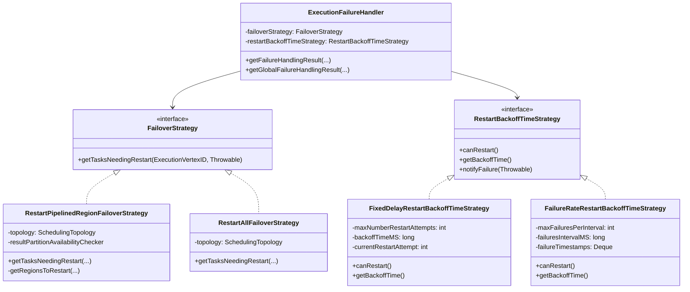
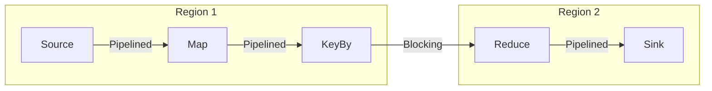
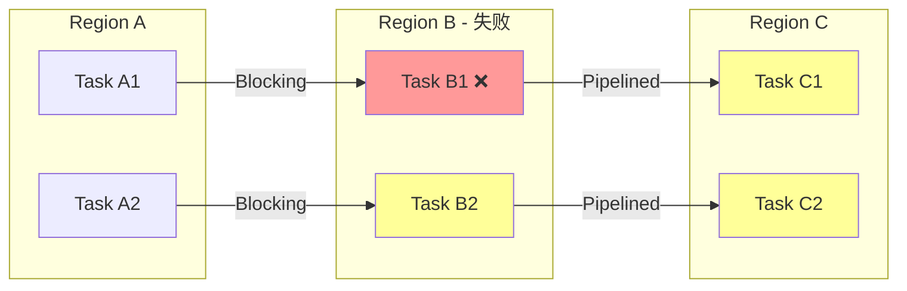
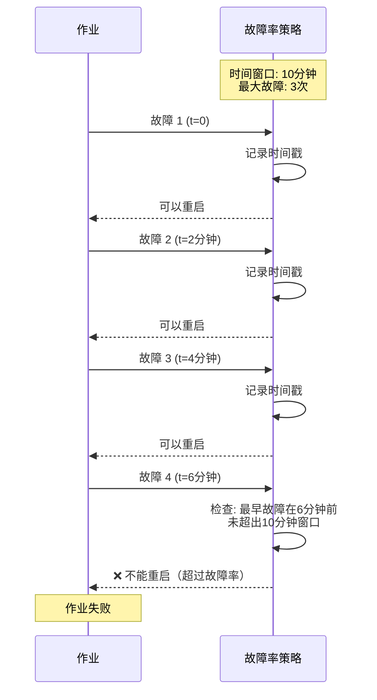
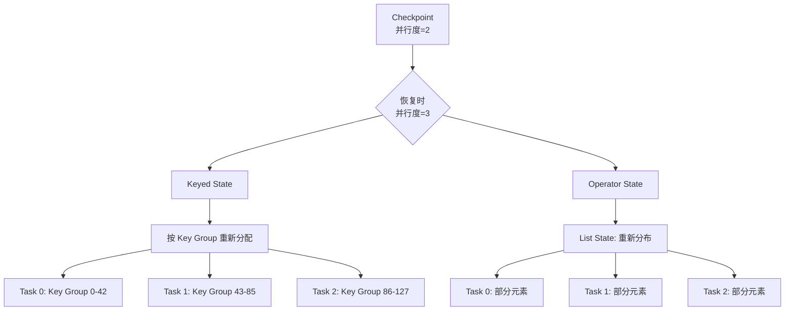
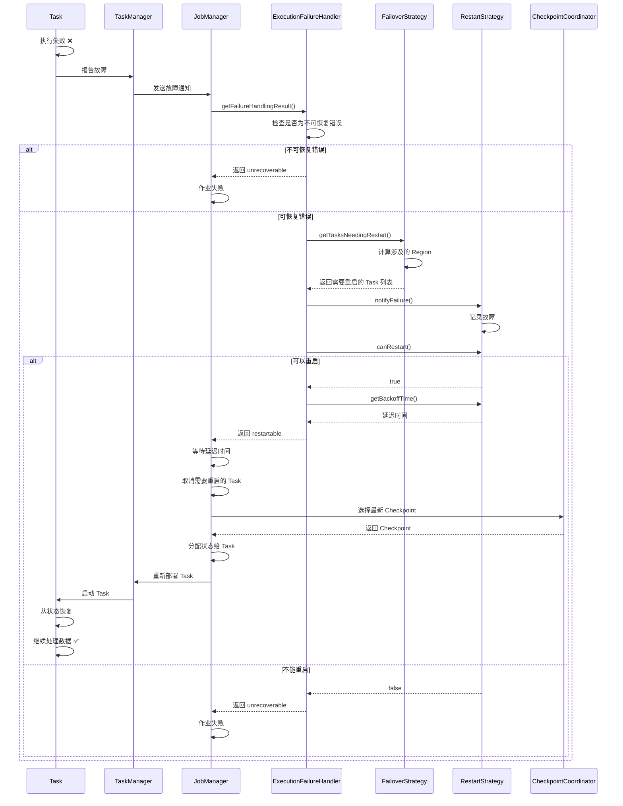
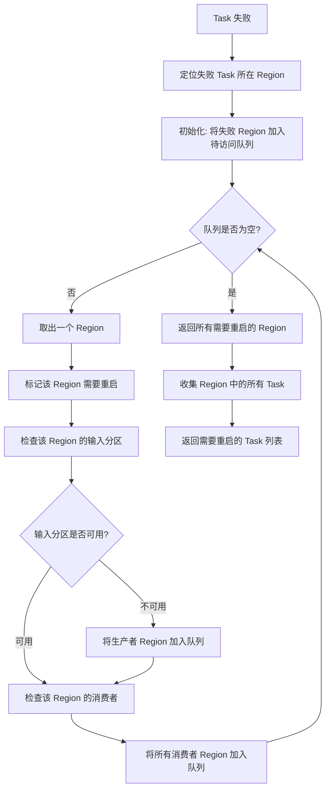

# 故障恢复机制源码深度解析

## 一、机制概述

### 1.1 什么是故障恢复机制

故障恢复机制是 Flink 保证作业高可用性的核心能力，当作业中的 Task 发生故障时，Flink 能够自动检测故障、决定重启策略、恢复状态，并重新启动受影响的 Task，从而实现作业的自动恢复。

在 Flink 架构中，故障恢复机制由以下几个核心组件协同工作：
- **故障检测**：监控 Task 执行状态，及时发现故障
- **Failover Strategy**：决定哪些 Task 需要重启（区域故障恢复）
- **Restart Strategy**：决定是否重启以及重启的时间间隔
- **状态恢复**：从 Checkpoint 恢复算子状态

### 1.2 为什么需要故障恢复机制

**解决的核心问题**：
- **节点故障**：TaskManager 宕机、网络中断等硬件故障
- **任务异常**：用户代码异常、数据异常导致的任务失败
- **资源不足**：内存溢出、磁盘空间不足等资源问题
- **数据问题**：上游数据分区丢失或损坏

**设计目标**：
- **细粒度恢复**：只重启受影响的 Task，而非整个作业
- **快速恢复**：最小化故障恢复时间，减少服务中断
- **状态一致性**：从最近的 Checkpoint 恢复，保证数据一致性
- **灵活配置**：支持多种重启策略，适应不同场景

## 二、核心类与接口

### 2.1 核心接口

#### FailoverStrategy
- **路径**：`flink-runtime/src/main/java/org/apache/flink/runtime/executiongraph/failover/flip1/FailoverStrategy.java`
- **职责**：定义故障转移策略，决定哪些 Task 需要重启

```java
public interface FailoverStrategy {
    /**
     * 返回需要重启的 Task ID 集合
     * @param executionVertexId 失败的 Task ID
     * @param cause 失败原因
     * @return 需要重启的 Task ID 集合
     */
    Set<ExecutionVertexID> getTasksNeedingRestart(
            ExecutionVertexID executionVertexId, Throwable cause);
}
```

#### RestartBackoffTimeStrategy
- **路径**：`flink-runtime/src/main/java/org/apache/flink/runtime/executiongraph/failover/flip1/RestartBackoffTimeStrategy.java`
- **职责**：定义重启策略，决定是否重启以及重启延迟

```java
public interface RestartBackoffTimeStrategy {
    // 是否可以重启
    boolean canRestart();
    
    // 重启延迟时间（毫秒）
    long getBackoffTime();
    
    // 通知策略发生了故障
    void notifyFailure(Throwable cause);
}
```

### 2.2 核心实现类

#### RestartPipelinedRegionFailoverStrategy
- **路径**：`flink-runtime/src/main/java/org/apache/flink/runtime/executiongraph/failover/flip1/RestartPipelinedRegionFailoverStrategy.java`
- **职责**：基于 Pipelined Region 的细粒度故障恢复策略（默认策略）
- **核心思想**：
  - 将作业拓扑划分为多个 Pipelined Region（通过 Pipelined 边连接的 Task 集合）
  - 只重启受影响的 Region，而非整个作业
  - 如果上游数据分区不可用，则同时重启生产者 Region

#### RestartAllFailoverStrategy
- **路径**：`flink-runtime/src/main/java/org/apache/flink/runtime/executiongraph/failover/flip1/RestartAllFailoverStrategy.java`
- **职责**：全局重启策略，任何 Task 失败都重启所有 Task
- **适用场景**：简单作业或需要全局一致性的场景

#### ExecutionFailureHandler
- **路径**：`flink-runtime/src/main/java/org/apache/flink/runtime/executiongraph/failover/flip1/ExecutionFailureHandler.java`
- **职责**：故障处理器，协调 FailoverStrategy 和 RestartBackoffTimeStrategy
- **核心功能**：
  - 接收 Task 故障通知
  - 调用 FailoverStrategy 计算需要重启的 Task
  - 调用 RestartBackoffTimeStrategy 判断是否可以重启
  - 返回故障处理结果（重启或失败）

#### FixedDelayRestartBackoffTimeStrategy
- **路径**：`flink-runtime/src/main/java/org/apache/flink/runtime/executiongraph/failover/flip1/FixedDelayRestartBackoffTimeStrategy.java`
- **职责**：固定延迟重启策略
- **参数**：
  - `maxNumberRestartAttempts`：最大重启次数
  - `backoffTimeMS`：重启延迟时间

#### FailureRateRestartBackoffTimeStrategy
- **路径**：`flink-runtime/src/main/java/org/apache/flink/runtime/executiongraph/failover/flip1/FailureRateRestartBackoffTimeStrategy.java`
- **职责**：基于故障率的重启策略
- **参数**：
  - `maxFailuresPerInterval`：时间窗口内最大故障次数
  - `failuresIntervalMS`：时间窗口大小
  - `backoffTimeMS`：重启延迟时间

### 2.3 类图关系



## 三、源码深度分析

### 3.1 故障检测与处理流程

#### 3.1.1 故障检测

当 Task 执行失败时，TaskManager 会向 JobManager 报告故障：

```java
// ExecutionFailureHandler.java
public FailureHandlingResult getFailureHandlingResult(
        Execution failedExecution, Throwable cause, long timestamp) {
    return handleFailure(
            failedExecution,
            cause,
            timestamp,
            // 调用 FailoverStrategy 计算需要重启的 Task
            failoverStrategy.getTasksNeedingRestart(failedExecution.getVertex().getID(), cause),
            false);
}
```

**关键点**：
- `failedExecution`：失败的 Task 执行实例
- `cause`：故障原因（异常）
- `timestamp`：故障发生时间
- 调用 `FailoverStrategy.getTasksNeedingRestart()` 计算需要重启的 Task

#### 3.1.2 故障分类

Flink 将故障分为两类：

1. **可恢复故障**：可以通过重启恢复的故障
   - 用户代码异常
   - 网络临时中断
   - 数据分区丢失

2. **不可恢复故障**：无法通过重启恢复的故障
   - `NonRecoverableError`：如配置错误、类加载失败
   - 超过重启次数限制

```java
// ExecutionFailureHandler.java
private FailureHandlingResult handleFailure(
        @Nullable final Execution failedExecution,
        final Throwable cause,
        long timestamp,
        final Set<ExecutionVertexID> verticesToRestart,
        final boolean globalFailure) {

    final CompletableFuture<Map<String, String>> failureLabels =
            labelFailure(cause, globalFailure);

    // 检查是否为不可恢复错误
    if (isUnrecoverableError(cause)) {
        return FailureHandlingResult.unrecoverable(
                failedExecution,
                new JobException("The failure is not recoverable", cause),
                timestamp,
                failureLabels,
                globalFailure);
    }

    // 通知重启策略发生了故障
    restartBackoffTimeStrategy.notifyFailure(cause);
    
    // 检查是否可以重启
    if (restartBackoffTimeStrategy.canRestart()) {
        numberOfRestarts++;

        return FailureHandlingResult.restartable(
                failedExecution,
                cause,
                timestamp,
                failureLabels,
                verticesToRestart,
                restartBackoffTimeStrategy.getBackoffTime(),
                globalFailure);
    } else {
        // 超过重启限制
        return FailureHandlingResult.unrecoverable(
                failedExecution,
                new JobException(
                        "Recovery is suppressed by " + restartBackoffTimeStrategy, cause),
                timestamp,
                failureLabels,
                globalFailure);
    }
}
```

**处理流程**：
1. 检查是否为不可恢复错误
2. 通知重启策略（记录故障）
3. 检查是否可以重启
4. 返回处理结果（可重启或不可恢复）

### 3.2 Pipelined Region 故障恢复

#### 3.2.1 Region 划分

Pipelined Region 是通过 Pipelined 边连接的 Task 集合：

- **Pipelined 边**：数据通过内存直接传递，无持久化
- **Blocking 边**：数据持久化到磁盘，可以重新消费

**Region 划分规则**：
- 通过 Pipelined 边连接的 Task 属于同一个 Region
- Blocking 边将作业拓扑分割为多个 Region



#### 3.2.2 Region 故障恢复逻辑

```java
// RestartPipelinedRegionFailoverStrategy.java
@Override
public Set<ExecutionVertexID> getTasksNeedingRestart(
        ExecutionVertexID executionVertexId, Throwable cause) {

    // 获取失败 Task 所在的 Region
    final SchedulingPipelinedRegion failedRegion =
            topology.getPipelinedRegionOfVertex(executionVertexId);
    if (failedRegion == null) {
        throw new IllegalStateException(
                "Can not find the failover region for task " + executionVertexId, cause);
    }

    // 如果是数据消费异常，标记对应的数据分区为失败
    Optional<PartitionException> dataConsumptionException =
            ExceptionUtils.findThrowable(cause, PartitionException.class);
    if (dataConsumptionException.isPresent()) {
        resultPartitionAvailabilityChecker.markResultPartitionFailed(
                dataConsumptionException.get().getPartitionId().getPartitionId());
    }

    // 计算需要重启的 Region
    Set<ExecutionVertexID> tasksToRestart = new HashSet<>();
    for (SchedulingPipelinedRegion region : getRegionsToRestart(failedRegion)) {
        for (SchedulingExecutionVertex vertex : region.getVertices()) {
            // 跳过已经在初始状态的 Task
            if (vertex.getState() != ExecutionState.CREATED) {
                tasksToRestart.add(vertex.getId());
            }
        }
    }

    // 恢复后移除失败标记
    if (dataConsumptionException.isPresent()) {
        resultPartitionAvailabilityChecker.removeResultPartitionFromFailedState(
                dataConsumptionException.get().getPartitionId().getPartitionId());
    }

    return tasksToRestart;
}
```

**关键点**：
- 定位失败 Task 所在的 Region
- 处理数据分区异常（标记分区失败）
- 计算需要重启的所有 Region
- 收集 Region 中的所有 Task

#### 3.2.3 涉及 Region 的计算

```java
// RestartPipelinedRegionFailoverStrategy.java
private Set<SchedulingPipelinedRegion> getRegionsToRestart(
        SchedulingPipelinedRegion failedRegion) {
    Set<SchedulingPipelinedRegion> regionsToRestart =
            Collections.newSetFromMap(new IdentityHashMap<>());
    Set<SchedulingPipelinedRegion> visitedRegions =
            Collections.newSetFromMap(new IdentityHashMap<>());

    Set<ConsumedPartitionGroup> visitedConsumedResultGroups =
            Collections.newSetFromMap(new IdentityHashMap<>());
    Set<ConsumerVertexGroup> visitedConsumerVertexGroups =
            Collections.newSetFromMap(new IdentityHashMap<>());

    // 从失败的 Region 开始，广度优先遍历所有涉及的 Region
    Queue<SchedulingPipelinedRegion> regionsToVisit = new ArrayDeque<>();
    visitedRegions.add(failedRegion);
    regionsToVisit.add(failedRegion);
    
    while (!regionsToVisit.isEmpty()) {
        SchedulingPipelinedRegion regionToRestart = regionsToVisit.poll();

        // 涉及的 Region 需要重启
        regionsToRestart.add(regionToRestart);

        // 规则 2：如果输入数据分区不可用，生产者 Region 也需要重启
        for (IntermediateResultPartitionID consumedPartitionId :
                getConsumedPartitionsToVisit(regionToRestart, visitedConsumedResultGroups)) {
            if (!resultPartitionAvailabilityChecker.isAvailable(consumedPartitionId)) {
                SchedulingResultPartition consumedPartition =
                        topology.getResultPartition(consumedPartitionId);
                SchedulingPipelinedRegion producerRegion =
                        topology.getPipelinedRegionOfVertex(
                                consumedPartition.getProducer().getId());
                if (!visitedRegions.contains(producerRegion)) {
                    visitedRegions.add(producerRegion);
                    regionsToVisit.add(producerRegion);
                }
            }
        }

        // 规则 3：涉及 Region 的所有消费者 Region 也需要重启
        for (ExecutionVertexID consumerVertexId :
                getConsumerVerticesToVisit(regionToRestart, visitedConsumerVertexGroups)) {
            SchedulingPipelinedRegion consumerRegion =
                    topology.getPipelinedRegionOfVertex(consumerVertexId);
            if (!visitedRegions.contains(consumerRegion)) {
                visitedRegions.add(consumerRegion);
                regionsToVisit.add(consumerRegion);
            }
        }
    }

    return regionsToRestart;
}
```

**涉及 Region 的计算规则**：
1. **规则 1**：失败 Task 所在的 Region 必须重启
2. **规则 2**：如果 Region 的输入数据分区不可用（Missing 或 Corrupted），生产者 Region 也需要重启
3. **规则 3**：如果 Region 需要重启，其所有消费者 Region 也需要重启（保证数据一致性）

**示例**：


**恢复策略**：
- Region B 失败 → Region B 需要重启
- Region C 消费 Region B 的数据 → Region C 也需要重启
- Region A 的数据已持久化（Blocking 边）→ Region A 不需要重启

### 3.3 重启策略

#### 3.3.1 固定延迟重启策略

```java
// FixedDelayRestartBackoffTimeStrategy.java
public class FixedDelayRestartBackoffTimeStrategy implements RestartBackoffTimeStrategy {
    private final int maxNumberRestartAttempts;  // 最大重启次数
    private final long backoffTimeMS;            // 重启延迟
    private int currentRestartAttempt;           // 当前重启次数

    @Override
    public boolean canRestart() {
        return currentRestartAttempt <= maxNumberRestartAttempts;
    }

    @Override
    public long getBackoffTime() {
        return backoffTimeMS;
    }

    @Override
    public void notifyFailure(Throwable cause) {
        currentRestartAttempt++;  // 每次故障，重启次数 +1
    }
}
```

**配置示例**：
```java
// 最多重启 3 次，每次延迟 10 秒
env.setRestartStrategy(RestartStrategies.fixedDelayRestart(
    3,      // 最大重启次数
    10000   // 延迟时间（毫秒）
));
```

**特点**：
- 简单直观，适合大多数场景
- 固定的重启次数和延迟时间
- 超过重启次数后，作业失败

#### 3.3.2 故障率重启策略

```java
// FailureRateRestartBackoffTimeStrategy.java
public class FailureRateRestartBackoffTimeStrategy implements RestartBackoffTimeStrategy {
    private final long failuresIntervalMS;        // 时间窗口大小
    private final long backoffTimeMS;             // 重启延迟
    private final int maxFailuresPerInterval;     // 时间窗口内最大故障次数
    private final Deque<Long> failureTimestamps;  // 故障时间戳队列
    private final Clock clock;

    @Override
    public boolean canRestart() {
        if (isFailureTimestampsQueueFull()) {
            Long now = clock.absoluteTimeMillis();
            Long earliestFailure = failureTimestamps.peek();

            // 如果最早的故障已经超出时间窗口，可以重启
            return (now - earliestFailure) > failuresIntervalMS;
        } else {
            // 队列未满，可以重启
            return true;
        }
    }

    @Override
    public long getBackoffTime() {
        return backoffTimeMS;
    }

    @Override
    public void notifyFailure(Throwable cause) {
        if (isFailureTimestampsQueueFull()) {
            failureTimestamps.remove();  // 移除最早的故障
        }
        failureTimestamps.add(clock.absoluteTimeMillis());  // 添加当前故障
    }

    private boolean isFailureTimestampsQueueFull() {
        return failureTimestamps.size() > maxFailuresPerInterval;
    }
}
```

**配置示例**：
```java
// 10 分钟内最多失败 3 次，每次延迟 10 秒
env.setRestartStrategy(RestartStrategies.failureRateRestart(
    3,      // 时间窗口内最大故障次数
    Time.minutes(10),  // 时间窗口大小
    Time.seconds(10)   // 延迟时间
));
```

**特点**：
- 基于时间窗口的故障率控制
- 适合长时间运行的作业
- 避免短时间内频繁重启

**工作原理**：


### 3.4 状态恢复流程

当 Task 重启后，需要从 Checkpoint 恢复状态：

#### 3.4.1 恢复 Checkpoint 选择

```java
// CheckpointCoordinator.java
// 从最新的 CompletedCheckpoint 恢复
CompletedCheckpoint latest = completedCheckpointStore.getLatestCheckpoint();
if (latest != null) {
    restoreStateToCoordinators(latest.getCheckpointID(), operatorStates);
}
```

**恢复流程**：
1. 从 `CompletedCheckpointStore` 获取最新的 Checkpoint
2. 将 Checkpoint 中的状态分配给各个 Task
3. Task 启动时从状态句柄恢复状态

#### 3.4.2 状态分配

Flink 使用 `StateAssignmentOperation` 将 Checkpoint 中的状态分配给 Task：

**状态分配规则**：
- **Keyed State**：根据 Key Group 分配，支持并行度变化
- **Operator State**：根据并行度重新分配（List State 重新分布，Union State 广播）
- **Raw State**：用户自定义的状态分配逻辑

**并行度变化处理**：


## 四、执行流程图

### 4.1 完整故障恢复流程



### 4.2 Region 故障恢复决策流程



## 五、关键设计模式与技巧

### 5.1 细粒度故障恢复（FLIP-1）

**设计思想**：
- 传统方式：任何 Task 失败都重启整个作业
- FLIP-1：只重启受影响的 Pipelined Region

**优势**：
- **减少重启开销**：只重启必要的 Task
- **提高可用性**：未受影响的 Task 继续运行
- **降低恢复时间**：减少状态恢复的数据量

**适用场景**：
- 大规模作业（数千个 Task）
- 部分 Task 故障率较高
- 需要快速恢复的场景

### 5.2 数据分区可用性检查

Flink 通过 `ResultPartitionAvailabilityChecker` 检查数据分区是否可用：

```java
// RegionFailoverResultPartitionAvailabilityChecker
@Override
public boolean isAvailable(IntermediateResultPartitionID resultPartitionID) {
    return !failedPartitions.contains(resultPartitionID)
            && resultPartitionAvailabilityChecker.isAvailable(resultPartitionID)
            // 可重新消费或 PIPELINED_APPROXIMATE 类型
            && isResultPartitionIsReConsumableOrPipelinedApproximate(resultPartitionID);
}
```

**检查逻辑**：
1. 分区未被标记为失败
2. Shuffle Master 确认分区可用
3. 分区类型支持重新消费（Blocking 或 PIPELINED_APPROXIMATE）

### 5.3 故障传播控制

Flink 通过 Region 划分控制故障传播范围：

**Blocking 边的作用**：
- 隔离故障传播
- 上游 Region 失败不影响下游（数据已持久化）
- 下游 Region 失败不影响上游

**Pipelined 边的影响**：
- 故障会传播到整个 Region
- 需要同时重启 Region 内的所有 Task

### 5.4 重启延迟策略

**为什么需要延迟**：
- 避免立即重启导致的资源竞争
- 给临时故障（如网络抖动）恢复的时间
- 减少频繁重启对系统的冲击

**延迟时间选择**：
- 固定延迟：适合已知故障恢复时间的场景
- 指数退避：适合不确定故障恢复时间的场景

## 六、面试高频问题

### Q1: Flink 的故障恢复流程是怎样的？

**答案**：

Flink 的故障恢复流程分为以下几个阶段：

1. **故障检测**：
   - Task 执行失败，TaskManager 捕获异常
   - TaskManager 向 JobManager 报告故障

2. **故障分析**：
   - `ExecutionFailureHandler` 接收故障通知
   - 检查是否为不可恢复错误（如 `NonRecoverableError`）
   - 如果不可恢复，直接失败作业

3. **计算重启范围**：
   - 调用 `FailoverStrategy.getTasksNeedingRestart()`
   - 默认使用 `RestartPipelinedRegionFailoverStrategy`
   - 计算需要重启的 Pipelined Region 和 Task

4. **重启决策**：
   - 调用 `RestartBackoffTimeStrategy.notifyFailure()` 记录故障
   - 调用 `RestartBackoffTimeStrategy.canRestart()` 判断是否可以重启
   - 如果不能重启（超过限制），作业失败

5. **延迟等待**：
   - 获取重启延迟时间 `getBackoffTime()`
   - 等待延迟时间后开始重启

6. **Task 取消**：
   - 取消需要重启的所有 Task
   - 释放资源

7. **状态恢复**：
   - 从 `CompletedCheckpointStore` 获取最新 Checkpoint
   - 使用 `StateAssignmentOperation` 分配状态给 Task
   - 处理并行度变化（如果有）

8. **Task 重启**：
   - 重新部署 Task 到 TaskManager
   - Task 从状态句柄恢复状态
   - Task 继续处理数据

**源码支撑**：
- [`ExecutionFailureHandler.getFailureHandlingResult()`](file:///Users/wanghaofeng/IdeaProjects/flink/flink-runtime/src/main/java/org/apache/flink/runtime/executiongraph/failover/flip1/ExecutionFailureHandler.java#L105-L113)
- [`RestartPipelinedRegionFailoverStrategy.getTasksNeedingRestart()`](file:///Users/wanghaofeng/IdeaProjects/flink/flink-runtime/src/main/java/org/apache/flink/runtime/executiongraph/failover/flip1/RestartPipelinedRegionFailoverStrategy.java#L110-L149)

### Q2: 什么是 Pipelined Region？为什么要基于 Region 进行故障恢复？

**答案**：

**Pipelined Region 定义**：
Pipelined Region 是通过 Pipelined 边连接的 Task 集合。Pipelined 边表示数据通过内存直接传递，没有持久化到磁盘。

**Region 划分规则**：
- 通过 Pipelined 边连接的 Task 属于同一个 Region
- Blocking 边（数据持久化）将作业拓扑分割为多个 Region

**为什么基于 Region 恢复**：

1. **细粒度恢复**：
   - 只重启受影响的 Region，而非整个作业
   - 未受影响的 Region 继续运行，减少重启开销

2. **数据一致性**：
   - Pipelined Region 内的 Task 共享内存数据
   - 任何一个 Task 失败，内存数据都会丢失
   - 必须同时重启整个 Region 以保证一致性

3. **故障隔离**：
   - Blocking 边的数据已持久化
   - 上游 Region 失败不影响下游（数据可重新消费）
   - 下游 Region 失败不影响上游（上游已完成）

4. **性能优化**：
   - 减少状态恢复的数据量
   - 减少 Task 重启的数量
   - 降低故障恢复时间

**示例**：
```
Source (Region 1) --Pipelined--> Map (Region 1) --Blocking--> Reduce (Region 2) --Pipelined--> Sink (Region 2)
```

- 如果 Map 失败：只需重启 Region 1（Source + Map）
- 如果 Reduce 失败：只需重启 Region 2（Reduce + Sink），Region 1 的数据已持久化

**源码支撑**：
- [`RestartPipelinedRegionFailoverStrategy`](file:///Users/wanghaofeng/IdeaProjects/flink/flink-runtime/src/main/java/org/apache/flink/runtime/executiongraph/failover/flip1/RestartPipelinedRegionFailoverStrategy.java#L52)
- Region 计算逻辑：[`getRegionsToRestart()`](file:///Users/wanghaofeng/IdeaProjects/flink/flink-runtime/src/main/java/org/apache/flink/runtime/executiongraph/failover/flip1/RestartPipelinedRegionFailoverStrategy.java#L158-L209)

### Q3: Flink 有哪些重启策略？它们的区别是什么？

**答案**：

Flink 提供了以下几种重启策略：

#### 1. **Fixed Delay（固定延迟）**

**特点**：
- 固定的重启次数和延迟时间
- 超过重启次数后，作业失败

**配置**：
```java
env.setRestartStrategy(RestartStrategies.fixedDelayRestart(
    3,      // 最大重启次数
    10000   // 延迟时间（毫秒）
));
```

**适用场景**：
- 临时故障（如网络抖动）
- 已知故障恢复时间
- 大多数生产环境

#### 2. **Failure Rate（故障率）**

**特点**：
- 基于时间窗口的故障率控制
- 时间窗口内故障次数超过限制后，作业失败
- 超出时间窗口的故障会被遗忘

**配置**：
```java
env.setRestartStrategy(RestartStrategies.failureRateRestart(
    3,                  // 时间窗口内最大故障次数
    Time.minutes(10),   // 时间窗口大小
    Time.seconds(10)    // 延迟时间
));
```

**适用场景**：
- 长时间运行的作业
- 需要容忍偶发故障
- 避免短时间内频繁重启

#### 3. **Exponential Delay（指数退避）**

**特点**：
- 每次重启的延迟时间呈指数增长
- 避免频繁重启对系统的冲击

**配置**：
```java
env.setRestartStrategy(RestartStrategies.exponentialDelayRestart(
    Time.seconds(1),    // 初始延迟
    Time.seconds(60),   // 最大延迟
    2.0,                // 退避因子
    Time.seconds(120),  // 重置时间
    0.1                 // 抖动因子
));
```

**适用场景**：
- 不确定故障恢复时间
- 需要避免雪崩效应
- 依赖外部系统的作业

#### 4. **No Restart（不重启）**

**特点**：
- 任何故障都直接失败作业
- 适合开发测试环境

**配置**：
```java
env.setRestartStrategy(RestartStrategies.noRestart());
```

**对比表**：

| 策略 | 重启次数限制 | 延迟时间 | 适用场景 |
|------|------------|---------|---------|
| Fixed Delay | 固定次数 | 固定延迟 | 临时故障、生产环境 |
| Failure Rate | 时间窗口内限制 | 固定延迟 | 长时间运行、偶发故障 |
| Exponential Delay | 无限制（有最大延迟） | 指数增长 | 不确定恢复时间 |
| No Restart | 0 | 无 | 开发测试 |

**源码支撑**：
- [`FixedDelayRestartBackoffTimeStrategy`](file:///Users/wanghaofeng/IdeaProjects/flink/flink-runtime/src/main/java/org/apache/flink/runtime/executiongraph/failover/flip1/FixedDelayRestartBackoffTimeStrategy.java#L30)
- [`FailureRateRestartBackoffTimeStrategy`](file:///Users/wanghaofeng/IdeaProjects/flink/flink-runtime/src/main/java/org/apache/flink/runtime/executiongraph/failover/flip1/FailureRateRestartBackoffTimeStrategy.java#L33)

### Q4: 故障恢复时如何处理并行度变化？

**答案**：

Flink 支持在故障恢复时改变算子的并行度，但需要正确处理状态的重新分配。

**状态类型与并行度变化**：

#### 1. **Keyed State**

**处理方式**：
- Keyed State 基于 Key Group 分配
- Key Group 数量 = Max Parallelism（默认 128）
- 并行度变化时，重新分配 Key Group 到 Task

**示例**：
```
Checkpoint 时并行度 = 2:
- Task 0: Key Group 0-63
- Task 1: Key Group 64-127

恢复时并行度 = 4:
- Task 0: Key Group 0-31
- Task 1: Key Group 32-63
- Task 2: Key Group 64-95
- Task 3: Key Group 96-127
```

**关键点**：
- Max Parallelism 必须在作业首次运行时设置
- Max Parallelism 不能改变（否则无法恢复）
- 并行度可以在 [1, Max Parallelism] 范围内调整

#### 2. **Operator State（List State）**

**处理方式**：
- List State 在恢复时会重新分布
- 所有元素会被均匀分配到新的并行度

**示例**：
```
Checkpoint 时并行度 = 2:
- Task 0: [1, 2, 3]
- Task 1: [4, 5, 6]

恢复时并行度 = 3:
- Task 0: [1, 2]
- Task 1: [3, 4]
- Task 2: [5, 6]
```

#### 3. **Operator State（Union State）**

**处理方式**：
- Union State 会广播到所有并行实例
- 每个 Task 都会收到完整的状态

**示例**：
```
Checkpoint 时并行度 = 2:
- Task 0: [1, 2, 3]
- Task 1: [4, 5, 6]

恢复时并行度 = 3:
- Task 0: [1, 2, 3, 4, 5, 6]
- Task 1: [1, 2, 3, 4, 5, 6]
- Task 2: [1, 2, 3, 4, 5, 6]
```

**配置 Max Parallelism**：
```java
env.setMaxParallelism(256);  // 全局设置

dataStream.map(...).setMaxParallelism(128);  // 算子级别设置
```

**最佳实践**：
- 首次运行时设置合理的 Max Parallelism（通常是并行度的 2-4 倍）
- 避免频繁改变并行度（影响状态分布）
- 使用 Keyed State 时，确保 Key 分布均匀

**源码支撑**：
- `StateAssignmentOperation` 负责状态重新分配
- Key Group 分配逻辑在 `KeyGroupRangeAssignment` 中

### Q5: 如果 Checkpoint 失败，故障恢复会怎样？

**答案**：

Checkpoint 失败不会直接导致作业失败，但会影响故障恢复的能力。

**Checkpoint 失败的影响**：

1. **作业继续运行**：
   - Checkpoint 失败不会中断数据处理
   - 作业继续运行，等待下一次 Checkpoint

2. **故障恢复点回退**：
   - 如果 Task 失败，只能从上一个成功的 Checkpoint 恢复
   - 恢复点越早，需要重新处理的数据越多

3. **数据重复处理**：
   - 从旧 Checkpoint 恢复会导致部分数据重复处理
   - At-Least-Once 语义下可以接受
   - Exactly-Once 语义需要依赖 Sink 的幂等性或事务性

**Checkpoint 失败容忍**：

Flink 提供了 Checkpoint 失败容忍配置：

```java
env.getCheckpointConfig().setTolerableCheckpointFailureNumber(3);
```

- 容忍连续 3 次 Checkpoint 失败
- 超过容忍次数后，作业失败

**最坏情况**：

如果所有 Checkpoint 都失败：
- 作业无法从故障中恢复
- Task 失败后，作业失败
- 需要从头开始处理数据（如果没有 Savepoint）

**最佳实践**：
- 监控 Checkpoint 成功率
- 设置合理的 Checkpoint 超时时间
- 使用可靠的外部存储（HDFS、S3）
- 定期创建 Savepoint 作为备份

**源码支撑**：
- `CheckpointFailureManager` 管理 Checkpoint 失败计数
- 超过容忍次数后，调用 `failJob()` 失败作业

### Q6: Flink 如何区分可恢复错误和不可恢复错误？

**答案**：

Flink 使用 `ThrowableClassifier` 对异常进行分类：

**不可恢复错误（NonRecoverableError）**：
- `OutOfMemoryError`：内存溢出
- `StackOverflowError`：栈溢出
- `NoClassDefFoundError`：类加载失败
- `ExceptionInInitializerError`：静态初始化失败
- 用户自定义的 `NonRecoverableError`

**可恢复错误**：
- 用户代码异常（如 `NullPointerException`）
- 网络异常（如 `IOException`）
- 数据分区异常（`PartitionException`）
- 其他运行时异常

**检查逻辑**：

```java
// ExecutionFailureHandler.java
public static boolean isUnrecoverableError(Throwable cause) {
    Optional<Throwable> unrecoverableError =
            ThrowableClassifier.findThrowableOfThrowableType(
                    cause, ThrowableType.NonRecoverableError);
    return unrecoverableError.isPresent();
}
```

**处理策略**：
- 可恢复错误：根据重启策略决定是否重启
- 不可恢复错误：直接失败作业，不尝试重启

**自定义不可恢复错误**：

用户可以通过配置指定某些异常为不可恢复：

```java
// 将特定异常标记为不可恢复
env.getConfig().setGlobalJobParameters(...);
```

**源码支撑**：
- [`ExecutionFailureHandler.isUnrecoverableError()`](file:///Users/wanghaofeng/IdeaProjects/flink/flink-runtime/src/main/java/org/apache/flink/runtime/executiongraph/failover/flip1/ExecutionFailureHandler.java#L186-L191)
- `ThrowableClassifier` 定义异常分类规则

## 七、最佳实践与注意事项

### 7.1 重启策略配置建议

**1. 生产环境推荐配置**：

```java
// 故障率重启策略（推荐）
env.setRestartStrategy(RestartStrategies.failureRateRestart(
    5,                  // 10分钟内最多失败5次
    Time.minutes(10),
    Time.seconds(30)    // 每次延迟30秒
));

// 或固定延迟重启策略
env.setRestartStrategy(RestartStrategies.fixedDelayRestart(
    10,                 // 最多重启10次
    Time.seconds(30)    // 每次延迟30秒
));
```

**2. 开发测试环境**：

```java
// 不重启，快速失败
env.setRestartStrategy(RestartStrategies.noRestart());
```

**3. 长时间运行的流作业**：

```java
// 故障率策略，容忍偶发故障
env.setRestartStrategy(RestartStrategies.failureRateRestart(
    10,                 // 1小时内最多失败10次
    Time.hours(1),
    Time.minutes(1)     // 延迟1分钟
));
```

### 7.2 Checkpoint 与故障恢复配置

**1. Checkpoint 间隔**：

```java
// 根据数据丢失容忍度设置
env.enableCheckpointing(60000);  // 60秒
```

- 间隔越短，恢复时重新处理的数据越少
- 间隔越长，Checkpoint 开销越小

**2. Checkpoint 保留**：

```java
// 作业取消时保留 Checkpoint
env.getCheckpointConfig().enableExternalizedCheckpoints(
    ExternalizedCheckpointCleanup.RETAIN_ON_CANCELLATION
);
```

- 允许从取消的作业恢复
- 需要手动清理旧 Checkpoint

**3. Checkpoint 失败容忍**：

```java
// 容忍3次 Checkpoint 失败
env.getCheckpointConfig().setTolerableCheckpointFailureNumber(3);
```

### 7.3 并行度与 Max Parallelism

**1. 设置 Max Parallelism**：

```java
// 全局设置
env.setMaxParallelism(512);

// 算子级别设置
dataStream.map(...).setMaxParallelism(256);
```

**推荐值**：
- Max Parallelism = 并行度 × 2 ~ 4
- 不要设置过大（影响性能）
- 不要设置过小（限制扩展性）

**2. 并行度调整**：

```java
// 从 Savepoint 恢复时改变并行度
flink run -s hdfs://path/to/savepoint -p 16 MyJob.jar
```

### 7.4 常见陷阱

**1. 忘记设置 Max Parallelism**：

- **问题**：首次运行时未设置 Max Parallelism，后续无法改变并行度
- **解决**：首次运行时设置合理的 Max Parallelism

**2. Checkpoint 间隔过长**：

- **问题**：故障恢复时需要重新处理大量数据
- **解决**：根据业务需求设置合理的 Checkpoint 间隔

**3. 重启策略过于激进**：

- **问题**：频繁重启导致作业不稳定
- **解决**：设置合理的重启延迟和次数限制

**4. 未监控 Checkpoint 成功率**：

- **问题**：Checkpoint 持续失败，故障恢复能力下降
- **解决**：监控 Checkpoint 指标，及时发现问题

**5. 状态过大导致恢复缓慢**：

- **问题**：状态数据量大，恢复时间长
- **解决**：
  - 使用 RocksDB 增量 Checkpoint
  - 启用本地恢复
  - 优化状态数据结构

### 7.5 监控与诊断

**1. 关键指标**：

- `numberOfRestarts`：重启次数
- `lastRestartTimestamp`：最近一次重启时间
- `numberOfFailedCheckpoints`：失败的 Checkpoint 数量
- `restartingTime`：重启耗时

**2. 通过 Web UI 查看**：

- 访问 `http://jobmanager:8081/#/job/<job-id>/overview`
- 查看重启历史和故障原因

**3. 日志分析**：

```bash
# 查看故障日志
grep "Exception" flink-*.log

# 查看重启日志
grep "Restarting" flink-*.log
```

## 八、总结

### 核心要点回顾

1. **故障恢复是 Flink 高可用的基石**：
   - 自动检测故障、决定重启策略、恢复状态
   - 支持细粒度恢复，减少重启开销

2. **Pipelined Region 故障恢复**：
   - 基于 Region 的细粒度恢复（FLIP-1）
   - 只重启受影响的 Region，未受影响的 Region 继续运行
   - 通过 Blocking 边隔离故障传播

3. **重启策略**：
   - Fixed Delay：固定次数和延迟
   - Failure Rate：基于时间窗口的故障率控制
   - Exponential Delay：指数退避
   - 根据场景选择合适的策略

4. **状态恢复**：
   - 从最新 Checkpoint 恢复状态
   - 支持并行度变化（Keyed State 基于 Key Group）
   - Operator State 重新分布或广播

### 与其他机制的关联

- **Checkpoint 机制**：提供故障恢复的状态基础
- **State Backend**：影响状态恢复的性能
- **调度机制**：决定 Task 的部署和资源分配
- **反压机制**：故障恢复后可能触发反压

---

**文档版本**：v1.0  
**基于 Flink 版本**：Apache Flink 主分支（最新）  
**最后更新**：2026-02-05
