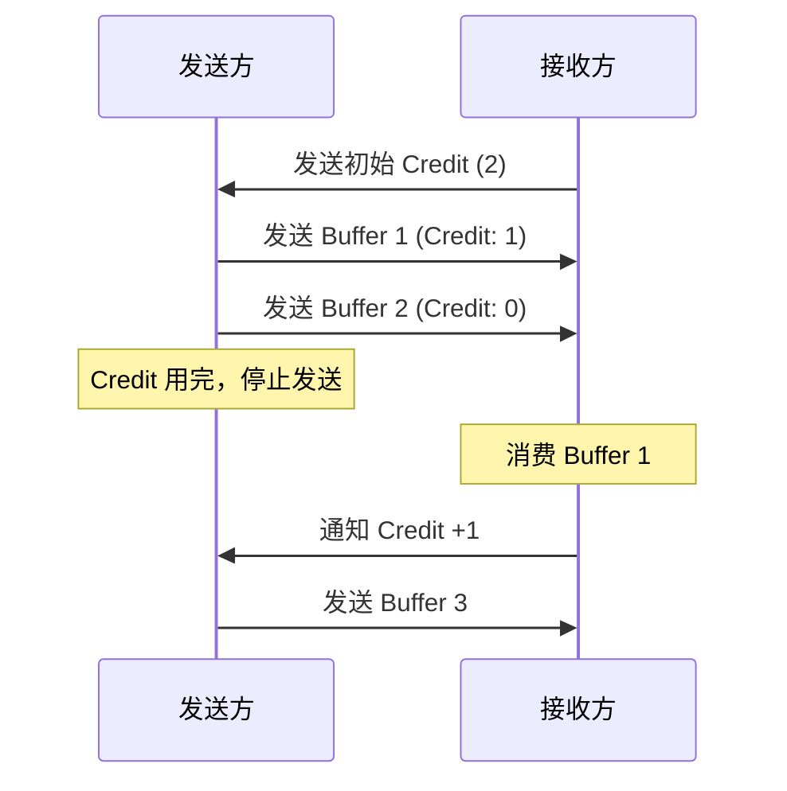
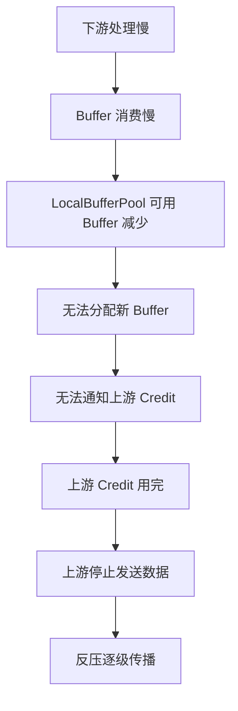

# 反压机制源码深度解析

## 一、机制概述

### 1.1 什么是反压机制

反压（Backpressure）是 Flink 流处理系统中的一种自适应流控机制。当下游算子处理速度跟不上上游算子的数据生产速度时，反压机制会自动减缓上游的数据发送速度，防止系统过载。

**核心思想**：
- **被动式流控**：下游消费慢 → Buffer 不足 → 上游发送慢
- **基于 Credit 的流控**：接收方通过 Credit 控制发送方的发送速率
- **端到端传播**：反压可以从 Sink 一直传播到 Source

### 1.2 为什么需要反压机制

**解决的核心问题**：
- **速度不匹配**：上下游算子处理速度差异导致的数据堆积
- **资源保护**：防止内存溢出、GC 频繁等资源问题
- **系统稳定性**：避免因数据堆积导致的系统崩溃
- **自适应调节**：无需人工干预，系统自动调节流速

**设计目标**：
- **自动化**：无需配置，自动生效
- **细粒度**：基于 Channel 级别的流控
- **低延迟**：快速响应速度变化
- **公平性**：多个 Channel 公平竞争资源

## 二、核心类与接口

### 2.1 Buffer 管理

#### NetworkBufferPool
- **路径**：`flink-runtime/src/main/java/org/apache/flink/runtime/io/network/buffer/NetworkBufferPool.java`
- **职责**：全局网络 Buffer 池，管理所有 TaskManager 的网络内存
- **核心字段**：
  - `totalNumberOfMemorySegments`：总 MemorySegment 数量
  - `memorySegmentSize`：MemorySegment 大小（默认 32KB）
  - `availableMemorySegments`：可用的 MemorySegment 队列
  - `allBufferPools`：所有的 LocalBufferPool
  - `resizableBufferPools`：可调整大小的 BufferPool

#### LocalBufferPool
- **路径**：`flink-runtime/src/main/java/org/apache/flink/runtime/io/network/buffer/LocalBufferPool.java`
- **职责**：每个 Task 的本地 Buffer 池
- **核心字段**：
  - `networkBufferPool`：全局 Buffer 池引用
  - `numberOfRequiredMemorySegments`：最小 Buffer 数量
  - `maxNumberOfMemorySegments`：最大 Buffer 数量
  - `currentPoolSize`：当前池大小
  - `availableMemorySegments`：可用的 MemorySegment
  - `maxBuffersPerChannel`：每个 Channel 的最大 Buffer 数量

### 2.2 Credit 机制

#### CreditBasedPartitionRequestClientHandler
- **路径**：`flink-runtime/src/main/java/org/apache/flink/runtime/io/network/netty/CreditBasedPartitionRequestClientHandler.java`
- **职责**：基于 Credit 的数据接收处理器（消费端）
- **核心功能**：接收上游发送的 Buffer 数据、向上游发送 Credit 通知

#### RemoteInputChannel
- **路径**：`flink-runtime/src/main/java/org/apache/flink/runtime/io/network/partition/consumer/RemoteInputChannel.java`
- **职责**：远程输入通道，从远程 TaskManager 接收数据
- **Credit 相关字段**：
  - `unannouncedCredit`：未通知的 Credit
  - `numExclusiveBuffers`：独占 Buffer 数量

## 三、源码深度分析

### 3.1 NetworkBufferPool 初始化

```java
// NetworkBufferPool.java
public NetworkBufferPool(
        int numberOfSegmentsToAllocate, int segmentSize, Duration requestSegmentsTimeout) {
    this.totalNumberOfMemorySegments = numberOfSegmentsToAllocate;
    this.memorySegmentSize = segmentSize;

    // 预分配所有 MemorySegment
    this.availableMemorySegments = new ArrayDeque<>(numberOfSegmentsToAllocate);
    for (int i = 0; i < numberOfSegmentsToAllocate; i++) {
        availableMemorySegments.add(
                MemorySegmentFactory.allocateUnpooledOffHeapMemory(segmentSize, null));
    }
}
```

**关键点**：启动时预分配所有网络内存（Off-Heap），默认 Segment 大小为 32KB。

### 3.2 LocalBufferPool Buffer 请求

```java
// LocalBufferPool.java
@Nullable
private MemorySegment requestMemorySegment(int targetChannel) {
    MemorySegment segment = null;
    synchronized (availableMemorySegments) {
        checkDestroyed();

        // 优先从本地可用队列获取
        if (!availableMemorySegments.isEmpty()) {
            segment = availableMemorySegments.poll();
        } else if (isRequestedSizeReached()) {
            // 已达到当前池大小，请求透支 Buffer
            segment = requestOverdraftMemorySegmentFromGlobal();
        }

        if (segment == null) {
            return null;
        }

        // 更新 Channel 的 Buffer 计数
        if (targetChannel != UNKNOWN_CHANNEL) {
            if (++subpartitionBuffersCount[targetChannel] == maxBuffersPerChannel) {
                unavailableSubpartitionsCount++;
            }
        }

        checkAndUpdateAvailability();
    }
    return segment;
}
```

**请求逻辑**：
1. 检查本地可用队列
2. 如果本地没有，检查是否达到池大小
3. 如果达到池大小，尝试请求透支 Buffer
4. 更新 Channel 的 Buffer 计数

### 3.3 Credit 机制

**Credit 的概念**：Credit 表示接收方（下游）可用的 Buffer 数量。

**Credit 流控原理**：


### 3.4 反压传播

反压的产生过程：



## 四、面试高频问题

### Q1: Flink 的反压机制是如何工作的？

**答案**：

Flink 的反压机制基于 **Credit-Based 流控**，核心思想是接收方通过 Credit 控制发送方的发送速率。

**工作流程**：

1. **初始化阶段**：下游 Task 创建 LocalBufferPool，向上游发送初始 Credit
2. **正常传输**：上游根据 Credit 发送数据，下游消费后回收 Buffer 并发送新 Credit
3. **反压产生**：下游处理慢 → Buffer 回收慢 → 无法分配新 Credit → 上游 Credit 用完 → 停止发送
4. **反压传播**：反压从 Sink 逐级向 Source 传播
5. **反压恢复**：下游处理加快 → Buffer 回收加快 → 分配新 Credit → 上游恢复发送

**关键特点**：
- 被动式流控，无需配置
- 端到端传播
- 自动化调节

**源码支撑**：
- [`LocalBufferPool.requestMemorySegment()`](file:///Users/wanghaofeng/IdeaProjects/flink/flink-runtime/src/main/java/org/apache/flink/runtime/io/network/buffer/LocalBufferPool.java#L393)
- [`LocalBufferPool.recycle()`](file:///Users/wanghaofeng/IdeaProjects/flink/flink-runtime/src/main/java/org/apache/flink/runtime/io/network/buffer/LocalBufferPool.java#L579)

### Q2: 什么是 Credit？Credit 机制如何实现流控？

**答案**：

**Credit 的定义**：Credit 表示接收方可用的 Buffer 数量，是一种流控凭证。

**Credit 的类型**：
1. **Exclusive Credit**：独占 Buffer，每个 InputChannel 独享
2. **Floating Credit**：浮动 Buffer，多个 InputChannel 共享
3. **Unannounced Credit**：未通知的 Credit，需要发送给上游

**流控机制**：
- 发送方根据 Credit 发送数据，每发送一个 Buffer，Credit -1
- 接收方消费数据后回收 Buffer，向上游发送新 Credit
- Credit 用完时，发送方停止发送

**配置参数**：
```yaml
taskmanager.network.memory.buffers-per-channel: 2
taskmanager.network.memory.floating-buffers-per-gate: 8
```

### Q3: NetworkBufferPool 和 LocalBufferPool 的区别是什么？

**答案**：

| 特性 | NetworkBufferPool | LocalBufferPool |
|------|-------------------|-----------------|
| 作用域 | 全局（TaskManager） | 本地（Task） |
| 数量 | 1 个 | 每个 Task 1 个 |
| 大小 | 固定 | 动态（min~max） |
| 分配时机 | 启动时预分配 | 运行时动态分配 |
| 透支 | 不支持 | 支持 |

**协作关系**：
- NetworkBufferPool 创建和管理 LocalBufferPool
- LocalBufferPool 从 NetworkBufferPool 请求 Buffer
- NetworkBufferPool 动态重分配 Buffer 给各个 LocalBufferPool

### Q4: 如何监控和诊断 Flink 的反压问题？

**答案**：

**1. Web UI 监控**：
- 访问 Flink Web UI → Job → Task → Backpressure
- **OK**（绿色）：无反压
- **LOW**（黄色）：低反压
- **HIGH**（红色）：高反压

**2. Metrics 监控**：
```java
taskmanager.network.buffers.inPoolUsage
taskmanager.network.buffers.outPoolUsage
```

**3. 诊断步骤**：
- 定位反压源头：从 Sink 向 Source 逐个检查
- 分析原因：处理逻辑慢、外部系统慢、数据倾斜
- 优化措施：增加并行度、增加 Buffer、优化算子

### Q5: 如何优化 Flink 的网络 Buffer 配置？

**答案**：

**核心配置参数**：
```yaml
# 网络内存占比
taskmanager.network.memory.fraction: 0.1

# Buffer 配置
taskmanager.network.memory.buffers-per-channel: 2
taskmanager.network.memory.floating-buffers-per-gate: 8
```

**配置建议**：
- **高吞吐量作业**：增加网络内存和 Buffer 数量
- **低延迟作业**：减小 Buffer 大小
- **大规模作业**：大幅增加网络内存

**调优步骤**：
1. 监控 Buffer 使用率
2. 识别瓶颈（Buffer 不足、反压严重）
3. 调整配置
4. 验证效果

## 五、最佳实践

### 5.1 网络配置建议

```yaml
# 推荐配置
taskmanager.network.memory.fraction: 0.1
taskmanager.network.memory.min: 64mb
taskmanager.network.memory.max: 1gb
taskmanager.network.memory.buffers-per-channel: 2
taskmanager.network.memory.floating-buffers-per-gate: 8
```

### 5.2 反压优化策略

1. **定位反压源头**：使用 Web UI 查看反压状态
2. **优化处理逻辑**：减少计算复杂度、优化外部调用
3. **调整并行度**：增加慢算子的并行度
4. **增加 Buffer**：增加网络内存和 Buffer 数量

### 5.3 常见陷阱

- **Buffer 配置过小**：频繁反压，吞吐量低
- **Buffer 配置过大**：浪费内存，GC 压力大
- **忽略反压监控**：反压问题未及时发现
- **盲目增加并行度**：反压问题未解决，资源浪费

---

**文档版本**：v1.0  
**基于 Flink 版本**：Apache Flink 主分支  
**最后更新**：2026-02-05
