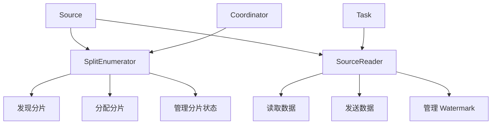
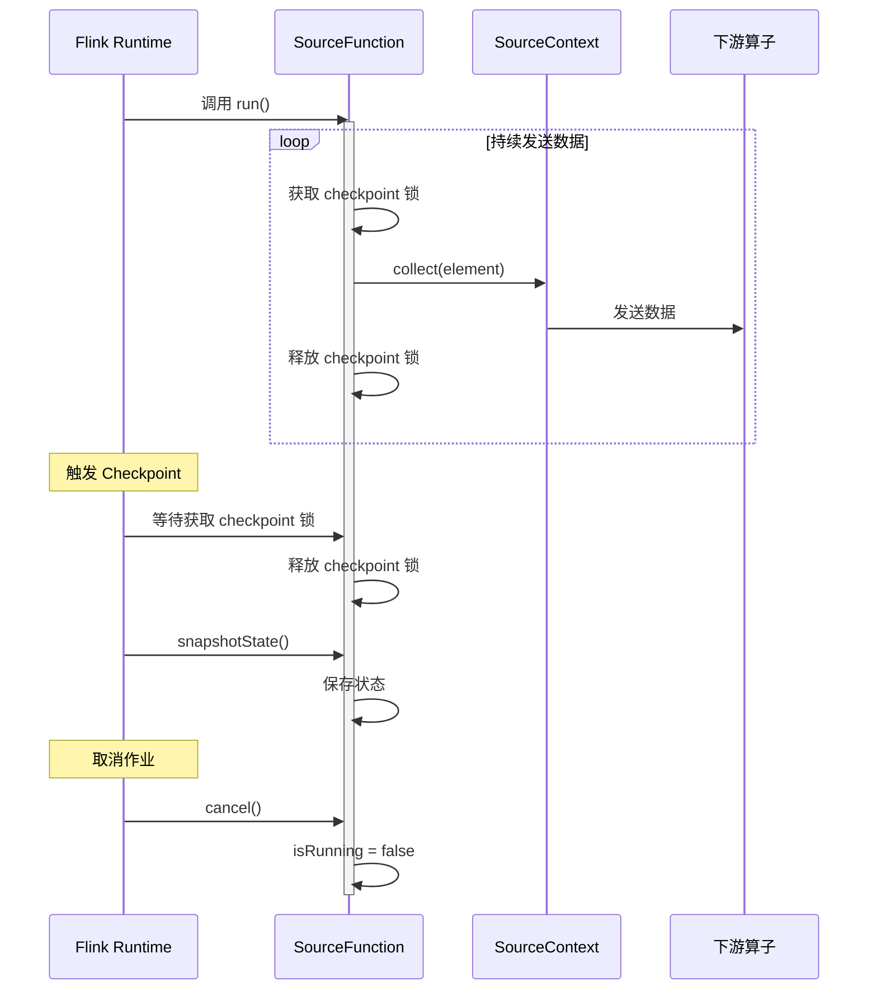
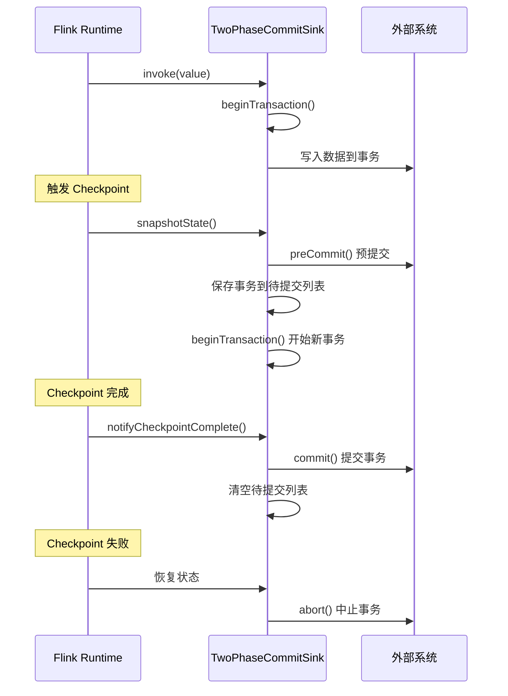

# Source 与 Sink 实现机制源码深度解析

## 一、机制概述

### 1.1 什么是 Source 和 Sink

**Source**：数据源，负责从外部系统读取数据并发送到 Flink 流处理管道。
**Sink**：数据汇，负责将 Flink 处理后的数据写入外部系统。

**核心职责**：
- **Source**：数据读取、分片管理、Watermark 生成、状态管理
- **Sink**：数据写入、事务管理、Exactly-Once 保证

### 1.2 API 演进

**旧版 API**（已废弃）：
- `SourceFunction`：简单但功能有限
- `SinkFunction`：基础的数据写入接口

**新版 API**：
- **FLIP-27 Source API**：统一的 Source 接口，支持批流一体
- **FLIP-143 Sink API**：新一代 Sink 接口，支持两阶段提交

## 二、核心类与接口

### 2.1 旧版 Source API

#### SourceFunction
- **路径**：`flink-streaming-java/src/main/java/org/apache/flink/streaming/api/functions/source/SourceFunction.java`
- **职责**：旧版数据源接口
- **核心方法**：
  - `run(SourceContext<T> ctx)`：启动数据源，持续发送数据
  - `cancel()`：取消数据源

```java
public interface SourceFunction<T> extends Function, Serializable {
    void run(SourceContext<T> ctx) throws Exception;
    void cancel();
    
    interface SourceContext<T> {
        void collect(T element);
        void collectWithTimestamp(T element, long timestamp);
        void emitWatermark(Watermark mark);
        Object getCheckpointLock();
    }
}
```

### 2.2 新版 Source API (FLIP-27)

#### Source
- **路径**：`flink-core/src/main/java/org/apache/flink/api/connector/source/Source.java`
- **职责**：新版数据源接口
- **核心组件**：
  - `SplitEnumerator`：分片枚举器，负责分片发现和分配
  - `SourceReader`：分片读取器，负责读取数据
  - `SourceSplit`：数据分片

```java
public interface Source<T, SplitT extends SourceSplit, EnumChkT> extends Serializable {
    Boundedness getBoundedness();
    
    SplitEnumerator<SplitT, EnumChkT> createEnumerator(
            SplitEnumeratorContext<SplitT> enumContext);
    
    SourceReader<T, SplitT> createReader(SourceReaderContext readerContext);
}
```

### 2.3 旧版 Sink API

#### SinkFunction
- **路径**：`flink-streaming-java/src/main/java/org/apache/flink/streaming/api/functions/sink/SinkFunction.java`
- **职责**：旧版数据汇接口
- **核心方法**：
  - `invoke(IN value, Context context)`：写入单条数据
  - `finish()`：结束时刷新缓冲数据

```java
public interface SinkFunction<IN> extends Function, Serializable {
    void invoke(IN value, Context context) throws Exception;
    void finish() throws Exception;
}
```

#### TwoPhaseCommitSinkFunction
- **路径**：`flink-streaming-java/src/main/java/org/apache/flink/streaming/api/functions/sink/TwoPhaseCommitSinkFunction.java`
- **职责**：两阶段提交 Sink，实现 Exactly-Once 语义
- **核心方法**：
  - `beginTransaction()`：开始事务
  - `preCommit(TXN transaction)`：预提交
  - `commit(TXN transaction)`：提交事务
  - `abort(TXN transaction)`：中止事务

### 2.4 新版 Sink API (FLIP-143)

#### Sink
- **路径**：`flink-core/src/main/java/org/apache/flink/api/connector/sink2/Sink.java`
- **职责**：新版数据汇接口
- **核心组件**：
  - `SinkWriter`：数据写入器
  - `Committer`：提交器（可选）
  - `GlobalCommitter`：全局提交器（可选）

## 三、源码深度分析

### 3.1 SourceFunction 实现示例

```java
public class ExampleCountSource implements SourceFunction<Long>, CheckpointedFunction {
    private long count = 0L;
    private volatile boolean isRunning = true;
    private transient ListState<Long> checkpointedCount;

    @Override
    public void run(SourceContext<Long> ctx) throws Exception {
        while (isRunning && count < 1000) {
            // 使用 checkpoint 锁保证原子性
            synchronized (ctx.getCheckpointLock()) {
                ctx.collect(count);
                count++;
            }
        }
    }

    @Override
    public void cancel() {
        isRunning = false;
    }

    @Override
    public void initializeState(FunctionInitializationContext context) {
        this.checkpointedCount = context
            .getOperatorStateStore()
            .getListState(new ListStateDescriptor<>("count", Long.class));

        if (context.isRestored()) {
            for (Long count : this.checkpointedCount.get()) {
                this.count += count;
            }
        }
    }

    @Override
    public void snapshotState(FunctionSnapshotContext context) {
        this.checkpointedCount.clear();
        this.checkpointedCount.add(count);
    }
}
```

**关键点**：
- 使用 `checkpoint 锁`保证状态更新和数据发送的原子性
- 实现 `CheckpointedFunction` 接口进行状态管理
- 使用 `volatile boolean` 标志位实现优雅停止

### 3.2 新版 Source API 架构



**SplitEnumerator 职责**：
- 发现数据分片（如 Kafka Partition、文件列表）
- 将分片分配给 SourceReader
- 处理 SourceReader 的分片请求
- 管理分片的 Checkpoint 状态

**SourceReader 职责**：
- 从分配的分片读取数据
- 发送数据到下游
- 生成和发送 Watermark
- 管理读取位置的 Checkpoint

### 3.3 TwoPhaseCommitSinkFunction 实现

```java
public abstract class TwoPhaseCommitSinkFunction<IN, TXN, CONTEXT>
        extends RichSinkFunction<IN> implements CheckpointedFunction, CheckpointListener {

    // 当前事务
    protected transient Optional<TXN> currentTransaction;
    
    // 待提交的事务
    protected transient List<TXN> pendingCommitTransactions;

    @Override
    public void invoke(IN value, Context context) throws Exception {
        // 确保有活跃事务
        if (!currentTransaction.isPresent()) {
            currentTransaction = Optional.of(beginTransaction());
        }
        
        // 写入数据到当前事务
        invoke(currentTransaction.get(), value, context);
    }

    @Override
    public void snapshotState(FunctionSnapshotContext context) throws Exception {
        // 预提交当前事务
        preCommit(currentTransaction.get());
        
        // 将事务加入待提交列表
        pendingCommitTransactions.add(currentTransaction.get());
        
        // 开始新事务
        currentTransaction = Optional.of(beginTransaction());
    }

    @Override
    public void notifyCheckpointComplete(long checkpointId) throws Exception {
        // Checkpoint 完成后，提交所有待提交的事务
        for (TXN transaction : pendingCommitTransactions) {
            commit(transaction);
        }
        pendingCommitTransactions.clear();
    }

    // 子类实现的抽象方法
    protected abstract TXN beginTransaction() throws Exception;
    protected abstract void invoke(TXN transaction, IN value, Context context) throws Exception;
    protected abstract void preCommit(TXN transaction) throws Exception;
    protected abstract void commit(TXN transaction);
    protected abstract void abort(TXN transaction);
}
```

**两阶段提交流程**：
1. **写入阶段**：数据写入当前事务
2. **预提交阶段**：Checkpoint 时预提交事务
3. **提交阶段**：Checkpoint 完成后提交事务
4. **中止阶段**：Checkpoint 失败时中止事务

## 四、执行流程图

### 4.1 SourceFunction 执行流程



### 4.2 TwoPhaseCommitSink 执行流程



## 五、面试高频问题

### Q1: SourceFunction 如何保证 Exactly-Once 语义？

**答案**：

SourceFunction 通过以下机制保证 Exactly-Once：

1. **Checkpoint 锁机制**：
```java
synchronized (ctx.getCheckpointLock()) {
    ctx.collect(element);
    offset++;
}
```
- 使用 checkpoint 锁保证状态更新和数据发送的原子性
- Checkpoint 时会获取该锁，确保状态一致性

2. **状态管理**：
- 实现 `CheckpointedFunction` 接口
- 在 `snapshotState()` 中保存读取位置（如 Kafka offset）
- 在 `initializeState()` 中恢复读取位置

3. **幂等性恢复**：
- 从 Checkpoint 恢复时，从保存的位置重新读取
- 可能会重复读取部分数据，但保证不丢失

**源码支撑**：
- [`SourceFunction`](file:///Users/wanghaofeng/IdeaProjects/flink/flink-streaming-java/src/main/java/org/apache/flink/streaming/api/functions/source/SourceFunction.java#L103)
- Checkpoint 锁机制确保原子性

### Q2: TwoPhaseCommitSinkFunction 如何实现 Exactly-Once？

**答案**：

TwoPhaseCommitSinkFunction 通过两阶段提交协议实现 Exactly-Once：

**阶段 1：预提交（Pre-Commit）**：
- Checkpoint 触发时调用 `preCommit()`
- 将当前事务标记为"准备提交"状态
- 事务数据已写入外部系统，但未最终提交

**阶段 2：提交（Commit）**：
- Checkpoint 完成后调用 `notifyCheckpointComplete()`
- 调用 `commit()` 最终提交事务
- 数据对外部系统可见

**失败处理**：
- Checkpoint 失败时调用 `abort()` 中止事务
- 从上一个成功的 Checkpoint 恢复
- 重新执行未提交的事务

**关键保证**：
- 每个 Checkpoint 对应一个事务
- 只有 Checkpoint 成功才提交事务
- 事务提交是幂等的（可重复提交）

**示例**：Kafka Sink
```java
// 预提交：刷新数据到 Kafka，但不提交 offset
preCommit() {
    producer.flush();
}

// 提交：提交 offset 到 Kafka
commit() {
    producer.commitTransaction();
}

// 中止：回滚事务
abort() {
    producer.abortTransaction();
}
```

### Q3: 新版 Source API (FLIP-27) 相比旧版有什么优势？

**答案**：

**1. 批流一体**：
- 旧版：`SourceFunction` 只支持流处理
- 新版：`Source` 支持批流一体，通过 `Boundedness` 区分

**2. 分片管理**：
- 旧版：分片逻辑耦合在 `SourceFunction` 中
- 新版：`SplitEnumerator` 独立管理分片，支持动态分片发现

**3. 并行度变化**：
- 旧版：并行度变化需要重新分配分片，逻辑复杂
- 新版：`SplitEnumerator` 自动处理分片重分配

**4. Watermark 生成**：
- 旧版：在 `SourceFunction` 中手动生成
- 新版：`SourceReader` 支持自动 Watermark 生成

**5. 状态管理**：
- 旧版：状态管理与数据读取耦合
- 新版：`SplitEnumerator` 和 `SourceReader` 分别管理状态

**架构对比**：

| 特性 | 旧版 SourceFunction | 新版 Source API |
|------|---------------------|-----------------|
| 批流支持 | 仅流 | 批流一体 |
| 分片管理 | 耦合 | 解耦（SplitEnumerator） |
| 并行度变化 | 复杂 | 自动处理 |
| Watermark | 手动 | 自动 |
| 状态管理 | 耦合 | 解耦 |

### Q4: Sink 如何处理反压？

**答案**：

Sink 处理反压的机制：

**1. 背压传播**：
- Sink 写入慢 → Buffer 不足 → 上游停止发送
- 反压自动从 Sink 传播到 Source

**2. 缓冲机制**：
- Sink 内部维护缓冲区
- 缓冲区满时阻塞接收数据
- 触发反压

**3. 异步写入**：
- 使用异步 I/O 减少阻塞
- 提高吞吐量，缓解反压

**4. 批量写入**：
- 批量写入外部系统
- 减少网络开销，提高效率

**示例**：Kafka Sink
```java
// 批量写入
List<ProducerRecord> buffer = new ArrayList<>();

@Override
public void invoke(IN value, Context context) {
    buffer.add(toProducerRecord(value));
    
    if (buffer.size() >= batchSize) {
        flush();
    }
}

private void flush() {
    for (ProducerRecord record : buffer) {
        producer.send(record);
    }
    buffer.clear();
}
```

**优化建议**：
- 增加 Sink 并行度
- 使用异步写入
- 批量写入
- 优化外部系统性能

### Q5: 如何实现自定义 Source？

**答案**：

**旧版 API（SourceFunction）**：

```java
public class CustomSource implements SourceFunction<String>, CheckpointedFunction {
    private volatile boolean isRunning = true;
    private long offset = 0;
    private transient ListState<Long> offsetState;

    @Override
    public void run(SourceContext<String> ctx) throws Exception {
        while (isRunning) {
            synchronized (ctx.getCheckpointLock()) {
                String data = readData(offset);
                ctx.collect(data);
                offset++;
            }
        }
    }

    @Override
    public void cancel() {
        isRunning = false;
    }

    @Override
    public void snapshotState(FunctionSnapshotContext context) {
        offsetState.clear();
        offsetState.add(offset);
    }

    @Override
    public void initializeState(FunctionInitializationContext context) {
        offsetState = context.getOperatorStateStore()
            .getListState(new ListStateDescriptor<>("offset", Long.class));
        
        if (context.isRestored()) {
            for (Long o : offsetState.get()) {
                offset = o;
            }
        }
    }
}
```

**新版 API（FLIP-27）**：

需要实现三个组件：

1. **Source**：
```java
public class CustomSource implements Source<String, CustomSplit, Long> {
    @Override
    public Boundedness getBoundedness() {
        return Boundedness.CONTINUOUS_UNBOUNDED;
    }

    @Override
    public SplitEnumerator<CustomSplit, Long> createEnumerator(
            SplitEnumeratorContext<CustomSplit> context) {
        return new CustomSplitEnumerator(context);
    }

    @Override
    public SourceReader<String, CustomSplit> createReader(
            SourceReaderContext context) {
        return new CustomSourceReader(context);
    }
}
```

2. **SplitEnumerator**：
```java
public class CustomSplitEnumerator implements SplitEnumerator<CustomSplit, Long> {
    @Override
    public void start() {
        // 发现分片
    }

    @Override
    public void handleSplitRequest(int subtaskId, String requesterHostname) {
        // 分配分片
    }

    @Override
    public void addSplitsBack(List<CustomSplit> splits, int subtaskId) {
        // 处理失败的分片
    }

    @Override
    public Long snapshotState(long checkpointId) {
        // 保存状态
        return currentOffset;
    }
}
```

3. **SourceReader**：
```java
public class CustomSourceReader implements SourceReader<String, CustomSplit> {
    @Override
    public void start() {
        // 初始化
    }

    @Override
    public InputStatus pollNext(ReaderOutput<String> output) {
        // 读取数据
        String data = readData();
        output.collect(data);
        return InputStatus.MORE_AVAILABLE;
    }

    @Override
    public List<CustomSplit> snapshotState(long checkpointId) {
        // 保存分片状态
        return currentSplits;
    }

    @Override
    public void addSplits(List<CustomSplit> splits) {
        // 接收分片
        currentSplits.addAll(splits);
    }
}
```

**关键点**：
- 实现 `CheckpointedFunction` 保证状态一致性
- 使用 checkpoint 锁保证原子性
- 正确处理取消和异常

## 六、最佳实践

### 6.1 Source 最佳实践

1. **使用 checkpoint 锁**：
```java
synchronized (ctx.getCheckpointLock()) {
    ctx.collect(element);
    updateState();
}
```

2. **实现优雅停止**：
```java
private volatile boolean isRunning = true;

@Override
public void cancel() {
    isRunning = false;
}
```

3. **状态管理**：
- 保存读取位置（offset、文件路径等）
- 恢复时从保存的位置继续读取

4. **异常处理**：
- 捕获并记录异常
- 根据异常类型决定是否重试

### 6.2 Sink 最佳实践

1. **批量写入**：
```java
List<Record> buffer = new ArrayList<>();

if (buffer.size() >= batchSize) {
    flush();
}
```

2. **异步写入**：
- 使用异步 I/O 提高吞吐量
- 注意处理异步异常

3. **幂等性**：
- 确保写入操作是幂等的
- 支持重复写入相同数据

4. **事务管理**：
- 使用 `TwoPhaseCommitSinkFunction` 实现 Exactly-Once
- 正确处理事务提交和回滚

### 6.3 常见陷阱

1. **忘记使用 checkpoint 锁**：
- 导致状态不一致
- 可能丢失或重复数据

2. **阻塞操作**：
- 在 checkpoint 锁内执行长时间操作
- 导致 Checkpoint 超时

3. **资源泄漏**：
- 未正确关闭外部连接
- 导致资源耗尽

4. **并发问题**：
- 多线程访问共享状态
- 导致数据不一致

---

**文档版本**：v1.0  
**基于 Flink 版本**：Apache Flink 主分支  
**最后更新**：2026-02-05
