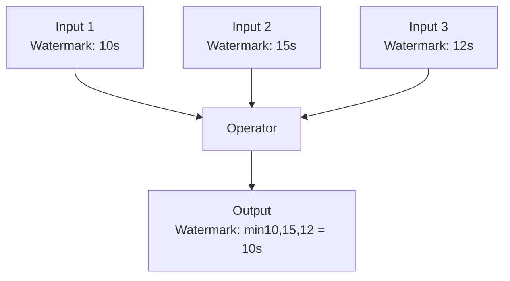
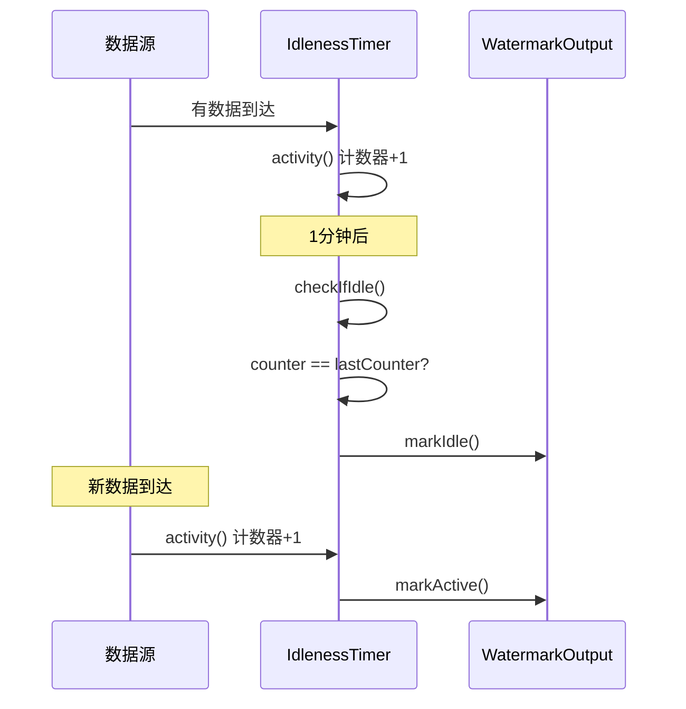
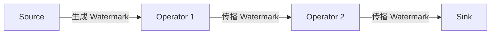
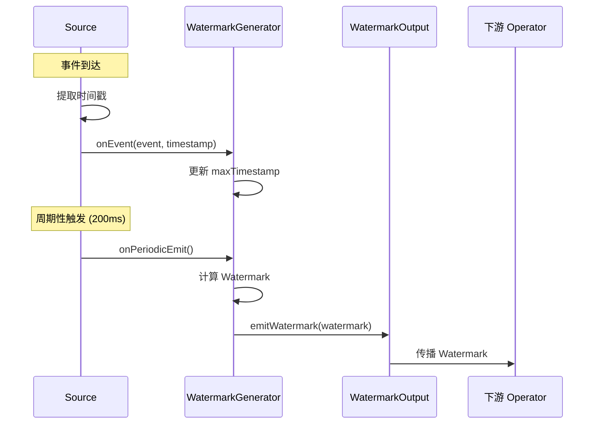
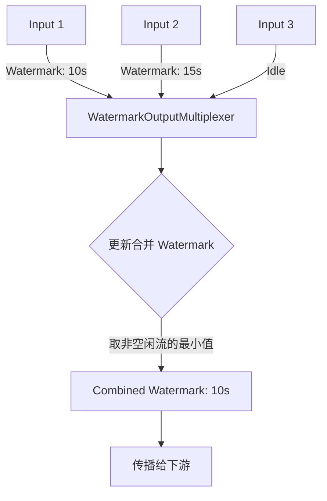
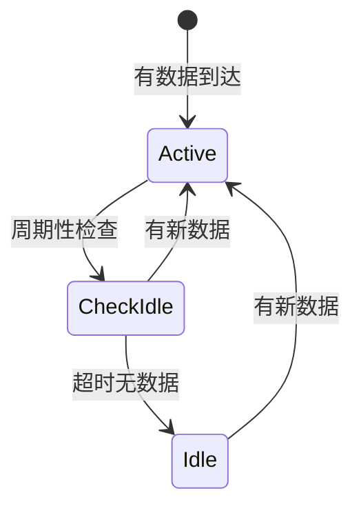
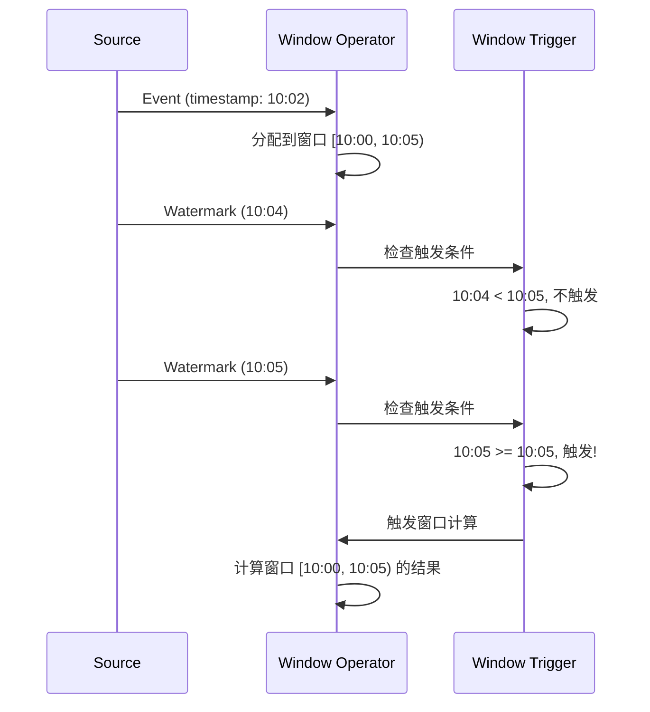

# Watermark 机制源码深度解析

## 一、机制概述

### 1.1 什么是 Watermark

**Watermark（水位线）** 是 Flink 中用于衡量事件时间（Event Time）进度的机制。Watermark 是一个时间戳 T，表示系统认为不会再有时间戳小于或等于 T 的事件到来。

**核心概念**：
- **Event Time**：事件实际发生的时间（嵌入在数据中）
- **Processing Time**：事件被处理的时间（系统时间）
- **Watermark**：事件时间的进度指示器

**Watermark 的作用**：
- **触发窗口计算**：当 Watermark 超过窗口结束时间时，触发窗口计算
- **处理乱序数据**：允许一定程度的数据乱序
- **标记数据完整性**：表示某个时间点之前的数据已经完整

### 1.2 为什么需要 Watermark

**解决的核心问题**：
- **数据乱序**：网络延迟、分布式系统导致数据到达顺序与事件发生顺序不一致
- **窗口触发时机**：如何判断窗口的数据已经收集完整
- **迟到数据处理**：如何识别和处理迟到的数据

**设计目标**：
- **准确性**：尽可能准确地反映事件时间进度
- **容错性**：允许一定程度的数据乱序
- **灵活性**：支持不同的 Watermark 生成策略

## 二、核心类与接口

### 2.1 Watermark 类

#### Watermark
- **路径**：`flink-core/src/main/java/org/apache/flink/api/common/eventtime/Watermark.java`
- **职责**：表示一个 Watermark，包含时间戳
- **核心字段**：
  - `timestamp`：Watermark 的时间戳（毫秒）
  - `MAX_WATERMARK`：表示事件时间结束的特殊 Watermark（`Long.MAX_VALUE`）

```java
public final class Watermark implements Serializable {
    /** The watermark that signifies end-of-event-time. */
    public static final Watermark MAX_WATERMARK = new Watermark(Long.MAX_VALUE);
    
    /** The timestamp of the watermark in milliseconds. */
    private final long timestamp;
    
    public Watermark(long timestamp) {
        this.timestamp = timestamp;
    }
    
    public long getTimestamp() {
        return timestamp;
    }
}
```

**关键点**：
- Watermark 时间戳 T 表示：不会再有时间戳 ≤ T 的事件到来
- 流的初始 Watermark 为 `Long.MIN_VALUE`
- 流结束时发送 `MAX_WATERMARK`

### 2.2 Watermark 生成

#### WatermarkStrategy
- **路径**：`flink-core/src/main/java/org/apache/flink/api/common/eventtime/WatermarkStrategy.java`
- **职责**：Watermark 策略的工厂接口
- **核心方法**：
  - `createWatermarkGenerator()`：创建 WatermarkGenerator
  - `createTimestampAssigner()`：创建 TimestampAssigner

```java
public interface WatermarkStrategy<T> 
        extends TimestampAssignerSupplier<T>, WatermarkGeneratorSupplier<T> {
    
    // 创建 Watermark 生成器
    WatermarkGenerator<T> createWatermarkGenerator(Context context);
    
    // 创建时间戳分配器
    default TimestampAssigner<T> createTimestampAssigner(Context context) {
        return new RecordTimestampAssigner<>();
    }
    
    // 内置策略：单调递增时间戳
    static <T> WatermarkStrategy<T> forMonotonousTimestamps() {
        return (ctx) -> new AscendingTimestampsWatermarks<>();
    }
    
    // 内置策略：有界乱序
    static <T> WatermarkStrategy<T> forBoundedOutOfOrderness(Duration maxOutOfOrderness) {
        return (ctx) -> new BoundedOutOfOrdernessWatermarks<>(maxOutOfOrderness);
    }
}
```

#### WatermarkGenerator
- **路径**：`flink-core/src/main/java/org/apache/flink/api/common/eventtime/WatermarkGenerator.java`
- **职责**：生成 Watermark 的核心接口
- **核心方法**：
  - `onEvent()`：每个事件到达时调用
  - `onPeriodicEmit()`：周期性调用，发送 Watermark

```java
public interface WatermarkGenerator<T> {
    /**
     * 每个事件到达时调用
     * 允许生成器检查事件时间戳，或基于事件立即发送 Watermark
     */
    void onEvent(T event, long eventTimestamp, WatermarkOutput output);
    
    /**
     * 周期性调用，可能发送新的 Watermark
     * 调用间隔由 ExecutionConfig.getAutoWatermarkInterval() 决定
     */
    void onPeriodicEmit(WatermarkOutput output);
}
```

### 2.3 内置 Watermark 生成器

#### BoundedOutOfOrdernessWatermarks
- **路径**：`flink-core/src/main/java/org/apache/flink/api/common/eventtime/BoundedOutOfOrdernessWatermarks.java`
- **职责**：有界乱序 Watermark 生成器
- **核心字段**：
  - `maxTimestamp`：目前遇到的最大时间戳
  - `outOfOrdernessMillis`：允许的最大乱序时间

```java
public class BoundedOutOfOrdernessWatermarks<T> implements WatermarkGenerator<T> {
    /** 目前遇到的最大时间戳 */
    private long maxTimestamp;
    
    /** 允许的最大乱序时间 */
    private final long outOfOrdernessMillis;
    
    public BoundedOutOfOrdernessWatermarks(Duration maxOutOfOrderness) {
        this.outOfOrdernessMillis = maxOutOfOrderness.toMillis();
        // 初始化为 Long.MIN_VALUE + outOfOrdernessMillis + 1
        this.maxTimestamp = Long.MIN_VALUE + outOfOrdernessMillis + 1;
    }
    
    @Override
    public void onEvent(T event, long eventTimestamp, WatermarkOutput output) {
        // 更新最大时间戳
        maxTimestamp = Math.max(maxTimestamp, eventTimestamp);
    }
    
    @Override
    public void onPeriodicEmit(WatermarkOutput output) {
        // 发送 Watermark = maxTimestamp - outOfOrdernessMillis - 1
        output.emitWatermark(new Watermark(maxTimestamp - outOfOrdernessMillis - 1));
    }
}
```

**Watermark 计算公式**：
```
Watermark = maxTimestamp - maxOutOfOrderness - 1
```

**示例**：
- 如果 `maxOutOfOrderness = 5秒`
- 当前最大时间戳 `maxTimestamp = 100秒`
- 则 Watermark = 100 - 5 - 1 = 94秒
- 表示：不会再有时间戳 ≤ 94秒 的事件到来

### 2.4 Watermark 传播

#### WatermarkOutputMultiplexer
- **路径**：`flink-core/src/main/java/org/apache/flink/api/common/eventtime/WatermarkOutputMultiplexer.java`
- **职责**：合并多个分片/分区的 Watermark
- **核心功能**：
  - 管理多个输入的 Watermark
  - 计算合并后的 Watermark（取最小值）
  - 处理空闲检测

```java
public class WatermarkOutputMultiplexer {
    /** 底层的 WatermarkOutput */
    private final WatermarkOutput underlyingOutput;
    
    /** 每个输出的 Watermark 状态 */
    private final Map<String, PartialWatermark> watermarkPerOutputId;
    
    /** 合并后的 Watermark 状态 */
    private final CombinedWatermarkStatus combinedWatermarkStatus;
    
    /** 更新合并后的 Watermark */
    private void updateCombinedWatermark() {
        if (combinedWatermarkStatus.updateCombinedWatermark()) {
            underlyingOutput.emitWatermark(
                new Watermark(combinedWatermarkStatus.getCombinedWatermark()));
        } else if (combinedWatermarkStatus.isIdle()) {
            underlyingOutput.markIdle();
        }
    }
}
```

#### CombinedWatermarkStatus
- **路径**：`flink-core/src/main/java/org/apache/flink/api/common/eventtime/CombinedWatermarkStatus.java`
- **职责**：计算合并后的 Watermark
- **核心逻辑**：取所有非空闲分片的最小 Watermark

```java
final class CombinedWatermarkStatus {
    /** 所有分片的 Watermark */
    private final List<PartialWatermark> partialWatermarks = new ArrayList<>();
    
    /** 合并后的 Watermark */
    private long combinedWatermark = Long.MIN_VALUE;
    
    /** 是否所有分片都空闲 */
    private boolean idle = false;
    
    public boolean updateCombinedWatermark() {
        long minimumOverAllOutputs = Long.MAX_VALUE;
        boolean allIdle = true;
        
        // 遍历所有分片
        for (PartialWatermark partialWatermark : partialWatermarks) {
            if (!partialWatermark.isIdle()) {
                // 取最小值
                minimumOverAllOutputs = 
                    Math.min(minimumOverAllOutputs, partialWatermark.getWatermark());
                allIdle = false;
            }
        }
        
        this.idle = allIdle;
        
        // 如果有非空闲分片且 Watermark 增大，则更新
        if (!allIdle && minimumOverAllOutputs > combinedWatermark) {
            combinedWatermark = minimumOverAllOutputs;
            return true;
        }
        
        return false;
    }
}
```

**合并规则**：
- **取最小值**：合并后的 Watermark = min(所有非空闲分片的 Watermark)
- **空闲处理**：如果所有分片都空闲，则标记为空闲
- **单调递增**：合并后的 Watermark 只能递增，不能回退

### 2.5 空闲检测

#### WatermarksWithIdleness
- **路径**：`flink-core/src/main/java/org/apache/flink/api/common/eventtime/WatermarksWithIdleness.java`
- **职责**：为 WatermarkGenerator 添加空闲检测
- **核心功能**：
  - 检测数据源是否空闲
  - 空闲时标记为 idle
  - 避免空闲分片阻塞 Watermark 进度

```java
public class WatermarksWithIdleness<T> implements WatermarkGenerator<T> {
    private final WatermarkGenerator<T> watermarks;
    private final IdlenessTimer idlenessTimer;
    private boolean isIdleNow = false;
    
    @Override
    public void onEvent(T event, long eventTimestamp, WatermarkOutput output) {
        watermarks.onEvent(event, eventTimestamp, output);
        idlenessTimer.activity();  // 记录活动
        isIdleNow = false;
    }
    
    @Override
    public void onPeriodicEmit(WatermarkOutput output) {
        if (idlenessTimer.checkIfIdle()) {
            if (!isIdleNow) {
                output.markIdle();  // 标记为空闲
                isIdleNow = true;
            }
        } else {
            watermarks.onPeriodicEmit(output);
        }
    }
}
```

**IdlenessTimer 实现**：
```java
static final class IdlenessTimer {
    private final Clock clock;
    private long counter;  // 活动计数器
    private long lastCounter;  // 上次检查时的计数器
    private long startOfInactivityNanos;  // 开始不活跃的时间
    private final long maxIdleTimeNanos;  // 最大空闲时间
    
    public void activity() {
        counter++;  // 每次有事件时递增
    }
    
    public boolean checkIfIdle() {
        if (counter != lastCounter) {
            // 有活动，重置计时器
            lastCounter = counter;
            startOfInactivityNanos = 0L;
            return false;
        } else if (startOfInactivityNanos == 0L) {
            // 第一次检测到无活动，开始计时
            startOfInactivityNanos = clock.relativeTimeNanos();
            return false;
        } else {
            // 检查是否超过空闲超时时间
            return clock.relativeTimeNanos() - startOfInactivityNanos > maxIdleTimeNanos;
        }
    }
}
```

## 三、源码深度分析

### 3.1 Watermark 生成策略

#### 3.1.1 单调递增时间戳

**适用场景**：时间戳严格递增的数据流（如日志文件按时间顺序读取）

```java
public class AscendingTimestampsWatermarks<T> implements WatermarkGenerator<T> {
    private long currentMaxTimestamp = Long.MIN_VALUE;
    
    @Override
    public void onEvent(T event, long eventTimestamp, WatermarkOutput output) {
        currentMaxTimestamp = Math.max(currentMaxTimestamp, eventTimestamp);
    }
    
    @Override
    public void onPeriodicEmit(WatermarkOutput output) {
        // Watermark = 当前最大时间戳 - 1
        output.emitWatermark(new Watermark(currentMaxTimestamp - 1));
    }
}
```

**特点**：
- Watermark 紧跟最大时间戳
- 延迟最小
- 不允许乱序

#### 3.1.2 有界乱序

**适用场景**：数据有一定乱序，但乱序程度有上界

**示例**：
```java
// 允许最多 5 秒的乱序
WatermarkStrategy<Event> strategy = WatermarkStrategy
    .<Event>forBoundedOutOfOrderness(Duration.ofSeconds(5))
    .withTimestampAssigner((event, timestamp) -> event.getTimestamp());
```

**工作原理**：
```
时间线：
事件到达: 10s, 12s, 8s, 15s, 9s, 20s
最大时间戳: 10s, 12s, 12s, 15s, 15s, 20s
Watermark (延迟5s): 4s, 6s, 6s, 9s, 9s, 14s

窗口 [0s-10s]:
- Watermark 达到 9s 时，窗口还未触发
- Watermark 达到 14s 时，窗口触发（包含 8s, 9s, 10s 的事件）
```

### 3.2 多流 Watermark 对齐

#### 3.2.1 合并规则

当一个算子有多个输入流时，Watermark 的合并规则：



**源码实现**：
```java
// CombinedWatermarkStatus.updateCombinedWatermark()
long minimumOverAllOutputs = Long.MAX_VALUE;
for (PartialWatermark partialWatermark : partialWatermarks) {
    if (!partialWatermark.isIdle()) {
        minimumOverAllOutputs = 
            Math.min(minimumOverAllOutputs, partialWatermark.getWatermark());
    }
}
```

**关键点**：
- **取最小值**：确保所有输入流的数据都已处理到该时间点
- **忽略空闲流**：空闲流不参与 Watermark 计算
- **单调递增**：合并后的 Watermark 只能前进，不能后退

#### 3.2.2 空闲流处理

**问题**：如果某个分片长时间没有数据，会阻塞整体 Watermark 进度

**解决方案**：空闲检测

```java
WatermarkStrategy<Event> strategy = WatermarkStrategy
    .<Event>forBoundedOutOfOrderness(Duration.ofSeconds(5))
    .withIdleness(Duration.ofMinutes(1));  // 1分钟无数据则标记为空闲
```

**工作流程**：


### 3.3 Watermark 传播机制

#### 3.3.1 Source 到 Operator



**传播规则**：
1. **Source 生成**：根据 WatermarkStrategy 生成 Watermark
2. **Operator 传播**：接收上游 Watermark，处理后传播给下游
3. **合并处理**：多输入算子取最小 Watermark

#### 3.3.2 周期性发送

```java
// 配置 Watermark 发送间隔
env.getConfig().setAutoWatermarkInterval(200);  // 200ms
```

**发送机制**：
- 每隔固定时间（默认 200ms）调用 `onPeriodicEmit()`
- 生成器决定是否发送新的 Watermark
- 只有 Watermark 增大时才会发送

## 四、执行流程图

### 4.1 Watermark 生成流程



### 4.2 多流 Watermark 合并流程



### 4.3 空闲检测流程



## 五、面试高频问题

### Q1: Watermark 是什么？有什么作用？

**答案**：

Watermark 是 Flink 中用于衡量事件时间进度的机制。它是一个时间戳 T，表示系统认为不会再有时间戳小于或等于 T 的事件到来。

**主要作用**：

1. **触发窗口计算**：
   - 当 Watermark 超过窗口结束时间时，触发窗口计算
   - 例如：窗口 [10:00, 10:05)，当 Watermark ≥ 10:05 时触发

2. **处理乱序数据**：
   - 允许一定程度的数据乱序
   - 通过设置延迟时间（如 5 秒），容忍 5 秒内的乱序

3. **标记数据完整性**：
   - Watermark T 表示时间戳 ≤ T 的数据已经完整
   - 帮助系统判断何时可以安全地处理数据

**源码支撑**：
- [`Watermark`](file:///Users/wanghaofeng/IdeaProjects/flink/flink-core/src/main/java/org/apache/flink/api/common/eventtime/Watermark.java#L46)：Watermark 类定义
- Watermark 时间戳表示不会再有更早的事件

### Q2: Watermark 如何生成？有哪些生成策略？

**答案**：

Watermark 通过 `WatermarkGenerator` 生成，有两种生成方式：

**1. 周期性生成（Periodic）**：
- 每隔固定时间（默认 200ms）调用 `onPeriodicEmit()`
- 适用于大多数场景

**2. 基于事件生成（Punctuated）**：
- 每个事件到达时在 `onEvent()` 中立即生成
- 适用于事件中包含 Watermark 信息的场景

**内置生成策略**：

**策略 1：单调递增时间戳**
```java
WatermarkStrategy.forMonotonousTimestamps()
```
- 适用场景：时间戳严格递增
- Watermark = maxTimestamp - 1
- 延迟最小，不允许乱序

**策略 2：有界乱序**
```java
WatermarkStrategy.forBoundedOutOfOrderness(Duration.ofSeconds(5))
```
- 适用场景：数据有一定乱序，但乱序程度有上界
- Watermark = maxTimestamp - maxOutOfOrderness - 1
- 允许 5 秒内的乱序

**源码实现**：
```java
// BoundedOutOfOrdernessWatermarks.java
@Override
public void onEvent(T event, long eventTimestamp, WatermarkOutput output) {
    maxTimestamp = Math.max(maxTimestamp, eventTimestamp);
}

@Override
public void onPeriodicEmit(WatermarkOutput output) {
    output.emitWatermark(new Watermark(maxTimestamp - outOfOrdernessMillis - 1));
}
```

### Q3: 多个输入流的 Watermark 如何合并？

**答案**：

当一个算子有多个输入流时，Watermark 的合并规则是：**取所有非空闲输入流的最小 Watermark**。

**合并规则**：
```
combinedWatermark = min(watermark1, watermark2, ..., watermarkN)
```

**原因**：
- 确保所有输入流的数据都已处理到该时间点
- 避免丢失某个输入流的数据

**示例**：
```
Input 1: Watermark = 10s
Input 2: Watermark = 15s
Input 3: Watermark = 12s

Combined Watermark = min(10s, 15s, 12s) = 10s
```

**源码实现**：
```java
// CombinedWatermarkStatus.updateCombinedWatermark()
long minimumOverAllOutputs = Long.MAX_VALUE;
boolean allIdle = true;

for (PartialWatermark partialWatermark : partialWatermarks) {
    if (!partialWatermark.isIdle()) {
        minimumOverAllOutputs = 
            Math.min(minimumOverAllOutputs, partialWatermark.getWatermark());
        allIdle = false;
    }
}

if (!allIdle && minimumOverAllOutputs > combinedWatermark) {
    combinedWatermark = minimumOverAllOutputs;
    return true;
}
```

**空闲流处理**：
- 空闲流不参与 Watermark 计算
- 避免空闲流阻塞整体进度

**源码支撑**：
- [`CombinedWatermarkStatus`](file:///Users/wanghaofeng/IdeaProjects/flink/flink-core/src/main/java/org/apache/flink/api/common/eventtime/CombinedWatermarkStatus.java#L33)

### Q4: 什么是空闲源（Idle Source）？如何处理？

**答案**：

**空闲源**：长时间没有数据到达的数据源或分片。

**问题**：
- 空闲源的 Watermark 不会更新
- 会阻塞下游算子的 Watermark 进度
- 导致窗口无法触发

**解决方案**：空闲检测

**配置方式**：
```java
WatermarkStrategy<Event> strategy = WatermarkStrategy
    .<Event>forBoundedOutOfOrderness(Duration.ofSeconds(5))
    .withIdleness(Duration.ofMinutes(1));  // 1分钟无数据则标记为空闲
```

**工作原理**：
1. **活动检测**：每次有事件到达时，记录活动
2. **周期性检查**：定期检查是否有活动
3. **标记空闲**：超过超时时间无活动，标记为空闲
4. **恢复活跃**：新数据到达时，恢复为活跃状态

**源码实现**：
```java
// WatermarksWithIdleness.java
@Override
public void onEvent(T event, long eventTimestamp, WatermarkOutput output) {
    watermarks.onEvent(event, eventTimestamp, output);
    idlenessTimer.activity();  // 记录活动
    isIdleNow = false;
}

@Override
public void onPeriodicEmit(WatermarkOutput output) {
    if (idlenessTimer.checkIfIdle()) {
        if (!isIdleNow) {
            output.markIdle();  // 标记为空闲
            isIdleNow = true;
        }
    } else {
        watermarks.onPeriodicEmit(output);
    }
}
```

**空闲检测逻辑**：
```java
// IdlenessTimer.checkIfIdle()
if (counter != lastCounter) {
    // 有活动，重置计时器
    lastCounter = counter;
    startOfInactivityNanos = 0L;
    return false;
} else if (startOfInactivityNanos == 0L) {
    // 第一次检测到无活动，开始计时
    startOfInactivityNanos = clock.relativeTimeNanos();
    return false;
} else {
    // 检查是否超过空闲超时时间
    return clock.relativeTimeNanos() - startOfInactivityNanos > maxIdleTimeNanos;
}
```

**源码支撑**：
- [`WatermarksWithIdleness`](file:///Users/wanghaofeng/IdeaProjects/flink/flink-core/src/main/java/org/apache/flink/api/common/eventtime/WatermarksWithIdleness.java#L37)

### Q5: Watermark 和窗口的关系是什么？

**答案**：

Watermark 决定窗口何时触发计算。

**触发规则**：
```
当 Watermark >= 窗口结束时间 时，触发窗口计算
```

**示例**：
```java
// 5 分钟滚动窗口
stream.keyBy(...)
      .window(TumblingEventTimeWindows.of(Time.minutes(5)))
      .process(...);

// 窗口 [10:00, 10:05)
// 当 Watermark >= 10:05:00 时，触发窗口计算
```

**完整流程**：


**迟到数据处理**：
```java
stream.keyBy(...)
      .window(TumblingEventTimeWindows.of(Time.minutes(5)))
      .allowedLateness(Time.minutes(1))  // 允许 1 分钟迟到
      .sideOutputLateData(lateOutputTag)  // 迟到数据输出到侧输出流
      .process(...);
```

**处理策略**：
- **允许迟到**：窗口触发后，仍接受一定时间内的迟到数据，重新计算
- **侧输出流**：超过允许迟到时间的数据，输出到侧输出流
- **丢弃**：直接丢弃迟到数据

## 六、最佳实践

### 6.1 选择合适的 Watermark 策略

**场景 1：时间戳严格递增**
```java
WatermarkStrategy.forMonotonousTimestamps()
```
- 适用：日志文件按时间顺序读取
- 优点：延迟最小
- 缺点：不允许乱序

**场景 2：有界乱序**
```java
WatermarkStrategy.forBoundedOutOfOrderness(Duration.ofSeconds(5))
```
- 适用：大多数实时数据流
- 优点：容忍一定乱序
- 缺点：增加延迟

**场景 3：无 Watermark**
```java
WatermarkStrategy.noWatermarks()
```
- 适用：纯 Processing Time 处理
- 优点：无延迟
- 缺点：无法使用 Event Time 窗口

### 6.2 配置空闲检测

```java
WatermarkStrategy<Event> strategy = WatermarkStrategy
    .<Event>forBoundedOutOfOrderness(Duration.ofSeconds(5))
    .withIdleness(Duration.ofMinutes(1));
```

**建议**：
- 对于有多个分片的数据源（如 Kafka），建议配置空闲检测
- 超时时间根据业务特点设置（通常 1-5 分钟）

### 6.3 调整 Watermark 发送间隔

```java
env.getConfig().setAutoWatermarkInterval(200);  // 200ms
```

**建议**：
- 默认 200ms 适用于大多数场景
- 低延迟场景可以减小间隔（如 100ms）
- 高吞吐场景可以增大间隔（如 500ms）

### 6.4 常见陷阱

**陷阱 1：乱序时间设置过小**
- 问题：大量数据被判定为迟到
- 解决：根据实际数据乱序程度设置

**陷阱 2：忘记配置空闲检测**
- 问题：空闲分片阻塞 Watermark 进度
- 解决：为多分片数据源配置空闲检测

**陷阱 3：Watermark 间隔过小**
- 问题：频繁发送 Watermark，影响性能
- 解决：根据延迟要求合理设置间隔

---

**文档版本**：v1.0  
**基于 Flink 版本**：Apache Flink 主分支  
**最后更新**：2026-02-05
