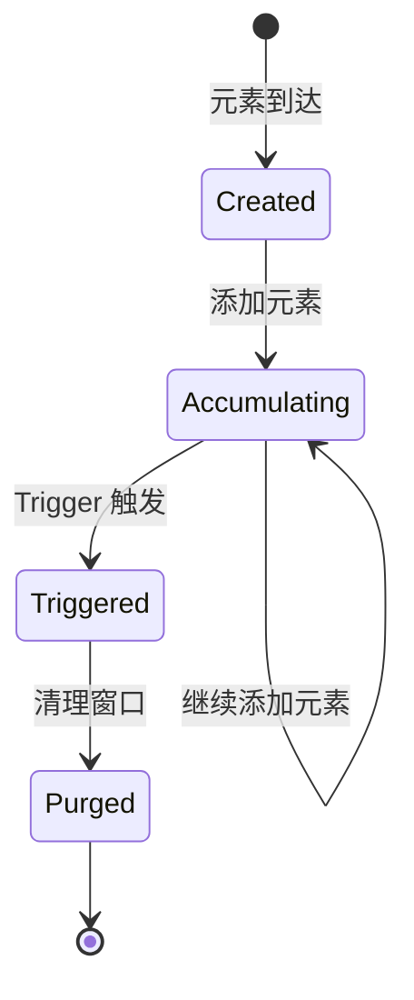
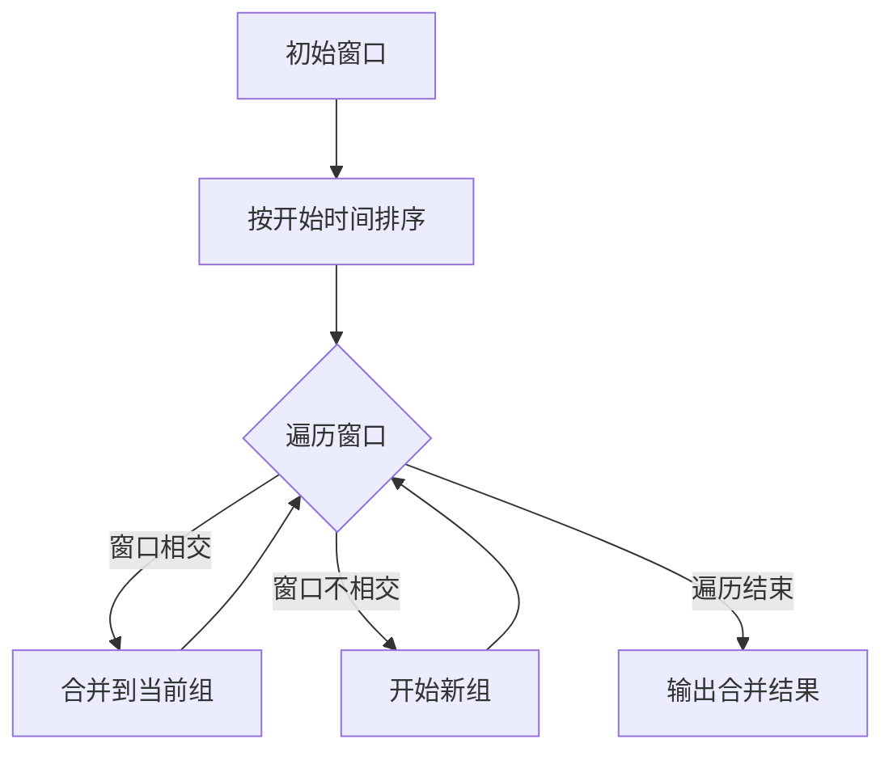
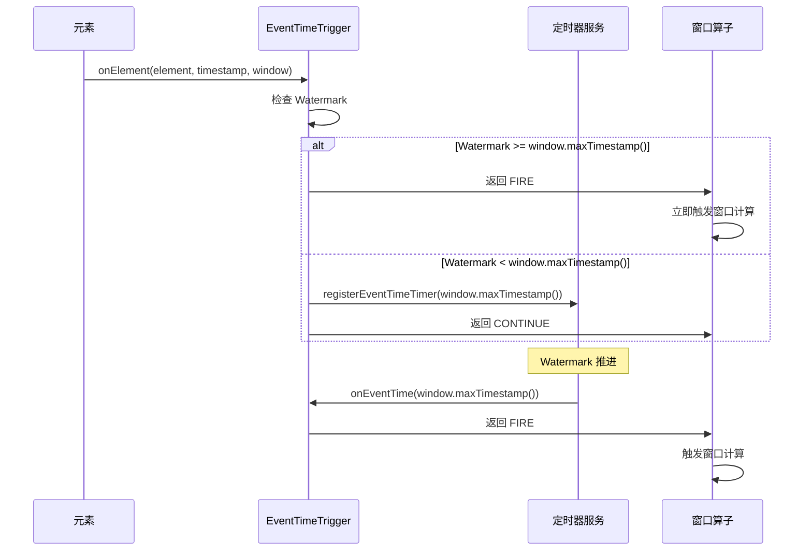
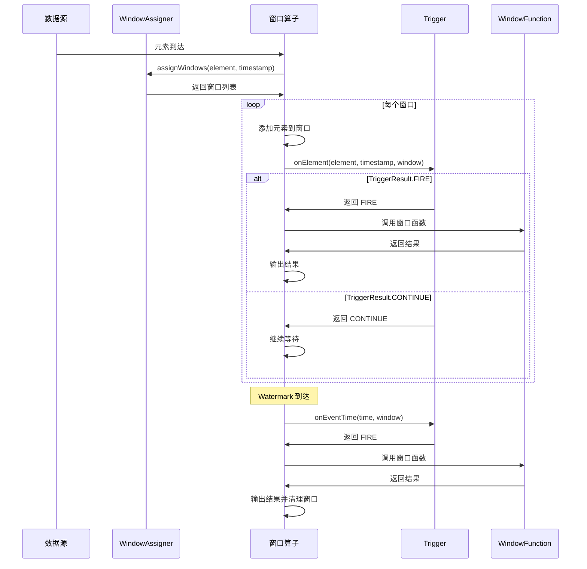
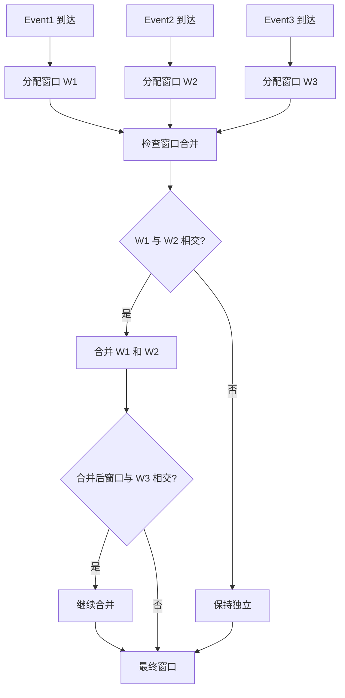
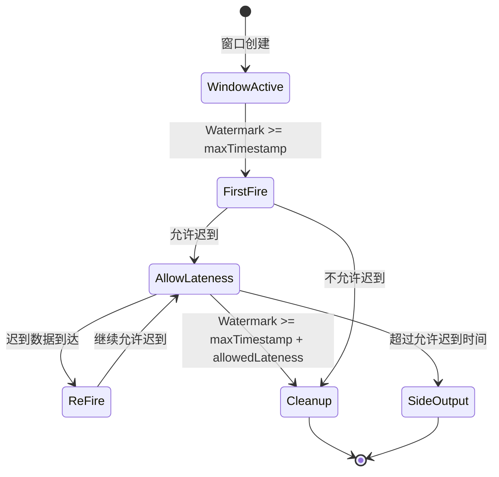

# 窗口机制源码深度解析

## 一、机制概述

### 1.1 什么是窗口

**窗口（Window）** 是 Flink 中将无界流切分成有界数据集的机制。窗口将元素分组到有限的桶（bucket）中，每个窗口都有一个最大时间戳，表示在某个时间点，所有属于该窗口的元素都已到达。

**核心概念**：
- **Window**：将流数据分组的逻辑单元
- **WindowAssigner**：决定元素分配到哪些窗口
- **Trigger**：决定何时触发窗口计算
- **Evictor**：决定窗口中保留哪些元素（可选）
- **WindowFunction**：窗口计算逻辑

### 1.2 窗口的分类

**按时间特性分类**：
- **Event Time Window**：基于事件时间
- **Processing Time Window**：基于处理时间

**按窗口行为分类**：
- **Tumbling Window（滚动窗口）**：固定大小，不重叠
- **Sliding Window（滑动窗口）**：固定大小，可重叠
- **Session Window（会话窗口）**：动态大小，基于活动间隔
- **Global Window（全局窗口）**：所有元素在同一个窗口

### 1.3 窗口的生命周期



## 二、核心类与接口

### 2.1 Window 抽象

#### Window
- **路径**：`flink-streaming-java/src/main/java/org/apache/flink/streaming/api/windowing/windows/Window.java`
- **职责**：窗口的抽象基类
- **核心方法**：
  - `maxTimestamp()`：返回窗口的最大时间戳

```java
public abstract class Window {
    /**
     * 获取仍属于此窗口的最大时间戳
     * @return 窗口的最大时间戳
     */
    public abstract long maxTimestamp();
}
```

#### TimeWindow
- **路径**：`flink-streaming-java/src/main/java/org/apache/flink/streaming/api/windowing/windows/TimeWindow.java`
- **职责**：基于时间的窗口实现
- **核心字段**：
  - `start`：窗口开始时间（包含）
  - `end`：窗口结束时间（不包含）

```java
public class TimeWindow extends Window {
    private final long start;
    private final long end;
    
    public TimeWindow(long start, long end) {
        this.start = start;
        this.end = end;
    }
    
    public long getStart() {
        return start;
    }
    
    public long getEnd() {
        return end;
    }
    
    @Override
    public long maxTimestamp() {
        return end - 1;  // 最大时间戳 = end - 1
    }
    
    /**
     * 判断两个窗口是否相交
     */
    public boolean intersects(TimeWindow other) {
        return this.start <= other.end && this.end >= other.start;
    }
    
    /**
     * 合并两个窗口，返回覆盖两者的最小窗口
     */
    public TimeWindow cover(TimeWindow other) {
        return new TimeWindow(
            Math.min(start, other.start), 
            Math.max(end, other.end)
        );
    }
}
```

**关键点**：
- 窗口区间：`[start, end)`，左闭右开
- `maxTimestamp() = end - 1`：窗口的最大时间戳是 end - 1
- 窗口触发条件：`Watermark >= end`

### 2.2 WindowAssigner

#### WindowAssigner
- **路径**：`flink-streaming-java/src/main/java/org/apache/flink/streaming/api/windowing/assigners/WindowAssigner.java`
- **职责**：将元素分配到一个或多个窗口
- **核心方法**：
  - `assignWindows()`：为元素分配窗口
  - `getDefaultTrigger()`：获取默认 Trigger
  - `isEventTime()`：是否基于事件时间

```java
public abstract class WindowAssigner<T, W extends Window> implements Serializable {
    /**
     * 为元素分配窗口
     * @param element 元素
     * @param timestamp 元素时间戳
     * @param context 上下文
     * @return 元素所属的窗口集合
     */
    public abstract Collection<W> assignWindows(
        T element, long timestamp, WindowAssignerContext context);
    
    /**
     * 获取默认 Trigger
     */
    public abstract Trigger<T, W> getDefaultTrigger(StreamExecutionEnvironment env);
    
    /**
     * 获取窗口序列化器
     */
    public abstract TypeSerializer<W> getWindowSerializer(ExecutionConfig executionConfig);
    
    /**
     * 是否基于事件时间
     */
    public abstract boolean isEventTime();
}
```

### 2.3 内置 WindowAssigner

#### 2.3.1 TumblingEventTimeWindows（滚动窗口）

**特点**：
- 固定大小
- 窗口不重叠
- 每个元素只属于一个窗口

```java
public class TumblingEventTimeWindows extends WindowAssigner<Object, TimeWindow> {
    private final long size;  // 窗口大小
    private final long globalOffset;  // 全局偏移量
    
    @Override
    public Collection<TimeWindow> assignWindows(
            Object element, long timestamp, WindowAssignerContext context) {
        if (timestamp > Long.MIN_VALUE) {
            // 计算窗口开始时间
            long start = TimeWindow.getWindowStartWithOffset(
                timestamp, globalOffset, size);
            return Collections.singletonList(new TimeWindow(start, start + size));
        } else {
            throw new RuntimeException("Record has Long.MIN_VALUE timestamp");
        }
    }
    
    @Override
    public Trigger<Object, TimeWindow> getDefaultTrigger(StreamExecutionEnvironment env) {
        return EventTimeTrigger.create();
    }
}
```

**窗口计算公式**：
```java
// TimeWindow.getWindowStartWithOffset()
public static long getWindowStartWithOffset(long timestamp, long offset, long windowSize) {
    final long remainder = (timestamp - offset) % windowSize;
    if (remainder < 0) {
        return timestamp - (remainder + windowSize);
    } else {
        return timestamp - remainder;
    }
}
```

**示例**：
```java
// 5 分钟滚动窗口
TumblingEventTimeWindows.of(Time.minutes(5))

// 时间戳 10:02:30 的元素
// windowSize = 5分钟 = 300秒
// start = 10:00:00, end = 10:05:00
// 窗口: [10:00:00, 10:05:00)
```

#### 2.3.2 SlidingEventTimeWindows（滑动窗口）

**特点**：
- 固定大小
- 窗口可重叠
- 每个元素可能属于多个窗口

```java
public class SlidingEventTimeWindows extends WindowAssigner<Object, TimeWindow> {
    private final long size;   // 窗口大小
    private final long slide;  // 滑动步长
    private final long offset; // 偏移量
    
    @Override
    public Collection<TimeWindow> assignWindows(
            Object element, long timestamp, WindowAssignerContext context) {
        if (timestamp > Long.MIN_VALUE) {
            List<TimeWindow> windows = new ArrayList<>((int) (size / slide));
            long lastStart = TimeWindow.getWindowStartWithOffset(timestamp, offset, slide);
            
            // 计算元素所属的所有窗口
            for (long start = lastStart; start > timestamp - size; start -= slide) {
                windows.add(new TimeWindow(start, start + size));
            }
            return windows;
        } else {
            throw new RuntimeException("Record has Long.MIN_VALUE timestamp");
        }
    }
}
```

**示例**：
```java
// 窗口大小 10 分钟，滑动步长 5 分钟
SlidingEventTimeWindows.of(Time.minutes(10), Time.minutes(5))

// 时间戳 10:07:00 的元素属于以下窗口：
// [10:05:00, 10:15:00)
// [10:00:00, 10:10:00)
```

**窗口数量计算**：
```
窗口数量 = ceil(size / slide)
```

#### 2.3.3 EventTimeSessionWindows（会话窗口）

**特点**：
- 动态大小
- 基于活动间隔（gap）
- 需要窗口合并

```java
public class EventTimeSessionWindows extends MergingWindowAssigner<Object, TimeWindow> {
    protected long sessionTimeout;  // 会话超时时间
    
    @Override
    public Collection<TimeWindow> assignWindows(
            Object element, long timestamp, WindowAssignerContext context) {
        // 每个元素初始分配到一个窗口：[timestamp, timestamp + sessionTimeout)
        return Collections.singletonList(
            new TimeWindow(timestamp, timestamp + sessionTimeout));
    }
    
    @Override
    public void mergeWindows(
            Collection<TimeWindow> windows, MergeCallback<TimeWindow> c) {
        // 合并重叠的窗口
        TimeWindow.mergeWindows(windows, c);
    }
}
```

**合并逻辑**：
```java
// TimeWindow.mergeWindows()
public static void mergeWindows(
        Collection<TimeWindow> windows, MergeCallback<TimeWindow> c) {
    // 1. 按开始时间排序
    List<TimeWindow> sortedWindows = new ArrayList<>(windows);
    Collections.sort(sortedWindows, 
        (o1, o2) -> Long.compare(o1.getStart(), o2.getStart()));
    
    // 2. 合并重叠窗口
    List<Tuple2<TimeWindow, Set<TimeWindow>>> merged = new ArrayList<>();
    Tuple2<TimeWindow, Set<TimeWindow>> currentMerge = null;
    
    for (TimeWindow candidate : sortedWindows) {
        if (currentMerge == null) {
            currentMerge = new Tuple2<>();
            currentMerge.f0 = candidate;
            currentMerge.f1 = new HashSet<>();
            currentMerge.f1.add(candidate);
        } else if (currentMerge.f0.intersects(candidate)) {
            // 窗口相交，合并
            currentMerge.f0 = currentMerge.f0.cover(candidate);
            currentMerge.f1.add(candidate);
        } else {
            // 窗口不相交，开始新的合并组
            merged.add(currentMerge);
            currentMerge = new Tuple2<>();
            currentMerge.f0 = candidate;
            currentMerge.f1 = new HashSet<>();
            currentMerge.f1.add(candidate);
        }
    }
    
    if (currentMerge != null) {
        merged.add(currentMerge);
    }
    
    // 3. 回调合并结果
    for (Tuple2<TimeWindow, Set<TimeWindow>> m : merged) {
        if (m.f1.size() > 1) {
            c.merge(m.f1, m.f0);
        }
    }
}
```

**示例**：
```java
// 会话超时 30 分钟
EventTimeSessionWindows.withGap(Time.minutes(30))

// 事件序列：
// Event1: 10:00
// Event2: 10:15
// Event3: 10:50
// Event4: 11:05

// 初始窗口分配：
// Event1: [10:00, 10:30)
// Event2: [10:15, 10:45)
// Event3: [10:50, 11:20)
// Event4: [11:05, 11:35)

// 合并后：
// Session1: [10:00, 10:45)  // Event1 + Event2
// Session2: [10:50, 11:35)  // Event3 + Event4
```

### 2.4 Trigger

#### Trigger
- **路径**：`flink-streaming-java/src/main/java/org/apache/flink/streaming/api/windowing/triggers/Trigger.java`
- **职责**：决定何时触发窗口计算
- **核心方法**：
  - `onElement()`：元素到达时调用
  - `onEventTime()`：事件时间定时器触发时调用
  - `onProcessingTime()`：处理时间定时器触发时调用
  - `clear()`：清理窗口状态

```java
public abstract class Trigger<T, W extends Window> implements Serializable {
    /**
     * 元素到达时调用
     * @return TriggerResult 决定窗口的行为
     */
    public abstract TriggerResult onElement(
        T element, long timestamp, W window, TriggerContext ctx) throws Exception;
    
    /**
     * 处理时间定时器触发时调用
     */
    public abstract TriggerResult onProcessingTime(
        long time, W window, TriggerContext ctx) throws Exception;
    
    /**
     * 事件时间定时器触发时调用
     */
    public abstract TriggerResult onEventTime(
        long time, W window, TriggerContext ctx) throws Exception;
    
    /**
     * 清理窗口状态
     */
    public abstract void clear(W window, TriggerContext ctx) throws Exception;
    
    /**
     * 是否支持窗口合并
     */
    public boolean canMerge() {
        return false;
    }
    
    /**
     * 窗口合并时调用
     */
    public void onMerge(W window, OnMergeContext ctx) throws Exception {
        throw new UnsupportedOperationException("This trigger does not support merging.");
    }
}
```

#### TriggerResult
- **路径**：`flink-streaming-java/src/main/java/org/apache/flink/streaming/api/windowing/triggers/TriggerResult.java`
- **职责**：Trigger 方法的返回值，决定窗口的行为

```java
public enum TriggerResult {
    /** 不采取任何行动 */
    CONTINUE(false, false),
    
    /** 触发窗口计算并清理窗口 */
    FIRE_AND_PURGE(true, true),
    
    /** 触发窗口计算但保留窗口元素 */
    FIRE(true, false),
    
    /** 清理窗口但不触发计算 */
    PURGE(false, true);
    
    private final boolean fire;
    private final boolean purge;
    
    public boolean isFire() {
        return fire;
    }
    
    public boolean isPurge() {
        return purge;
    }
}
```

**TriggerResult 说明**：
- **CONTINUE**：继续等待，不触发
- **FIRE**：触发计算，保留数据（用于允许迟到数据）
- **FIRE_AND_PURGE**：触发计算并清理数据
- **PURGE**：清理数据但不触发计算

#### EventTimeTrigger

**最常用的 Trigger**，基于事件时间触发窗口。

```java
public class EventTimeTrigger extends Trigger<Object, TimeWindow> {
    
    @Override
    public TriggerResult onElement(
            Object element, long timestamp, TimeWindow window, TriggerContext ctx) {
        if (window.maxTimestamp() <= ctx.getCurrentWatermark()) {
            // Watermark 已经超过窗口结束时间，立即触发
            return TriggerResult.FIRE;
        } else {
            // 注册事件时间定时器
            ctx.registerEventTimeTimer(window.maxTimestamp());
            return TriggerResult.CONTINUE;
        }
    }
    
    @Override
    public TriggerResult onEventTime(long time, TimeWindow window, TriggerContext ctx) {
        // 定时器触发时，检查是否是窗口的最大时间戳
        return time == window.maxTimestamp() 
            ? TriggerResult.FIRE 
            : TriggerResult.CONTINUE;
    }
    
    @Override
    public TriggerResult onProcessingTime(long time, TimeWindow window, TriggerContext ctx) {
        return TriggerResult.CONTINUE;
    }
    
    @Override
    public void clear(TimeWindow window, TriggerContext ctx) {
        // 删除事件时间定时器
        ctx.deleteEventTimeTimer(window.maxTimestamp());
    }
    
    @Override
    public boolean canMerge() {
        return true;
    }
    
    @Override
    public void onMerge(TimeWindow window, OnMergeContext ctx) {
        // 合并窗口时，注册新窗口的定时器
        long windowMaxTimestamp = window.maxTimestamp();
        if (windowMaxTimestamp > ctx.getCurrentWatermark()) {
            ctx.registerEventTimeTimer(windowMaxTimestamp);
        }
    }
}
```

**触发逻辑**：
1. **元素到达**：
   - 如果 Watermark 已经超过窗口结束时间，立即触发
   - 否则注册事件时间定时器，等待 Watermark 到达

2. **Watermark 到达**：
   - 当 Watermark >= window.maxTimestamp() 时，触发定时器
   - 定时器触发窗口计算

3. **窗口合并**：
   - 合并窗口时，注册新窗口的定时器

## 三、源码深度分析

### 3.1 窗口分配详解

#### 3.1.1 滚动窗口分配

**窗口计算公式**：
```
windowStart = timestamp - (timestamp - offset) % windowSize
windowEnd = windowStart + windowSize
```

**示例计算**：
```java
// 窗口大小：5 分钟 = 300000 ms
// 偏移量：0
// 时间戳：10:02:30 = 600000 + 150000 = 750000 ms（从 00:00 开始）

long windowSize = 300000;
long offset = 0;
long timestamp = 750000;

long remainder = (timestamp - offset) % windowSize;  // 750000 % 300000 = 150000
long windowStart = timestamp - remainder;  // 750000 - 150000 = 600000 (10:00:00)
long windowEnd = windowStart + windowSize;  // 600000 + 300000 = 900000 (10:05:00)

// 窗口：[10:00:00, 10:05:00)
```

**偏移量的作用**：
```java
// 中国时区（UTC+8），希望窗口从 00:00 开始
TumblingEventTimeWindows.of(Time.days(1), Time.hours(-8))

// 不使用偏移量：窗口从 08:00 开始
// 使用偏移量 -8 小时：窗口从 00:00 开始
```

#### 3.1.2 滑动窗口分配

**窗口计算逻辑**：
```java
// 窗口大小：10 分钟
// 滑动步长：5 分钟
// 时间戳：10:07:00

long size = 600000;   // 10 分钟
long slide = 300000;  // 5 分钟
long timestamp = ...;  // 10:07:00

// 1. 计算最后一个窗口的开始时间
long lastStart = TimeWindow.getWindowStartWithOffset(timestamp, offset, slide);
// lastStart = 10:05:00

// 2. 向前遍历，找到所有包含该时间戳的窗口
List<TimeWindow> windows = new ArrayList<>();
for (long start = lastStart; start > timestamp - size; start -= slide) {
    windows.add(new TimeWindow(start, start + size));
}

// 结果：
// [10:05:00, 10:15:00)
// [10:00:00, 10:10:00)
```

**窗口数量**：
```
窗口数量 = ceil(size / slide)

示例：
- size = 10 分钟，slide = 5 分钟 → 2 个窗口
- size = 10 分钟，slide = 2 分钟 → 5 个窗口
```

#### 3.1.3 会话窗口合并

**合并算法**：


**示例**：
```java
// 会话超时：30 分钟
// 事件序列：
Event1: 10:00  → Window1: [10:00, 10:30)
Event2: 10:15  → Window2: [10:15, 10:45)
Event3: 10:50  → Window3: [10:50, 11:20)

// 合并过程：
// 1. 排序：Window1, Window2, Window3
// 2. Window1 和 Window2 相交 → 合并为 [10:00, 10:45)
// 3. Window3 不相交 → 独立窗口 [10:50, 11:20)

// 最终结果：
Session1: [10:00, 10:45)
Session2: [10:50, 11:20)
```

### 3.2 窗口触发机制

#### 3.2.1 EventTimeTrigger 触发流程



**关键点**：
1. **元素到达**：检查 Watermark 是否已经超过窗口结束时间
2. **注册定时器**：如果未超过，注册事件时间定时器
3. **定时器触发**：Watermark 到达时触发窗口计算

#### 3.2.2 窗口触发条件

**Event Time Window**：
```
触发条件：Watermark >= window.maxTimestamp()
即：Watermark >= window.end - 1
```

**示例**：
```java
// 窗口：[10:00:00, 10:05:00)
// window.maxTimestamp() = 10:05:00 - 1 = 10:04:59.999

// Watermark 推进过程：
Watermark: 10:03:00 → 窗口不触发
Watermark: 10:04:00 → 窗口不触发
Watermark: 10:05:00 → 窗口触发！（Watermark >= 10:04:59.999）
```

### 3.3 窗口状态管理

#### 3.3.1 窗口状态

每个窗口维护以下状态：
- **窗口内容**：窗口中的元素
- **Trigger 状态**：Trigger 的自定义状态
- **定时器**：注册的事件时间/处理时间定时器

#### 3.3.2 窗口清理

**清理时机**：
1. **窗口触发后**：如果 TriggerResult 是 FIRE_AND_PURGE 或 PURGE
2. **允许迟到时间过后**：`allowedLateness` 时间过后

**清理逻辑**：
```java
// 窗口清理时间 = window.maxTimestamp() + allowedLateness
long cleanupTime = window.maxTimestamp() + allowedLateness;

// 当 Watermark >= cleanupTime 时，清理窗口
if (currentWatermark >= cleanupTime) {
    // 1. 清理窗口内容
    windowState.clear();
    
    // 2. 清理 Trigger 状态
    trigger.clear(window, triggerContext);
    
    // 3. 删除定时器
    ctx.deleteEventTimeTimer(cleanupTime);
}
```

### 3.4 迟到数据处理

#### 3.4.1 允许迟到

```java
stream.keyBy(...)
      .window(TumblingEventTimeWindows.of(Time.minutes(5)))
      .allowedLateness(Time.minutes(1))  // 允许 1 分钟迟到
      .process(...);
```

**处理逻辑**：
1. **窗口首次触发**：Watermark >= window.maxTimestamp()
2. **迟到数据到达**：
   - 如果在允许迟到时间内，重新触发窗口计算
   - 如果超过允许迟到时间，丢弃或输出到侧输出流

#### 3.4.2 侧输出流

```java
final OutputTag<Event> lateOutputTag = new OutputTag<Event>("late-data"){};

DataStream<Result> result = stream
    .keyBy(...)
    .window(TumblingEventTimeWindows.of(Time.minutes(5)))
    .allowedLateness(Time.minutes(1))
    .sideOutputLateData(lateOutputTag)  // 迟到数据输出到侧输出流
    .process(...);

// 获取迟到数据
DataStream<Event> lateData = result.getSideOutput(lateOutputTag);
```

## 四、执行流程图

### 4.1 窗口分配与触发流程



### 4.2 会话窗口合并流程



### 4.3 迟到数据处理流程



## 五、面试高频问题

### Q1: Flink 有哪些窗口类型？各有什么特点？

**答案**：

Flink 主要有以下窗口类型：

**1. 滚动窗口（Tumbling Window）**
- **特点**：固定大小，窗口不重叠
- **使用场景**：每 5 分钟统计一次 PV
- **示例**：
```java
TumblingEventTimeWindows.of(Time.minutes(5))
```

**2. 滑动窗口（Sliding Window）**
- **特点**：固定大小，窗口可重叠
- **使用场景**：每 5 分钟统计过去 10 分钟的 PV
- **示例**：
```java
SlidingEventTimeWindows.of(Time.minutes(10), Time.minutes(5))
```
- **窗口数量**：`ceil(size / slide)`

**3. 会话窗口（Session Window）**
- **特点**：动态大小，基于活动间隔
- **使用场景**：用户会话分析（30 分钟无活动则会话结束）
- **示例**：
```java
EventTimeSessionWindows.withGap(Time.minutes(30))
```
- **特殊性**：需要窗口合并

**4. 全局窗口（Global Window）**
- **特点**：所有元素在同一个窗口
- **使用场景**：自定义触发逻辑
- **示例**：
```java
GlobalWindows.create()
```

**源码支撑**：
- [`TumblingEventTimeWindows`](file:///Users/wanghaofeng/IdeaProjects/flink/flink-streaming-java/src/main/java/org/apache/flink/streaming/api/windowing/assigners/TumblingEventTimeWindows.java#L47)
- [`SlidingEventTimeWindows`](file:///Users/wanghaofeng/IdeaProjects/flink/flink-streaming-java/src/main/java/org/apache/flink/streaming/api/windowing/assigners/SlidingEventTimeWindows.java#L48)
- [`EventTimeSessionWindows`](file:///Users/wanghaofeng/IdeaProjects/flink/flink-streaming-java/src/main/java/org/apache/flink/streaming/api/windowing/assigners/EventTimeSessionWindows.java#L46)

### Q2: 窗口何时触发计算？触发机制是什么？

**答案**：

窗口触发由 **Trigger** 决定，最常用的是 `EventTimeTrigger`。

**触发条件**：
```
Watermark >= window.maxTimestamp()
即：Watermark >= window.end - 1
```

**触发流程**：

1. **元素到达时**：
```java
// EventTimeTrigger.onElement()
if (window.maxTimestamp() <= ctx.getCurrentWatermark()) {
    // Watermark 已经超过窗口结束时间，立即触发
    return TriggerResult.FIRE;
} else {
    // 注册事件时间定时器
    ctx.registerEventTimeTimer(window.maxTimestamp());
    return TriggerResult.CONTINUE;
}
```

2. **Watermark 到达时**：
```java
// EventTimeTrigger.onEventTime()
return time == window.maxTimestamp() 
    ? TriggerResult.FIRE 
    : TriggerResult.CONTINUE;
```

**TriggerResult 类型**：
- **CONTINUE**：继续等待，不触发
- **FIRE**：触发计算，保留数据
- **FIRE_AND_PURGE**：触发计算并清理数据
- **PURGE**：清理数据但不触发计算

**示例**：
```java
// 窗口：[10:00:00, 10:05:00)
// window.maxTimestamp() = 10:04:59.999

// Watermark 推进：
Watermark: 10:04:00 → 不触发
Watermark: 10:05:00 → 触发！
```

**源码支撑**：
- [`EventTimeTrigger`](file:///Users/wanghaofeng/IdeaProjects/flink/flink-streaming-java/src/main/java/org/apache/flink/streaming/api/windowing/triggers/EventTimeTrigger.java#L31)
- [`TriggerResult`](file:///Users/wanghaofeng/IdeaProjects/flink/flink-streaming-java/src/main/java/org/apache/flink/streaming/api/windowing/triggers/TriggerResult.java#L29)

### Q3: 滑动窗口中，一个元素会被分配到几个窗口？

**答案**：

一个元素会被分配到 **多个窗口**，窗口数量取决于窗口大小和滑动步长。

**计算公式**：
```
窗口数量 = ceil(size / slide)
```

**源码实现**：
```java
// SlidingEventTimeWindows.assignWindows()
List<TimeWindow> windows = new ArrayList<>((int) (size / slide));
long lastStart = TimeWindow.getWindowStartWithOffset(timestamp, offset, slide);

// 向前遍历，找到所有包含该时间戳的窗口
for (long start = lastStart; start > timestamp - size; start -= slide) {
    windows.add(new TimeWindow(start, start + size));
}
return windows;
```

**示例**：
```java
// 窗口大小 10 分钟，滑动步长 5 分钟
SlidingEventTimeWindows.of(Time.minutes(10), Time.minutes(5))

// 时间戳 10:07:00 的元素属于：
// 窗口数量 = ceil(10 / 5) = 2
// [10:05:00, 10:15:00)
// [10:00:00, 10:10:00)
```

**性能影响**：
- 窗口数量越多，计算开销越大
- 建议 `size / slide` 不要太大（通常 ≤ 10）

**源码支撑**：
- [`SlidingEventTimeWindows.assignWindows()`](file:///Users/wanghaofeng/IdeaProjects/flink/flink-streaming-java/src/main/java/org/apache/flink/streaming/api/windowing/assigners/SlidingEventTimeWindows.java#L70-L85)

### Q4: 会话窗口如何合并？合并算法是什么？

**答案**：

会话窗口通过 **窗口合并算法** 合并重叠的窗口。

**合并算法**：

1. **初始分配**：每个元素分配到一个窗口 `[timestamp, timestamp + sessionTimeout)`

2. **合并过程**：
```java
// TimeWindow.mergeWindows()
// 1. 按开始时间排序
List<TimeWindow> sortedWindows = new ArrayList<>(windows);
Collections.sort(sortedWindows, 
    (o1, o2) -> Long.compare(o1.getStart(), o2.getStart()));

// 2. 遍历窗口，合并重叠的窗口
for (TimeWindow candidate : sortedWindows) {
    if (currentMerge == null) {
        // 开始新的合并组
        currentMerge = new Tuple2<>();
        currentMerge.f0 = candidate;
        currentMerge.f1 = new HashSet<>();
        currentMerge.f1.add(candidate);
    } else if (currentMerge.f0.intersects(candidate)) {
        // 窗口相交，合并
        currentMerge.f0 = currentMerge.f0.cover(candidate);
        currentMerge.f1.add(candidate);
    } else {
        // 窗口不相交，开始新的合并组
        merged.add(currentMerge);
        // ... 开始新组
    }
}
```

**窗口相交判断**：
```java
// TimeWindow.intersects()
public boolean intersects(TimeWindow other) {
    return this.start <= other.end && this.end >= other.start;
}
```

**窗口合并**：
```java
// TimeWindow.cover()
public TimeWindow cover(TimeWindow other) {
    return new TimeWindow(
        Math.min(start, other.start), 
        Math.max(end, other.end)
    );
}
```

**示例**：
```java
// 会话超时 30 分钟
Event1: 10:00 → [10:00, 10:30)
Event2: 10:15 → [10:15, 10:45)
Event3: 10:50 → [10:50, 11:20)

// 合并过程：
// 1. 排序：[10:00, 10:30), [10:15, 10:45), [10:50, 11:20)
// 2. [10:00, 10:30) 和 [10:15, 10:45) 相交 → 合并为 [10:00, 10:45)
// 3. [10:00, 10:45) 和 [10:50, 11:20) 不相交 → 独立窗口

// 最终结果：
Session1: [10:00, 10:45)
Session2: [10:50, 11:20)
```

**源码支撑**：
- [`TimeWindow.mergeWindows()`](file:///Users/wanghaofeng/IdeaProjects/flink/flink-streaming-java/src/main/java/org/apache/flink/streaming/api/windowing/windows/TimeWindow.java#L208-L254)
- [`EventTimeSessionWindows`](file:///Users/wanghaofeng/IdeaProjects/flink/flink-streaming-java/src/main/java/org/apache/flink/streaming/api/windowing/assigners/EventTimeSessionWindows.java#L46)

### Q5: 如何处理迟到数据？有哪些策略？

**答案**：

Flink 提供了多种处理迟到数据的策略：

**策略 1：允许迟到（Allowed Lateness）**
```java
stream.keyBy(...)
      .window(TumblingEventTimeWindows.of(Time.minutes(5)))
      .allowedLateness(Time.minutes(1))  // 允许 1 分钟迟到
      .process(...);
```

**工作原理**：
- 窗口首次触发：`Watermark >= window.maxTimestamp()`
- 迟到数据到达：如果在允许迟到时间内，重新触发窗口计算
- 窗口清理：`Watermark >= window.maxTimestamp() + allowedLateness`

**策略 2：侧输出流（Side Output）**
```java
final OutputTag<Event> lateOutputTag = new OutputTag<Event>("late-data"){};

DataStream<Result> result = stream
    .keyBy(...)
    .window(TumblingEventTimeWindows.of(Time.minutes(5)))
    .allowedLateness(Time.minutes(1))
    .sideOutputLateData(lateOutputTag)  // 迟到数据输出到侧输出流
    .process(...);

// 获取迟到数据
DataStream<Event> lateData = result.getSideOutput(lateOutputTag);
```

**策略 3：增大 Watermark 延迟**
```java
WatermarkStrategy.<Event>forBoundedOutOfOrderness(Duration.ofSeconds(10))
```
- 增大乱序容忍度，减少迟到数据
- 代价：增加延迟

**策略 4：丢弃迟到数据**
- 默认行为：超过允许迟到时间的数据直接丢弃

**完整示例**：
```java
final OutputTag<Event> lateOutputTag = new OutputTag<Event>("late-data"){};

DataStream<Result> result = stream
    .assignTimestampsAndWatermarks(
        WatermarkStrategy.<Event>forBoundedOutOfOrderness(Duration.ofSeconds(5))
            .withTimestampAssigner((event, timestamp) -> event.getTimestamp())
    )
    .keyBy(Event::getKey)
    .window(TumblingEventTimeWindows.of(Time.minutes(5)))
    .allowedLateness(Time.minutes(1))  // 允许 1 分钟迟到
    .sideOutputLateData(lateOutputTag)  // 超过 1 分钟的迟到数据输出到侧输出流
    .process(new MyWindowFunction());

// 处理迟到数据
DataStream<Event> lateData = result.getSideOutput(lateOutputTag);
lateData.print("Late Data");
```

**时间线示例**：
```
窗口：[10:00, 10:05)
window.maxTimestamp() = 10:04:59.999
allowedLateness = 1 分钟

时间线：
10:05:00 - Watermark 到达，窗口首次触发
10:05:30 - 迟到数据到达（时间戳 10:04:00），重新触发窗口
10:06:00 - Watermark 到达 10:06:00，窗口清理
10:06:30 - 迟到数据到达（时间戳 10:04:00），输出到侧输出流
```

## 六、最佳实践

### 6.1 选择合适的窗口类型

**场景 1：固定时间间隔统计**
```java
// 每 5 分钟统计一次
TumblingEventTimeWindows.of(Time.minutes(5))
```

**场景 2：滑动统计**
```java
// 每 1 分钟统计过去 5 分钟的数据
SlidingEventTimeWindows.of(Time.minutes(5), Time.minutes(1))
```

**场景 3：用户会话分析**
```java
// 30 分钟无活动则会话结束
EventTimeSessionWindows.withGap(Time.minutes(30))
```

### 6.2 合理设置允许迟到时间

```java
stream.keyBy(...)
      .window(TumblingEventTimeWindows.of(Time.minutes(5)))
      .allowedLateness(Time.minutes(1))  // 根据业务需求设置
      .sideOutputLateData(lateOutputTag)
      .process(...);
```

**建议**：
- 根据数据乱序程度设置
- 通常设置为 Watermark 延迟的 2-3 倍
- 监控侧输出流中的迟到数据量

### 6.3 优化滑动窗口性能

**问题**：滑动窗口中，元素会被复制到多个窗口，增加计算开销

**优化方案**：
1. **减少窗口数量**：增大滑动步长
2. **使用增量聚合**：使用 `ReduceFunction` 或 `AggregateFunction`
3. **避免过大的 size/slide 比例**：建议 ≤ 10

```java
// 不推荐：size/slide = 60
SlidingEventTimeWindows.of(Time.hours(1), Time.minutes(1))

// 推荐：size/slide = 6
SlidingEventTimeWindows.of(Time.hours(1), Time.minutes(10))
```

### 6.4 常见陷阱

**陷阱 1：窗口偏移量设置错误**
```java
// 错误：中国时区（UTC+8），希望窗口从 00:00 开始
TumblingEventTimeWindows.of(Time.days(1))  // 窗口从 08:00 开始

// 正确：
TumblingEventTimeWindows.of(Time.days(1), Time.hours(-8))  // 窗口从 00:00 开始
```

**陷阱 2：忘记设置允许迟到**
- 问题：迟到数据被丢弃
- 解决：根据业务需求设置 `allowedLateness`

**陷阱 3：滑动窗口性能问题**
- 问题：`size/slide` 比例过大，导致性能下降
- 解决：减少窗口数量或使用增量聚合

**陷阱 4：会话窗口内存占用**
- 问题：会话窗口需要保留所有元素直到窗口触发
- 解决：使用增量聚合或限制会话超时时间

---

**文档版本**：v1.0  
**基于 Flink 版本**：Apache Flink 主分支  
**最后更新**：2026-02-05
