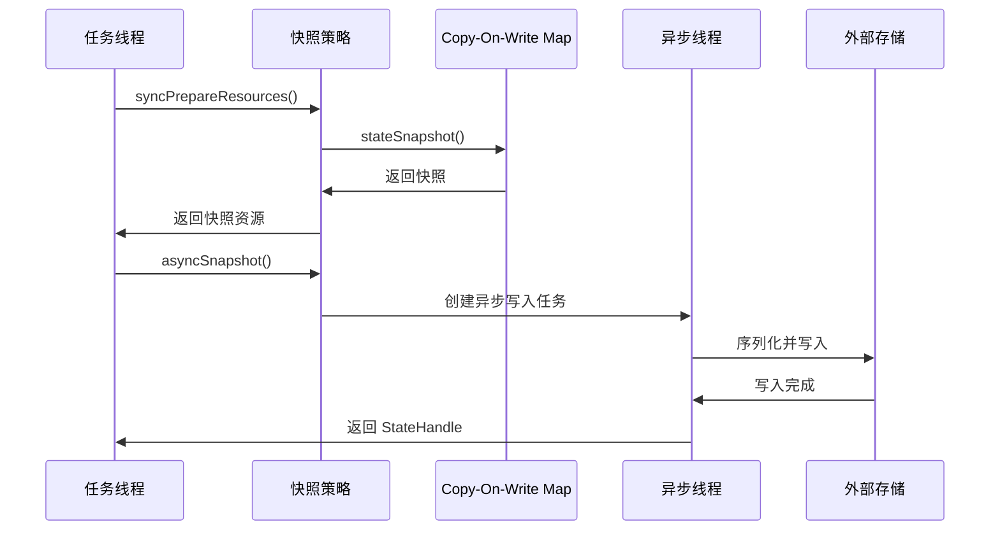
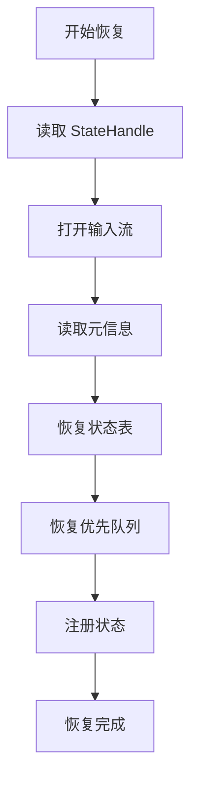
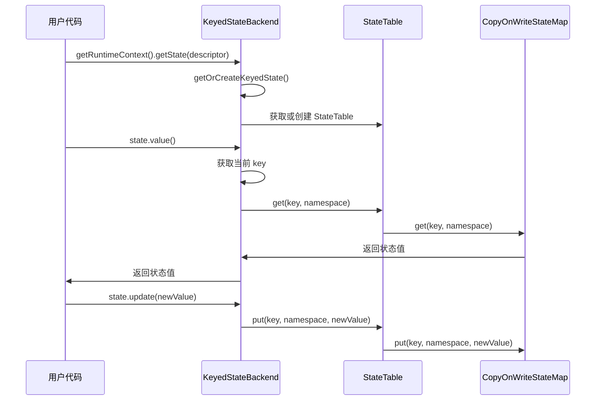
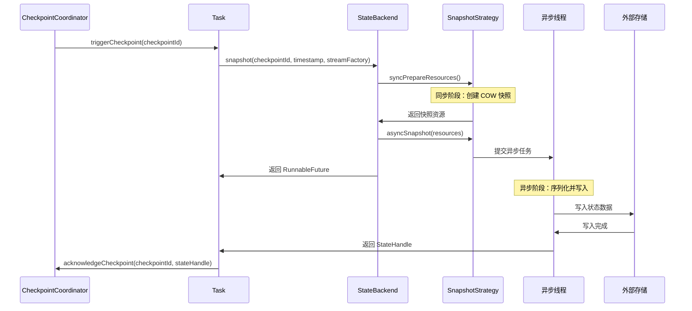
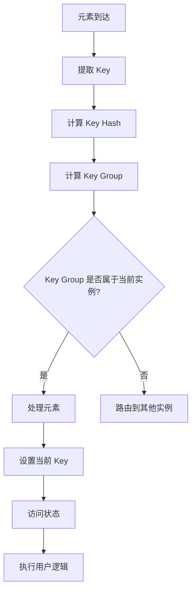
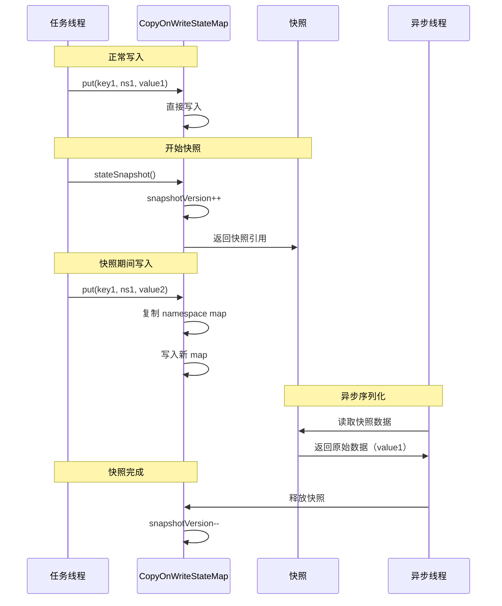

# State Backend 机制源码深度解析

## 一、机制概述

### 1.1 什么是 State Backend

**State Backend** 定义了 Flink 流式应用的状态如何在集群中本地存储。不同的 State Backend 以不同的方式存储状态，并使用不同的数据结构来保存运行应用的状态。

**核心职责**：
- **状态存储**：管理运行时状态的存储方式
- **状态快照**：将状态持久化到 Checkpoint 存储
- **状态恢复**：从 Checkpoint 恢复状态

### 1.2 State Backend 类型

Flink 提供了两种主要的 State Backend：

**1. HashMapStateBackend（内存）**
- 状态存储在 TaskManager 的 JVM 堆内存中
- 使用 HashMap 数据结构
- 快速访问，但受内存限制
- 适合小状态场景

**2. EmbeddedRocksDBStateBackend（磁盘）**
- 状态存储在嵌入式 RocksDB 数据库中
- RocksDB 将数据存储在本地磁盘
- 可扩展到 TB 级别
- 适合大状态场景

### 1.3 状态类型

**Keyed State（键控状态）**
- 与特定 key 绑定
- 只能在 KeyedStream 上使用
- 类型：ValueState、ListState、MapState、ReducingState、AggregatingState

**Operator State（算子状态）**
- 与算子实例绑定
- 不与 key 关联
- 类型：ListState、UnionListState、BroadcastState

## 二、核心类与接口

### 2.1 StateBackend 接口

#### StateBackend
- **路径**：`flink-runtime/src/main/java/org/apache/flink/runtime/state/StateBackend.java`
- **职责**：State Backend 的顶层接口
- **核心方法**：
  - `createKeyedStateBackend()`：创建 Keyed State Backend
  - `createOperatorStateBackend()`：创建 Operator State Backend

```java
@PublicEvolving
public interface StateBackend extends java.io.Serializable {
    
    /**
     * 创建 Keyed State Backend
     * @param env 任务环境
     * @param keySerializer Key 序列化器
     * @param numberOfKeyGroups Key Group 总数（最大并行度）
     * @param keyGroupRange 当前实例负责的 Key Group 范围
     * @param stateHandles 恢复用的状态句柄
     * @return Keyed State Backend 实例
     */
    <K> CheckpointableKeyedStateBackend<K> createKeyedStateBackend(
            Environment env,
            JobID jobID,
            String operatorIdentifier,
            TypeSerializer<K> keySerializer,
            int numberOfKeyGroups,
            KeyGroupRange keyGroupRange,
            TaskKvStateRegistry kvStateRegistry,
            TtlTimeProvider ttlTimeProvider,
            MetricGroup metricGroup,
            @Nonnull Collection<KeyedStateHandle> stateHandles,
            CloseableRegistry cancelStreamRegistry)
            throws Exception;
    
    /**
     * 创建 Operator State Backend
     * @param env 运行时环境
     * @param operatorIdentifier 算子标识符
     * @param stateHandles 恢复用的状态句柄
     * @return Operator State Backend 实例
     */
    OperatorStateBackend createOperatorStateBackend(
            Environment env,
            String operatorIdentifier,
            @Nonnull Collection<OperatorStateHandle> stateHandles,
            CloseableRegistry cancelStreamRegistry)
            throws Exception;
    
    /** 是否使用 Flink 托管内存 */
    default boolean useManagedMemory() {
        return false;
    }
    
    /** 是否支持 NO_CLAIM 恢复模式 */
    default boolean supportsNoClaimRestoreMode() {
        return false;
    }
}
```

**关键点**：
- State Backend 是可序列化的工厂类
- 负责创建 Keyed State Backend 和 Operator State Backend
- 线程安全，支持并发创建

### 2.2 HashMapStateBackend

#### HashMapStateBackend
- **路径**：`flink-runtime/src/main/java/org/apache/flink/runtime/state/hashmap/HashMapStateBackend.java`
- **职责**：基于内存的 State Backend 实现
- **特点**：
  - 状态存储在 JVM 堆内存
  - 使用 HashMap 数据结构
  - Checkpoint 时序列化到外部存储

```java
@PublicEvolving
public class HashMapStateBackend extends AbstractStateBackend 
        implements ConfigurableStateBackend {
    
    @Override
    public <K> AbstractKeyedStateBackend<K> createKeyedStateBackend(
            Environment env,
            JobID jobID,
            String operatorIdentifier,
            TypeSerializer<K> keySerializer,
            int numberOfKeyGroups,
            KeyGroupRange keyGroupRange,
            TaskKvStateRegistry kvStateRegistry,
            TtlTimeProvider ttlTimeProvider,
            MetricGroup metricGroup,
            @Nonnull Collection<KeyedStateHandle> stateHandles,
            CloseableRegistry cancelStreamRegistry)
            throws IOException {
        
        // 获取本地恢复配置
        TaskStateManager taskStateManager = env.getTaskStateManager();
        LocalRecoveryConfig localRecoveryConfig = 
            taskStateManager.createLocalRecoveryConfig();
        
        // 创建优先队列工厂（用于定时器）
        HeapPriorityQueueSetFactory priorityQueueSetFactory =
                new HeapPriorityQueueSetFactory(
                    keyGroupRange, numberOfKeyGroups, 128);
        
        // 使用 Builder 模式创建 HeapKeyedStateBackend
        return new HeapKeyedStateBackendBuilder<>(
                        kvStateRegistry,
                        keySerializer,
                        env.getUserCodeClassLoader().asClassLoader(),
                        numberOfKeyGroups,
                        keyGroupRange,
                        env.getExecutionConfig(),
                        ttlTimeProvider,
                        latencyTrackingStateConfig,
                        stateHandles,
                        getCompressionDecorator(env.getExecutionConfig()),
                        localRecoveryConfig,
                        priorityQueueSetFactory,
                        true,
                        cancelStreamRegistry)
                .build();
    }
    
    @Override
    public OperatorStateBackend createOperatorStateBackend(
            Environment env,
            String operatorIdentifier,
            @Nonnull Collection<OperatorStateHandle> stateHandles,
            CloseableRegistry cancelStreamRegistry)
            throws BackendBuildingException {
        
        // 创建默认的 Operator State Backend
        return new DefaultOperatorStateBackendBuilder(
                        env.getUserCodeClassLoader().asClassLoader(),
                        env.getExecutionConfig(),
                        true,
                        stateHandles,
                        cancelStreamRegistry)
                .build();
    }
    
    @Override
    public boolean supportsNoClaimRestoreMode() {
        // HashMap Backend 不共享文件，所有快照都是完整的
        return true;
    }
}
```

**内存考虑**：
```
总状态大小 ≤ TaskManager 堆内存 / 并发任务数
```

### 2.3 KeyedStateBackend

#### KeyedStateBackend
- **路径**：`flink-runtime/src/main/java/org/apache/flink/runtime/state/KeyedStateBackend.java`
- **职责**：管理 Keyed State 的接口
- **核心方法**：
  - `setCurrentKey()`：设置当前处理的 key
  - `getOrCreateKeyedState()`：获取或创建状态
  - `applyToAllKeys()`：对所有 key 应用函数

```java
public interface KeyedStateBackend<K>
        extends KeyedStateFactory, PriorityQueueSetFactory, Disposable {
    
    /**
     * 设置当前 key
     * @param newKey 新的当前 key
     */
    void setCurrentKey(K newKey);
    
    /** 获取当前 key */
    K getCurrentKey();
    
    /** 获取 key 序列化器 */
    TypeSerializer<K> getKeySerializer();
    
    /**
     * 获取或创建 Keyed State
     * @param namespaceSerializer Namespace 序列化器
     * @param stateDescriptor 状态描述符
     * @return 状态实例
     */
    <N, S extends State, T> S getOrCreateKeyedState(
            TypeSerializer<N> namespaceSerializer, 
            StateDescriptor<S, T> stateDescriptor)
            throws Exception;
    
    /**
     * 对所有 key 应用函数
     * @param namespace Namespace
     * @param namespaceSerializer Namespace 序列化器
     * @param stateDescriptor 状态描述符
     * @param function 要应用的函数
     */
    <N, S extends State, T> void applyToAllKeys(
            final N namespace,
            final TypeSerializer<N> namespaceSerializer,
            final StateDescriptor<S, T> stateDescriptor,
            final KeyedStateFunction<K, S> function)
            throws Exception;
    
    /**
     * 获取指定状态和 namespace 的所有 key
     * @param state 状态名称
     * @param namespace Namespace
     * @return Key 流
     */
    <N> Stream<K> getKeys(String state, N namespace);
}
```

**Key Context 机制**：
- 每个 Keyed State 操作都基于当前 key
- 通过 `setCurrentKey()` 切换 key 上下文
- 状态访问自动关联到当前 key

### 2.4 HeapKeyedStateBackend

#### HeapKeyedStateBackend
- **路径**：`flink-runtime/src/main/java/org/apache/flink/runtime/state/heap/HeapKeyedStateBackend.java`
- **职责**：基于堆内存的 Keyed State Backend 实现
- **核心数据结构**：
  - `registeredKVStates`：注册的状态表
  - `createdKVStates`：已创建的状态实例
  - `priorityQueuesManager`：优先队列管理器（用于定时器）

```java
public class HeapKeyedStateBackend<K> extends AbstractKeyedStateBackend<K> {
    
    /** 已创建的 Key/Value 状态 */
    private final Map<String, State> createdKVStates;
    
    /** 注册的 Key/Value 状态表 */
    private final Map<String, StateTable<K, ?, ?>> registeredKVStates;
    
    /** 优先队列管理器（用于定时器） */
    private final HeapPriorityQueuesManager priorityQueuesManager;
    
    /** 快照策略 */
    private final SnapshotStrategy<KeyedStateHandle, ?> checkpointStrategy;
    
    @Override
    public <N, SV, SEV, S extends State, IS extends S> IS createOrUpdateInternalState(
            @Nonnull TypeSerializer<N> namespaceSerializer,
            @Nonnull StateDescriptor<S, SV> stateDesc,
            @Nonnull StateSnapshotTransformFactory<SEV> snapshotTransformFactory)
            throws Exception {
        
        // 1. 注册或更新状态表
        StateTable<K, N, SV> stateTable =
                tryRegisterStateTable(
                        namespaceSerializer,
                        stateDesc,
                        getStateSnapshotTransformFactory(stateDesc, snapshotTransformFactory),
                        false);
        
        // 2. 获取已创建的状态
        @SuppressWarnings("unchecked")
        IS createdState = (IS) createdKVStates.get(stateDesc.getName());
        
        if (createdState == null) {
            // 3. 创建新状态
            StateCreateFactory stateCreateFactory = 
                STATE_CREATE_FACTORIES.get(stateDesc.getType());
            createdState =
                    stateCreateFactory.createState(
                        stateDesc, stateTable, getKeySerializer());
        } else {
            // 4. 更新已有状态
            StateUpdateFactory stateUpdateFactory = 
                STATE_UPDATE_FACTORIES.get(stateDesc.getType());
            createdState = stateUpdateFactory.updateState(
                stateDesc, stateTable, createdState);
        }
        
        // 5. 缓存状态实例
        createdKVStates.put(stateDesc.getName(), createdState);
        return createdState;
    }
    
    @Override
    public RunnableFuture<SnapshotResult<KeyedStateHandle>> snapshot(
            final long checkpointId,
            final long timestamp,
            @Nonnull final CheckpointStreamFactory streamFactory,
            @Nonnull CheckpointOptions checkpointOptions)
            throws Exception {
        
        // 使用快照策略执行快照
        SnapshotStrategyRunner<KeyedStateHandle, ?> snapshotStrategyRunner =
                new SnapshotStrategyRunner<>(
                        "Heap backend snapshot",
                        checkpointStrategy,
                        cancelStreamRegistry,
                        snapshotExecutionType);
        return snapshotStrategyRunner.snapshot(
                checkpointId, timestamp, streamFactory, checkpointOptions);
    }
}
```

**状态类型工厂**：
```java
private static final Map<StateDescriptor.Type, StateCreateFactory> STATE_CREATE_FACTORIES =
        Stream.of(
                Tuple2.of(StateDescriptor.Type.VALUE, 
                    (StateCreateFactory) HeapValueState::create),
                Tuple2.of(StateDescriptor.Type.LIST, 
                    (StateCreateFactory) HeapListState::create),
                Tuple2.of(StateDescriptor.Type.MAP, 
                    (StateCreateFactory) HeapMapState::create),
                Tuple2.of(StateDescriptor.Type.AGGREGATING, 
                    (StateCreateFactory) HeapAggregatingState::create),
                Tuple2.of(StateDescriptor.Type.REDUCING, 
                    (StateCreateFactory) HeapReducingState::create))
        .collect(Collectors.toMap(t -> t.f0, t -> t.f1));
```

### 2.5 OperatorStateBackend

#### OperatorStateBackend
- **路径**：`flink-runtime/src/main/java/org/apache/flink/runtime/state/OperatorStateBackend.java`
- **职责**：管理 Operator State 的接口
- **特点**：
  - 不与 key 关联
  - 与算子实例绑定
  - 支持 ListState、UnionListState、BroadcastState

```java
public interface OperatorStateBackend
        extends OperatorStateStore,
                Snapshotable<SnapshotResult<OperatorStateHandle>>,
                Closeable,
                Disposable {
    
    @Override
    void dispose();
}
```

**OperatorStateStore 接口**：
```java
public interface OperatorStateStore {
    
    /**
     * 创建或获取 ListState
     * @param stateDescriptor 状态描述符
     * @return ListState 实例
     */
    <S> ListState<S> getListState(ListStateDescriptor<S> stateDescriptor) 
        throws Exception;
    
    /**
     * 创建或获取 UnionListState
     * @param stateDescriptor 状态描述符
     * @return UnionListState 实例
     */
    <S> ListState<S> getUnionListState(ListStateDescriptor<S> stateDescriptor) 
        throws Exception;
    
    /**
     * 创建或获取 BroadcastState
     * @param stateDescriptor 状态描述符
     * @return BroadcastState 实例
     */
    <K, V> BroadcastState<K, V> getBroadcastState(
        MapStateDescriptor<K, V> stateDescriptor) throws Exception;
}
```

## 三、源码深度分析

### 3.1 状态存储机制

#### 3.1.1 StateTable 数据结构

**StateTable** 是 HeapKeyedStateBackend 中存储状态的核心数据结构：

```java
public class StateTable<K, N, S> implements StateSnapshotRestore {
    
    /** 状态映射：Key -> Namespace -> State */
    private final CopyOnWriteStateMap<K, N, S> stateMap;
    
    /** 元信息 */
    private RegisteredKeyValueStateBackendMetaInfo<N, S> metaInfo;
    
    /**
     * 获取状态值
     * @param key Key
     * @param namespace Namespace
     * @return 状态值
     */
    public S get(K key, N namespace) {
        return stateMap.get(key, namespace);
    }
    
    /**
     * 设置状态值
     * @param key Key
     * @param namespace Namespace
     * @param state 状态值
     */
    public void put(K key, N namespace, S state) {
        stateMap.put(key, namespace, state);
    }
    
    /**
     * 删除状态
     * @param key Key
     * @param namespace Namespace
     */
    public void remove(K key, N namespace) {
        stateMap.remove(key, namespace);
    }
}
```

**CopyOnWriteStateMap**：
- 使用 Copy-On-Write 策略
- 快照时不阻塞写入
- 支持并发读写

#### 3.1.2 Key Group 机制

**Key Group** 是 Flink 状态管理的基本单位：

```java
/**
 * Key Group 范围
 */
public class KeyGroupRange {
    private final int startKeyGroup;
    private final int endKeyGroup;
    
    public int getStartKeyGroup() {
        return startKeyGroup;
    }
    
    public int getEndKeyGroup() {
        return endKeyGroup;
    }
    
    public int getNumberOfKeyGroups() {
        return endKeyGroup - startKeyGroup + 1;
    }
}
```

**Key Group 分配**：
```java
public class KeyGroupRangeAssignment {
    
    /**
     * 计算 key 所属的 Key Group
     * @param key Key
     * @param maxParallelism 最大并行度
     * @return Key Group ID
     */
    public static int assignToKeyGroup(Object key, int maxParallelism) {
        return computeKeyGroupForKeyHash(key.hashCode(), maxParallelism);
    }
    
    public static int computeKeyGroupForKeyHash(int keyHash, int maxParallelism) {
        return MathUtils.murmurHash(keyHash) % maxParallelism;
    }
    
    /**
     * 计算算子实例负责的 Key Group 范围
     * @param subtaskIndex 子任务索引
     * @param parallelism 并行度
     * @param maxParallelism 最大并行度
     * @return Key Group 范围
     */
    public static KeyGroupRange computeKeyGroupRangeForOperatorIndex(
            int subtaskIndex,
            int parallelism,
            int maxParallelism) {
        
        int start = subtaskIndex * maxParallelism / parallelism;
        int end = (subtaskIndex + 1) * maxParallelism / parallelism - 1;
        return new KeyGroupRange(start, end);
    }
}
```

**示例**：
```
最大并行度：128
当前并行度：4
子任务 0：Key Group [0, 31]
子任务 1：Key Group [32, 63]
子任务 2：Key Group [64, 95]
子任务 3：Key Group [96, 127]
```

### 3.2 状态快照机制

#### 3.2.1 HeapSnapshotStrategy

```java
public class HeapSnapshotStrategy<K> 
        implements SnapshotStrategy<KeyedStateHandle, HeapSnapshotResources<K>> {
    
    @Override
    public HeapSnapshotResources<K> syncPrepareResources(long checkpointId) {
        // 1. 创建状态表的快照
        Map<String, StateMapSnapshot<K, ?, ?>> cowStateStableSnapshots = 
            new HashMap<>(registeredKVStates.size());
        
        for (Map.Entry<String, StateTable<K, ?, ?>> kvState : 
                registeredKVStates.entrySet()) {
            // 创建 Copy-On-Write 快照
            cowStateStableSnapshots.put(
                kvState.getKey(), 
                kvState.getValue().stateSnapshot());
        }
        
        // 2. 创建优先队列的快照
        Map<String, HeapPriorityQueueStateSnapshot<?, ?>> cowPriorityQueueSnapshots =
            priorityQueuesManager.createSnapshot();
        
        // 3. 返回快照资源
        return new HeapSnapshotResources<>(
            cowStateStableSnapshots,
            cowPriorityQueueSnapshots,
            keyGroupCompressionDecorator,
            keyGroupRange,
            keySerializer,
            numberOfKeyGroups);
    }
    
    @Override
    public SnapshotResultSupplier<KeyedStateHandle> asyncSnapshot(
            HeapSnapshotResources<K> syncPartResource,
            long checkpointId,
            long timestamp,
            CheckpointStreamFactory streamFactory,
            CheckpointOptions checkpointOptions) {
        
        // 异步写入快照到外部存储
        return new FullSnapshotAsyncWriter<>(
            syncPartResource,
            streamFactory,
            checkpointId);
    }
}
```

**快照流程**：


#### 3.2.2 Copy-On-Write 机制

```java
public class CopyOnWriteStateMap<K, N, S> extends StateMap<K, N, S> {
    
    /** 状态映射 */
    private final Map<K, Map<N, S>> stateMap;
    
    /** 快照版本 */
    private int snapshotVersion;
    
    @Override
    public S get(K key, N namespace) {
        Map<N, S> namespaceMap = stateMap.get(key);
        return namespaceMap != null ? namespaceMap.get(namespace) : null;
    }
    
    @Override
    public void put(K key, N namespace, S state) {
        Map<N, S> namespaceMap = stateMap.get(key);
        if (namespaceMap == null) {
            namespaceMap = new HashMap<>();
            stateMap.put(key, namespaceMap);
        }
        
        // 如果正在快照，复制 namespace map
        if (snapshotVersion > 0) {
            namespaceMap = new HashMap<>(namespaceMap);
            stateMap.put(key, namespaceMap);
        }
        
        namespaceMap.put(namespace, state);
    }
    
    @Override
    public StateMapSnapshot<K, N, S> stateSnapshot() {
        // 增加快照版本
        snapshotVersion++;
        
        // 返回当前状态的快照
        return new CopyOnWriteStateMapSnapshot<>(
            stateMap, snapshotVersion);
    }
}
```

**COW 优势**：
- 快照时不阻塞写入
- 读操作无锁
- 写操作仅在修改时复制

### 3.3 状态恢复机制

#### 3.3.1 HeapRestoreOperation

```java
public class HeapRestoreOperation<K> implements RestoreOperation<Void> {
    
    @Override
    public Void restore() throws Exception {
        // 1. 遍历所有状态句柄
        for (KeyedStateHandle keyedStateHandle : restoreStateHandles) {
            if (keyedStateHandle != null) {
                // 2. 恢复单个状态句柄
                restoreKeyedStateHandle(keyedStateHandle);
            }
        }
        return null;
    }
    
    private void restoreKeyedStateHandle(KeyedStateHandle keyedStateHandle) 
            throws Exception {
        
        // 1. 打开状态输入流
        FSDataInputStream fsDataInputStream = 
            keyedStateHandle.openInputStream();
        
        try {
            // 2. 读取元信息
            KeyedBackendSerializationProxy<K> serializationProxy =
                    new KeyedBackendSerializationProxy<>(userCodeClassLoader);
            
            DataInputViewStreamWrapper inView = 
                new DataInputViewStreamWrapper(fsDataInputStream);
            serializationProxy.read(inView);
            
            // 3. 恢复状态表
            List<RegisteredKeyValueStateBackendMetaInfo<?, ?>> restoredMetaInfos =
                    serializationProxy.getStateMetaInfoSnapshots();
            
            for (RegisteredKeyValueStateBackendMetaInfo<?, ?> metaInfo : 
                    restoredMetaInfos) {
                // 创建状态表
                StateTable<K, ?, ?> stateTable = 
                    createStateTable(metaInfo);
                
                // 读取状态数据
                restoreStateTable(stateTable, inView);
                
                // 注册状态表
                registeredKVStates.put(metaInfo.getName(), stateTable);
            }
            
            // 4. 恢复优先队列（定时器）
            restorePriorityQueues(inView);
            
        } finally {
            fsDataInputStream.close();
        }
    }
}
```

**恢复流程**：


## 四、执行流程图

### 4.1 状态访问流程



### 4.2 Checkpoint 流程



### 4.3 Key Group 分配流程



## 五、面试高频问题

### Q1: Flink 有哪些 State Backend？各有什么特点？

**答案**：

Flink 提供了两种主要的 State Backend：

**1. HashMapStateBackend（内存）**

**特点**：
- 状态存储在 TaskManager 的 JVM 堆内存中
- 使用 HashMap 数据结构
- 快速访问，低延迟
- 受内存限制

**适用场景**：
- 小状态（MB 到 GB 级别）
- 对延迟敏感的应用
- 状态访问频繁

**配置**：
```java
StreamExecutionEnvironment env = StreamExecutionEnvironment.getExecutionEnvironment();
env.setStateBackend(new HashMapStateBackend());
```

**2. EmbeddedRocksDBStateBackend（磁盘）**

**特点**：
- 状态存储在嵌入式 RocksDB 数据库中
- RocksDB 将数据存储在本地磁盘
- 可扩展到 TB 级别
- 访问延迟较高

**适用场景**：
- 大状态（GB 到 TB 级别）
- 状态大小超过内存
- 可以接受较高延迟

**配置**：
```java
env.setStateBackend(new EmbeddedRocksDBStateBackend());
```

**对比**：

| 特性 | HashMapStateBackend | EmbeddedRocksDBStateBackend |
|------|---------------------|----------------------------|
| 存储位置 | JVM 堆内存 | 本地磁盘 |
| 状态大小 | 受内存限制 | 仅受磁盘限制 |
| 访问延迟 | 低（纳秒级） | 较高（微秒级） |
| 快照方式 | 全量快照 | 增量快照 |
| 内存占用 | 高 | 低 |

**源码支撑**：
- [`HashMapStateBackend`](file:///Users/wanghaofeng/IdeaProjects/flink/flink-runtime/src/main/java/org/apache/flink/runtime/state/hashmap/HashMapStateBackend.java#L75)
- [`StateBackend`](file:///Users/wanghaofeng/IdeaProjects/flink/flink-runtime/src/main/java/org/apache/flink/runtime/state/StateBackend.java#L80)

### Q2: Keyed State 和 Operator State 有什么区别？

**答案**：

**Keyed State（键控状态）**

**特点**：
- 与特定 key 绑定
- 只能在 KeyedStream 上使用
- 自动按 key 分区
- 支持多种状态类型

**状态类型**：
- `ValueState<T>`：单个值
- `ListState<T>`：元素列表
- `MapState<K, V>`：键值对映射
- `ReducingState<T>`：聚合状态
- `AggregatingState<IN, OUT>`：聚合状态

**使用示例**：
```java
public class MyKeyedFunction extends RichFlatMapFunction<Event, Result> {
    private transient ValueState<Long> countState;
    
    @Override
    public void open(Configuration parameters) {
        ValueStateDescriptor<Long> descriptor =
                new ValueStateDescriptor<>("count", Long.class);
        countState = getRuntimeContext().getState(descriptor);
    }
    
    @Override
    public void flatMap(Event event, Collector<Result> out) throws Exception {
        Long count = countState.value();
        if (count == null) {
            count = 0L;
        }
        count++;
        countState.update(count);
        out.collect(new Result(event.getKey(), count));
    }
}
```

**Operator State（算子状态）**

**特点**：
- 与算子实例绑定
- 不与 key 关联
- 需要手动管理分区
- 支持的状态类型较少

**状态类型**：
- `ListState<T>`：元素列表
- `UnionListState<T>`：联合列表（恢复时广播到所有实例）
- `BroadcastState<K, V>`：广播状态

**使用示例**：
```java
public class MyOperatorFunction extends RichFlatMapFunction<Event, Result>
        implements CheckpointedFunction {
    
    private transient ListState<Long> checkpointedState;
    private List<Long> bufferedElements;
    
    @Override
    public void initializeState(FunctionInitializationContext context) 
            throws Exception {
        ListStateDescriptor<Long> descriptor =
                new ListStateDescriptor<>("buffered-elements", Long.class);
        checkpointedState = context.getOperatorStateStore().getListState(descriptor);
        
        if (context.isRestored()) {
            for (Long element : checkpointedState.get()) {
                bufferedElements.add(element);
            }
        }
    }
    
    @Override
    public void snapshotState(FunctionSnapshotContext context) throws Exception {
        checkpointedState.clear();
        for (Long element : bufferedElements) {
            checkpointedState.add(element);
        }
    }
}
```

**对比**：

| 特性 | Keyed State | Operator State |
|------|-------------|----------------|
| 绑定对象 | Key | 算子实例 |
| 使用场景 | KeyedStream | 任何流 |
| 分区方式 | 自动按 key 分区 | 手动管理 |
| 状态类型 | 5 种 | 3 种 |
| 扩缩容 | 自动重分配 | 需要手动处理 |

**源码支撑**：
- [`KeyedStateBackend`](file:///Users/wanghaofeng/IdeaProjects/flink/flink-runtime/src/main/java/org/apache/flink/runtime/state/KeyedStateBackend.java#L35)
- [`OperatorStateBackend`](file:///Users/wanghaofeng/IdeaProjects/flink/flink-runtime/src/main/java/org/apache/flink/runtime/state/OperatorStateBackend.java#L30)

### Q3: Key Group 是什么？有什么作用？

**答案**：

**Key Group** 是 Flink 状态管理和扩缩容的基本单位。

**核心概念**：

1. **Key Group 定义**：
   - Key Group 是一组 key 的集合
   - 每个 key 通过哈希函数映射到一个 Key Group
   - Key Group 数量 = 最大并行度（Max Parallelism）

2. **Key Group 分配**：
```java
// 计算 key 所属的 Key Group
public static int assignToKeyGroup(Object key, int maxParallelism) {
    return MathUtils.murmurHash(key.hashCode()) % maxParallelism;
}

// 计算算子实例负责的 Key Group 范围
public static KeyGroupRange computeKeyGroupRangeForOperatorIndex(
        int subtaskIndex,
        int parallelism,
        int maxParallelism) {
    
    int start = subtaskIndex * maxParallelism / parallelism;
    int end = (subtaskIndex + 1) * maxParallelism / parallelism - 1;
    return new KeyGroupRange(start, end);
}
```

**示例**：
```
最大并行度：128
当前并行度：4

子任务 0：Key Group [0, 31]    (32 个 Key Group)
子任务 1：Key Group [32, 63]   (32 个 Key Group)
子任务 2：Key Group [64, 95]   (32 个 Key Group)
子任务 3：Key Group [96, 127]  (32 个 Key Group)
```

**作用**：

1. **状态分区**：
   - 每个子任务负责一部分 Key Group
   - 状态按 Key Group 组织
   - 实现状态的分布式存储

2. **扩缩容**：
```
// 扩容：并行度 4 → 8
原子任务 0: [0, 31]   → 新子任务 0: [0, 15]
                      → 新子任务 1: [16, 31]
原子任务 1: [32, 63]  → 新子任务 2: [32, 47]
                      → 新子任务 3: [48, 63]
...
```

3. **Checkpoint 组织**：
   - 状态按 Key Group 序列化
   - 恢复时按 Key Group 分配
   - 支持灵活的扩缩容

**最大并行度选择**：
```java
// 默认最大并行度
int maxParallelism = Math.min(
    Math.max(
        MathUtils.roundUpToPowerOfTwo(parallelism + (parallelism / 2)),
        128
    ),
    32768
);
```

**建议**：
- 最大并行度应该是 2 的幂次方
- 通常设置为预期最大并行度的 1.5-2 倍
- 一旦设置，不能更改（会导致状态无法恢复）

**源码支撑**：
- [`KeyGroupRange`](file:///Users/wanghaofeng/IdeaProjects/flink/flink-runtime/src/main/java/org/apache/flink/runtime/state/KeyGroupRange.java)
- [`KeyGroupRangeAssignment`](file:///Users/wanghaofeng/IdeaProjects/flink/flink-runtime/src/main/java/org/apache/flink/runtime/state/KeyGroupRangeAssignment.java)

### Q4: HashMapStateBackend 如何实现快照时不阻塞写入？

**答案**：

HashMapStateBackend 使用 **Copy-On-Write (COW)** 机制实现快照时不阻塞写入。

**核心机制**：

1. **CopyOnWriteStateMap**：
```java
public class CopyOnWriteStateMap<K, N, S> extends StateMap<K, N, S> {
    
    /** 状态映射 */
    private final Map<K, Map<N, S>> stateMap;
    
    /** 快照版本号 */
    private int snapshotVersion;
    
    @Override
    public void put(K key, N namespace, S state) {
        Map<N, S> namespaceMap = stateMap.get(key);
        
        if (namespaceMap == null) {
            namespaceMap = new HashMap<>();
            stateMap.put(key, namespaceMap);
        }
        
        // 如果正在快照，复制 namespace map
        if (snapshotVersion > 0) {
            namespaceMap = new HashMap<>(namespaceMap);
            stateMap.put(key, namespaceMap);
        }
        
        namespaceMap.put(namespace, state);
    }
    
    @Override
    public StateMapSnapshot<K, N, S> stateSnapshot() {
        // 增加快照版本号
        snapshotVersion++;
        
        // 返回当前状态的快照
        return new CopyOnWriteStateMapSnapshot<>(
            stateMap, snapshotVersion);
    }
}
```

2. **快照流程**：

**同步阶段**（在任务线程执行）：
```java
// 1. 创建快照
StateMapSnapshot<K, N, S> snapshot = stateMap.stateSnapshot();
// 此时 snapshotVersion++，后续写入会触发复制

// 2. 返回快照资源
return new HeapSnapshotResources<>(snapshot, ...);
```

**异步阶段**（在异步线程执行）：
```java
// 3. 序列化并写入外部存储
for (Map.Entry<K, Map<N, S>> entry : snapshot.entrySet()) {
    serializeKeyGroup(entry, outputStream);
}
```

3. **COW 优势**：

**读操作**：
- 无锁，直接读取
- 不受快照影响
- 性能最优

**写操作**：
- 快照前：直接写入，无额外开销
- 快照中：首次写入时复制 namespace map
- 快照后：恢复正常写入

**快照操作**：
- 不阻塞读写
- 仅增加版本号
- 异步序列化

4. **内存开销**：

**最坏情况**：
```
快照期间修改了所有 key 的所有 namespace
内存开销 = 原状态大小 × 2
```

**实际情况**：
```
通常只修改部分 key 的部分 namespace
内存开销 << 原状态大小 × 2
```

5. **完整示例**：



**源码支撑**：
- [`CopyOnWriteStateMap`](file:///Users/wanghaofeng/IdeaProjects/flink/flink-runtime/src/main/java/org/apache/flink/runtime/state/heap/CopyOnWriteStateMap.java)
- [`HeapSnapshotStrategy`](file:///Users/wanghaofeng/IdeaProjects/flink/flink-runtime/src/main/java/org/apache/flink/runtime/state/heap/HeapSnapshotStrategy.java)

### Q5: 状态扩缩容时如何重新分配状态？

**答案**：

Flink 通过 **Key Group** 机制实现状态的重新分配。

**扩缩容流程**：

1. **Checkpoint 保存**：
```java
// 状态按 Key Group 组织
Map<Integer, KeyGroupStateHandle> keyGroupStates = new HashMap<>();

for (int keyGroup : keyGroupRange) {
    // 序列化该 Key Group 的所有状态
    KeyGroupStateHandle handle = serializeKeyGroup(keyGroup);
    keyGroupStates.put(keyGroup, handle);
}
```

2. **扩容示例**：
```
原并行度：4
新并行度：8
最大并行度：128

// 原分配
子任务 0: Key Group [0, 31]
子任务 1: Key Group [32, 63]
子任务 2: Key Group [64, 95]
子任务 3: Key Group [96, 127]

// 新分配
子任务 0: Key Group [0, 15]     ← 从原子任务 0
子任务 1: Key Group [16, 31]    ← 从原子任务 0
子任务 2: Key Group [32, 47]    ← 从原子任务 1
子任务 3: Key Group [48, 63]    ← 从原子任务 1
子任务 4: Key Group [64, 79]    ← 从原子任务 2
子任务 5: Key Group [80, 95]    ← 从原子任务 2
子任务 6: Key Group [96, 111]   ← 从原子任务 3
子任务 7: Key Group [112, 127]  ← 从原子任务 3
```

3. **状态恢复**：
```java
// 计算当前子任务负责的 Key Group 范围
KeyGroupRange newKeyGroupRange = 
    KeyGroupRangeAssignment.computeKeyGroupRangeForOperatorIndex(
        subtaskIndex, newParallelism, maxParallelism);

// 恢复属于该范围的 Key Group
for (KeyedStateHandle stateHandle : allStateHandles) {
    for (int keyGroup : stateHandle.getKeyGroupRange()) {
        if (newKeyGroupRange.contains(keyGroup)) {
            // 恢复该 Key Group 的状态
            restoreKeyGroup(keyGroup, stateHandle);
        }
    }
}
```

4. **Keyed State 重分配**：
- 自动按 Key Group 重分配
- 无需用户干预
- 保证状态一致性

5. **Operator State 重分配**：

**ListState（均匀分割）**：
```java
// 原状态：[1, 2, 3, 4, 5, 6]
// 并行度 2 → 3

// 原分配
子任务 0: [1, 2, 3]
子任务 1: [4, 5, 6]

// 新分配（均匀分割）
子任务 0: [1, 2]
子任务 1: [3, 4]
子任务 2: [5, 6]
```

**UnionListState（广播）**：
```java
// 原状态：[1, 2, 3, 4, 5, 6]
// 并行度 2 → 3

// 新分配（广播到所有实例）
子任务 0: [1, 2, 3, 4, 5, 6]
子任务 1: [1, 2, 3, 4, 5, 6]
子任务 2: [1, 2, 3, 4, 5, 6]
```

6. **最佳实践**：

**设置合理的最大并行度**：
```java
env.setMaxParallelism(256);  // 预期最大并行度的 1.5-2 倍
```

**避免频繁扩缩容**：
- 扩缩容需要重新分配状态
- 会增加恢复时间
- 建议提前规划并行度

**监控状态大小**：
- 状态过大会影响扩缩容性能
- 使用 TTL 清理过期状态
- 考虑使用 RocksDB Backend

**源码支撑**：
- [`KeyGroupRangeAssignment`](file:///Users/wanghaofeng/IdeaProjects/flink/flink-runtime/src/main/java/org/apache/flink/runtime/state/KeyGroupRangeAssignment.java)
- [`HeapRestoreOperation`](file:///Users/wanghaofeng/IdeaProjects/flink/flink-runtime/src/main/java/org/apache/flink/runtime/state/heap/HeapRestoreOperation.java)

## 六、最佳实践

### 6.1 选择合适的 State Backend

**场景 1：小状态，低延迟**
```java
// 使用 HashMapStateBackend
env.setStateBackend(new HashMapStateBackend());
```

**场景 2：大状态，可接受较高延迟**
```java
// 使用 RocksDB Backend
env.setStateBackend(new EmbeddedRocksDBStateBackend());
```

### 6.2 合理设置最大并行度

```java
// 设置最大并行度为预期最大并行度的 2 倍
env.setMaxParallelism(256);
```

**注意**：
- 最大并行度一旦设置，不能更改
- 建议设置为 2 的幂次方
- 影响 Key Group 数量和扩缩容粒度

### 6.3 使用 State TTL

```java
StateTtlConfig ttlConfig = StateTtlConfig
    .newBuilder(Time.hours(1))
    .setUpdateType(StateTtlConfig.UpdateType.OnCreateAndWrite)
    .setStateVisibility(StateTtlConfig.StateVisibility.NeverReturnExpired)
    .build();

ValueStateDescriptor<String> descriptor = 
    new ValueStateDescriptor<>("my-state", String.class);
descriptor.enableTimeToLive(ttlConfig);
```

### 6.4 监控状态大小

```java
// 使用 Metrics 监控状态大小
getRuntimeContext()
    .getMetricGroup()
    .gauge("state-size", () -> stateSize);
```

### 6.5 常见陷阱

**陷阱 1：状态过大导致 OOM**
- 问题：HashMapStateBackend 状态超过内存
- 解决：使用 RocksDB Backend 或增加内存

**陷阱 2：忘记设置最大并行度**
- 问题：默认最大并行度可能不够
- 解决：显式设置最大并行度

**陷阱 3：频繁扩缩容**
- 问题：状态重分配耗时长
- 解决：提前规划并行度，避免频繁调整

**陷阱 4：状态未清理**
- 问题：过期状态占用内存
- 解决：使用 State TTL 自动清理

---

**文档版本**：v1.0  
**基于 Flink 版本**：Apache Flink 主分支  
**最后更新**：2026-02-05
