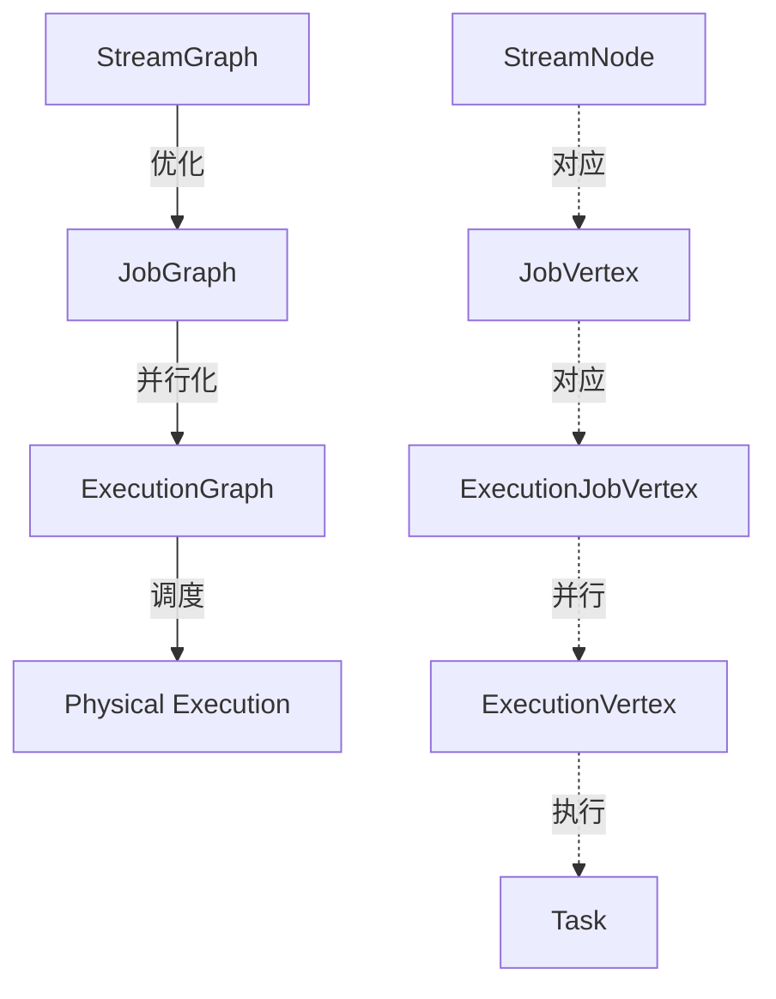
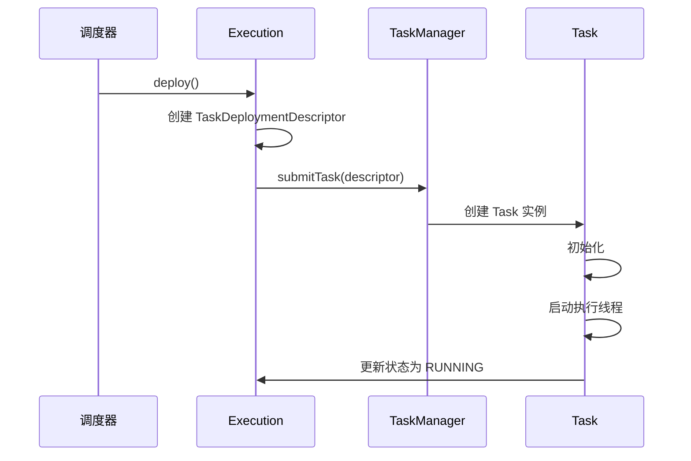
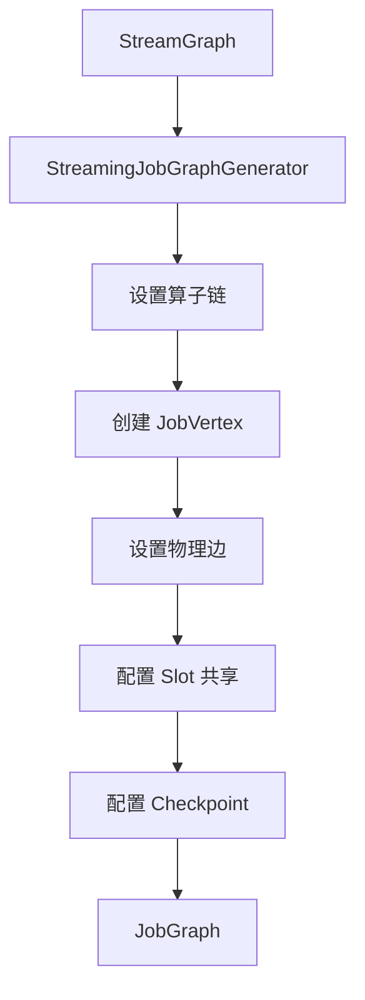
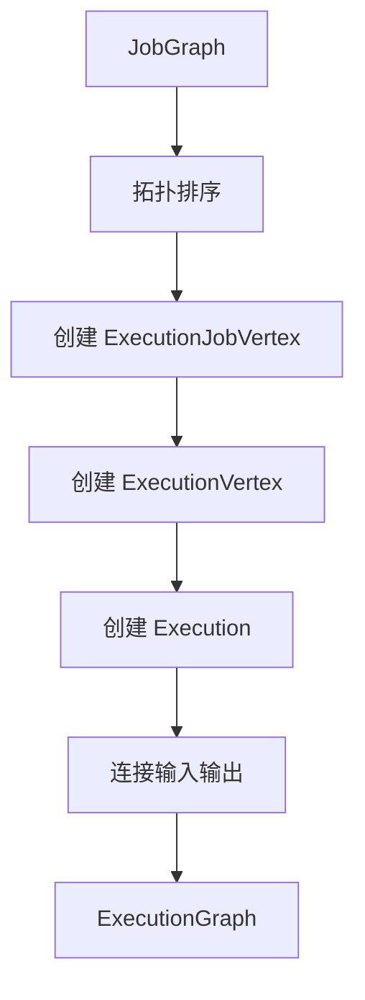
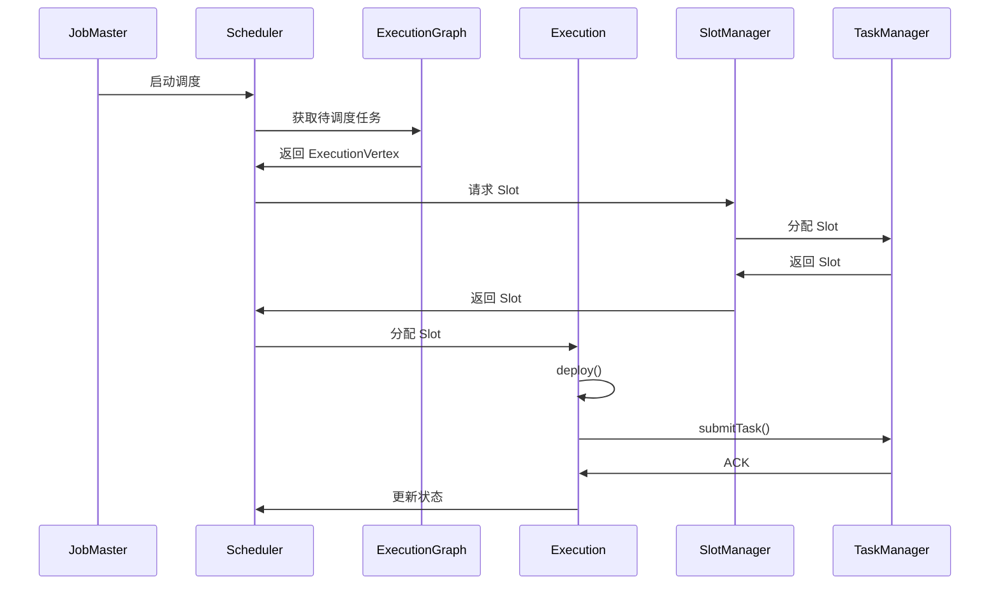

# Task 调度与执行机制源码深度解析

## 一、机制概述

### 1.1 什么是 Task 调度与执行

**Task 调度与执行**是 Flink 将用户程序转换为分布式执行任务的核心机制。它负责将高层 API 编写的数据流程序转换为可在集群上执行的物理任务。

**核心流程**：
```
用户程序 → StreamGraph → JobGraph → ExecutionGraph → 物理执行
```

### 1.2 核心概念

**JobGraph（作业图）**
- 用户程序的逻辑表示
- 由 JobVertex（算子）和 JobEdge（数据流）组成
- 已经过算子链优化
- 提交给 JobManager

**ExecutionGraph（执行图）**
- JobGraph 的并行化版本
- 包含实际执行的物理信息
- 由 ExecutionJobVertex、ExecutionVertex、Execution 组成
- 调度器的核心数据结构

**Task（任务）**
- 在 TaskManager 上实际执行的单元
- 对应 ExecutionVertex 的一次执行尝试
- 包含算子链中的所有算子

### 1.3 图转换层次



## 二、核心类与接口

### 2.1 JobGraph

#### JobGraph
- **路径**：`flink-runtime/src/main/java/org/apache/flink/runtime/jobgraph/JobGraph.java`
- **职责**：表示提交给 JobManager 的作业图
- **核心字段**：
  - `taskVertices`：作业顶点映射
  - `jobConfiguration`：作业配置
  - `snapshotSettings`：Checkpoint 设置

```java
public class JobGraph implements Serializable {
    
    /** 作业顶点列表 */
    private final Map<JobVertexID, JobVertex> taskVertices =
            new LinkedHashMap<>();
    
    /** 作业配置 */
    private final Configuration jobConfiguration = new Configuration();
    
    /** 作业 ID */
    private JobID jobID;
    
    /** 作业名称 */
    private final String jobName;
    
    /** Checkpoint 设置 */
    private JobCheckpointingSettings snapshotSettings;
    
    /**
     * 添加作业顶点
     * @param vertex 作业顶点
     */
    public void addVertex(JobVertex vertex) {
        final JobVertexID id = vertex.getID();
        JobVertex previous = taskVertices.put(id, vertex);
        
        if (previous != null) {
            taskVertices.put(id, previous);
            throw new IllegalArgumentException(
                    "The JobGraph already contains a vertex with that id.");
        }
    }
    
    /**
     * 获取拓扑排序的顶点列表
     * @return 按拓扑顺序排序的顶点列表
     */
    public List<JobVertex> getVerticesSortedTopologicallyFromSources()
            throws InvalidProgramException {
        
        List<JobVertex> sorted = new ArrayList<>(this.taskVertices.size());
        Set<JobVertex> remaining = new LinkedHashSet<>(this.taskVertices.values());
        
        // 1. 找到没有输入边的顶点（Source）
        Iterator<JobVertex> iter = remaining.iterator();
        while (iter.hasNext()) {
            JobVertex vertex = iter.next();
            if (vertex.hasNoConnectedInputs()) {
                sorted.add(vertex);
                iter.remove();
            }
        }
        
        // 2. 从 Source 开始遍历，按拓扑顺序添加顶点
        int startNodePos = 0;
        while (!remaining.isEmpty()) {
            if (startNodePos >= sorted.size()) {
                throw new InvalidProgramException("The job graph is cyclic.");
            }
            
            JobVertex current = sorted.get(startNodePos++);
            addNodesThatHaveNoNewPredecessors(current, sorted, remaining);
        }
        
        return sorted;
    }
}
```

**关键点**：
- JobGraph 是逻辑计划，不包含并行度信息
- 已经过算子链优化，多个算子可能合并为一个 JobVertex
- 拓扑排序确保依赖关系正确

### 2.2 JobVertex

#### JobVertex
- **路径**：`flink-runtime/src/main/java/org/apache/flink/runtime/jobgraph/JobVertex.java`
- **职责**：表示 JobGraph 中的一个算子节点
- **核心字段**：
  - `id`：顶点 ID
  - `parallelism`：并行度
  - `invokableClassName`：可执行类名
  - `inputs`：输入边
  - `results`：输出数据集

```java
public class JobVertex implements java.io.Serializable {
    
    /** 顶点 ID */
    private final JobVertexID id;
    
    /** 算子 ID 列表（算子链） */
    private final List<OperatorIDPair> operatorIDs;
    
    /** 输出数据集 */
    private final Map<IntermediateDataSetID, IntermediateDataSet> results = 
        new LinkedHashMap<>();
    
    /** 输入边 */
    private final List<JobEdge> inputs = new ArrayList<>();
    
    /** 并行度 */
    private int parallelism = ExecutionConfig.PARALLELISM_DEFAULT;
    
    /** 最大并行度 */
    private int maxParallelism = MAX_PARALLELISM_DEFAULT;
    
    /** 可执行类名 */
    private String invokableClassName;
    
    /** Slot 共享组 */
    @Nullable private SlotSharingGroup slotSharingGroup;
    
    /** Co-Location 组 */
    @Nullable private CoLocationGroupImpl coLocationGroup;
    
    /**
     * 设置可执行类
     * @param invokable 可执行类
     */
    public void setInvokableClass(Class<? extends TaskInvokable> invokable) {
        Preconditions.checkNotNull(invokable);
        this.invokableClassName = invokable.getName();
    }
    
    /**
     * 连接新的数据集作为输入
     * @param input 输入顶点
     * @param distPattern 分发模式
     * @param partitionType 分区类型
     * @return 创建的边
     */
    public JobEdge connectNewDataSetAsInput(
            JobVertex input,
            DistributionPattern distPattern,
            ResultPartitionType partitionType) {
        
        IntermediateDataSet dataSet =
                input.getOrCreateResultDataSet(
                    new IntermediateDataSetID(), partitionType);
        
        JobEdge edge = new JobEdge(dataSet, this, distPattern, false);
        this.inputs.add(edge);
        dataSet.addConsumer(edge);
        return edge;
    }
    
    /**
     * 设置 Slot 共享组
     * @param grp Slot 共享组
     */
    public void setSlotSharingGroup(SlotSharingGroup grp) {
        checkNotNull(grp);
        
        if (this.slotSharingGroup != null) {
            this.slotSharingGroup.removeVertexFromGroup(this.getID());
        }
        
        grp.addVertexToGroup(this.getID());
        this.slotSharingGroup = grp;
    }
}
```

**Slot 共享机制**：
- 同一个 Slot 共享组的不同算子可以共享 Slot
- 提高资源利用率
- 避免数据倾斜导致的资源浪费

**Co-Location 机制**：
- 强制某些算子的子任务运行在同一个 TaskManager
- 用于迭代算法
- 确保数据本地性

### 2.3 ExecutionGraph

#### ExecutionGraph
- **路径**：`flink-runtime/src/main/java/org/apache/flink/runtime/executiongraph/ExecutionGraph.java`
- **职责**：协调数据流的分布式执行
- **核心组件**：
  - `ExecutionJobVertex`：并行化的作业顶点
  - `ExecutionVertex`：单个并行子任务
  - `Execution`：一次执行尝试

```java
public interface ExecutionGraph extends AccessExecutionGraph {
    
    /**
     * 启动执行图
     * @param jobMasterMainThreadExecutor 主线程执行器
     */
    void start(@Nonnull ComponentMainThreadExecutor jobMasterMainThreadExecutor);
    
    /**
     * 获取调度拓扑
     * @return 调度拓扑
     */
    SchedulingTopology getSchedulingTopology();
    
    /**
     * 启用 Checkpoint
     */
    void enableCheckpointing(
            CheckpointCoordinatorConfiguration chkConfig,
            List<MasterTriggerRestoreHook<?>> masterHooks,
            CheckpointIDCounter checkpointIDCounter,
            CompletedCheckpointStore checkpointStore,
            StateBackend checkpointStateBackend,
            CheckpointStorage checkpointStorage,
            CheckpointStatsTracker statsTracker,
            CheckpointsCleaner checkpointsCleaner,
            String changelogStorage);
    
    /**
     * 获取所有顶点（拓扑排序）
     * @return 顶点迭代器
     */
    @Override
    Iterable<ExecutionJobVertex> getVerticesTopologically();
    
    /**
     * 获取所有执行顶点
     * @return 执行顶点迭代器
     */
    @Override
    Iterable<ExecutionVertex> getAllExecutionVertices();
    
    /**
     * 附加 JobGraph
     * @param topologicallySorted 拓扑排序的顶点列表
     */
    void attachJobGraph(
            List<JobVertex> topologicallySorted,
            JobManagerJobMetricGroup jobManagerJobMetricGroup)
            throws JobException;
    
    /**
     * 转换到运行状态
     */
    void transitionToRunning();
    
    /**
     * 更新任务状态
     * @param state 状态转换
     * @return 是否更新成功
     */
    boolean updateState(TaskExecutionStateTransition state);
}
```

**ExecutionGraph 层次结构**：
```
ExecutionGraph
├── ExecutionJobVertex (并行度 = N)
│   ├── ExecutionVertex[0]
│   │   └── Execution (attempt 0, 1, ...)
│   ├── ExecutionVertex[1]
│   │   └── Execution
│   └── ...
│   └── ExecutionVertex[N-1]
│       └── Execution
```

### 2.4 ExecutionJobVertex

```java
public class ExecutionJobVertex {
    
    /** 对应的 JobVertex */
    private final JobVertex jobVertex;
    
    /** 所有并行子任务 */
    private final ExecutionVertex[] taskVertices;
    
    /** 并行度 */
    private final int parallelism;
    
    /** 输入 */
    private final List<IntermediateResult> inputs;
    
    /** 输出 */
    private IntermediateResult producedDataSets[];
    
    /**
     * 创建执行顶点
     * @param createTimestamp 创建时间戳
     */
    public void initialize(
            long createTimestamp,
            Map<IntermediateDataSetID, JobVertexInputInfo> jobVertexInputInfos)
            throws JobException {
        
        // 1. 创建并行子任务
        for (int i = 0; i < parallelism; i++) {
            ExecutionVertex vertex = new ExecutionVertex(
                this,
                i,
                producedDataSets,
                createTimestamp,
                maxPriorAttemptsHistoryLength);
            
            taskVertices[i] = vertex;
        }
        
        // 2. 连接输入
        for (IntermediateResult result : inputs) {
            result.connectToPredecessors(this);
        }
    }
}
```

### 2.5 ExecutionVertex

```java
public class ExecutionVertex {
    
    /** 所属的 ExecutionJobVertex */
    private final ExecutionJobVertex jobVertex;
    
    /** 子任务索引 */
    private final int subTaskIndex;
    
    /** 当前执行 */
    private Execution currentExecution;
    
    /** 历史执行 */
    private final EvictingBoundedList<Execution> priorExecutions;
    
    /** 输入分区 */
    private final List<IntermediateResultPartition>[] inputEdges;
    
    /**
     * 创建新的执行尝试
     * @param timestamp 时间戳
     * @return 新的执行
     */
    public Execution createNewExecution(long timestamp) {
        Execution newExecution = new Execution(
            getExecutionGraphAccessor().getFutureExecutor(),
            this,
            currentExecution.getAttemptNumber() + 1,
            timestamp,
            timeout);
        
        // 保存旧执行到历史
        if (currentExecution != null) {
            priorExecutions.add(currentExecution);
        }
        
        currentExecution = newExecution;
        return newExecution;
    }
}
```

### 2.6 Execution

```java
public class Execution {
    
    /** 执行尝试 ID */
    private final ExecutionAttemptID attemptId;
    
    /** 所属的 ExecutionVertex */
    private final ExecutionVertex vertex;
    
    /** 尝试次数 */
    private final int attemptNumber;
    
    /** 执行状态 */
    private volatile ExecutionState state = ExecutionState.CREATED;
    
    /** 分配的 Slot */
    private volatile LogicalSlot assignedResource;
    
    /**
     * 部署任务
     */
    public void deploy() throws JobException {
        // 1. 检查状态
        if (state != ExecutionState.SCHEDULED) {
            throw new IllegalStateException(
                "Cannot deploy execution " + this + " : not in SCHEDULED state");
        }
        
        // 2. 创建部署描述符
        TaskDeploymentDescriptor deployment = 
            createDeploymentDescriptor(attemptId, assignedResource);
        
        // 3. 部署到 TaskManager
        taskManagerGateway.submitTask(deployment, timeout)
            .whenCompleteAsync(
                (ack, failure) -> {
                    if (failure == null) {
                        switchToRunning();
                    } else {
                        markFailed(failure);
                    }
                },
                executor);
    }
    
    /**
     * 切换到运行状态
     */
    private void switchToRunning() {
        if (transitionState(ExecutionState.DEPLOYING, ExecutionState.RUNNING)) {
            vertex.notifyStateTransition(this, ExecutionState.RUNNING);
        }
    }
}
```

## 三、源码深度分析

### 3.1 JobGraph 生成

#### 3.1.1 StreamGraph 到 JobGraph

```java
public class StreamingJobGraphGenerator {
    
    public JobGraph createJobGraph() {
        // 1. 创建 JobGraph
        jobGraph = new JobGraph(jobID, streamGraph.getJobName());
        
        // 2. 设置配置
        jobGraph.setJobType(streamGraph.getJobType());
        jobGraph.setDynamic(streamGraph.isDynamic());
        
        // 3. 设置算子链策略
        setChaining();
        
        // 4. 设置物理边
        setPhysicalEdges();
        
        // 5. 设置 Slot 共享和 Co-Location
        setSlotSharingAndCoLocation();
        
        // 6. 配置 Checkpoint
        configureCheckpointing();
        
        return jobGraph;
    }
    
    /**
     * 设置算子链
     */
    private void setChaining() {
        // 遍历所有 Source 节点
        for (Integer sourceNodeId : streamGraph.getSourceIDs()) {
            createChain(
                sourceNodeId,
                0,
                new OperatorChainInfo(...),
                chainedNames,
                chainedMinResources,
                chainedPreferredResources,
                chainedOperators);
        }
    }
    
    /**
     * 创建算子链
     */
    private List<StreamEdge> createChain(
            Integer currentNodeId,
            int chainIndex,
            OperatorChainInfo chainInfo,
            Map<Integer, byte[]> chainedNames,
            Map<Integer, ResourceSpec> chainedMinResources,
            Map<Integer, ResourceSpec> chainedPreferredResources,
            Map<Integer, StreamConfig> chainedConfigs) {
        
        StreamNode currentNode = streamGraph.getStreamNode(currentNodeId);
        
        // 1. 检查是否可以链接
        if (currentNode.getOutEdges().size() == 1) {
            StreamEdge outEdge = currentNode.getOutEdges().get(0);
            StreamNode downStreamNode = streamGraph.getStreamNode(
                outEdge.getTargetId());
            
            if (isChainable(outEdge, streamGraph)) {
                // 可以链接，递归处理
                chainedNames.put(currentNodeId, ...);
                return createChain(...);
            }
        }
        
        // 2. 不能链接，创建 JobVertex
        createJobVertex(currentNodeId, chainInfo);
        
        return transitiveOutEdges;
    }
    
    /**
     * 判断是否可以链接
     */
    private boolean isChainable(StreamEdge edge, StreamGraph streamGraph) {
        StreamNode upStreamVertex = streamGraph.getStreamNode(edge.getSourceId());
        StreamNode downStreamVertex = streamGraph.getStreamNode(edge.getTargetId());
        
        return downStreamVertex.getInEdges().size() == 1
                && upStreamVertex.isSameSlotSharingGroup(downStreamVertex)
                && areOperatorsChainable(upStreamVertex, downStreamVertex, streamGraph)
                && (edge.getPartitioner() instanceof ForwardPartitioner)
                && edge.getShuffleMode() != ShuffleMode.BATCH
                && upStreamVertex.getParallelism() == downStreamVertex.getParallelism()
                && streamGraph.isChainingEnabled();
    }
}
```

**算子链条件**：
1. 下游算子只有一个输入
2. 上下游在同一个 Slot 共享组
3. 算子可以链接（如 map、filter）
4. 使用 Forward 分区器
5. 不是批处理模式
6. 并行度相同
7. 启用了算子链

### 3.2 ExecutionGraph 构建

#### 3.2.1 从 JobGraph 到 ExecutionGraph

```java
public class DefaultExecutionGraph implements ExecutionGraph {
    
    @Override
    public void attachJobGraph(
            List<JobVertex> topologicallySorted,
            JobManagerJobMetricGroup jobManagerJobMetricGroup)
            throws JobException {
        
        long createTimestamp = System.currentTimeMillis();
        
        // 1. 按拓扑顺序创建 ExecutionJobVertex
        for (JobVertex jobVertex : topologicallySorted) {
            
            // 创建 ExecutionJobVertex
            ExecutionJobVertex ejv = new ExecutionJobVertex(
                this,
                jobVertex,
                maxPriorAttemptsHistoryLength,
                rpcTimeout,
                createTimestamp,
                initialAttemptCounts.getAttemptCounts(jobVertex.getID()));
            
            // 初始化
            ejv.initialize(
                createTimestamp,
                VertexInputInfoComputationUtils.computeVertexInputInfos(
                    ejv, getAllIntermediateResults()::get),
                jobManagerJobMetricGroup);
            
            // 注册
            registerExecutionJobVertex(ejv);
        }
        
        // 2. 连接所有顶点
        for (ExecutionJobVertex ejv : verticesInCreationOrder) {
            ejv.connectToPredecessors(this.intermediateResults);
        }
    }
    
    /**
     * 注册 ExecutionJobVertex
     */
    private void registerExecutionJobVertex(ExecutionJobVertex ejv) {
        // 注册顶点
        tasks.put(ejv.getJobVertexId(), ejv);
        verticesInCreationOrder.add(ejv);
        
        // 注册所有 Execution
        for (ExecutionVertex ev : ejv.getTaskVertices()) {
            currentExecutions.put(
                ev.getCurrentExecutionAttempt().getAttemptId(),
                ev.getCurrentExecutionAttempt());
        }
    }
}
```

### 3.3 Task 调度

#### 3.3.1 调度策略

Flink 支持多种调度策略：

**1. Eager Scheduling（急切调度）**
- 一次性调度所有任务
- 适用于流式作业
- 需要足够的资源

**2. Lazy From Sources（懒调度）**
- 从 Source 开始逐步调度
- 适用于批处理作业
- 节省资源

**3. Pipelined Region Scheduling（流水线区域调度）**
- 按流水线区域调度
- 平衡资源利用和延迟

#### 3.3.2 Slot 分配

```java
public class SlotSharingGroup {
    
    /** 共享组 ID */
    private final SlotSharingGroupId slotSharingGroupId;
    
    /** 组内的顶点 */
    private final Set<JobVertexID> jobVertexIds = new HashSet<>();
    
    /**
     * 添加顶点到组
     */
    public void addVertexToGroup(JobVertexID jobVertexId) {
        jobVertexIds.add(jobVertexId);
    }
}
```

**Slot 共享示例**：
```
Slot 1:
├── Source[0]
├── Map[0]
└── Sink[0]

Slot 2:
├── Source[1]
├── Map[1]
└── Sink[1]
```

### 3.4 Task 部署

#### 3.4.1 TaskDeploymentDescriptor

```java
public class TaskDeploymentDescriptor implements Serializable {
    
    /** 执行尝试 ID */
    private final ExecutionAttemptID executionAttemptId;
    
    /** 分配的 Slot */
    private final AllocationID allocationId;
    
    /** Job ID */
    private final JobID jobId;
    
    /** Task 信息 */
    private final TaskInfo taskInfo;
    
    /** 可执行类 */
    private final String invokableClassName;
    
    /** Task 配置 */
    private final Configuration taskConfiguration;
    
    /** 输入门描述符 */
    private final Collection<InputGateDeploymentDescriptor> inputGates;
    
    /** 结果分区描述符 */
    private final Collection<ResultPartitionDeploymentDescriptor> resultPartitions;
}
```

#### 3.4.2 Task 启动流程



## 四、执行流程图

### 4.1 JobGraph 生成流程



### 4.2 ExecutionGraph 构建流程



### 4.3 Task 调度流程



## 五、面试高频问题

### Q1: Flink 的图转换过程是怎样的？

**答案**：

Flink 的图转换经历以下几个阶段：

**1. StreamGraph（流图）**
- **生成时机**：用户程序执行时
- **特点**：
  - 最接近用户代码的表示
  - 每个算子对应一个 StreamNode
  - 包含算子的配置信息
- **示例**：
```java
DataStream<String> source = env.addSource(...);  // StreamNode 1
DataStream<String> mapped = source.map(...);     // StreamNode 2
mapped.addSink(...);                             // StreamNode 3
```

**2. JobGraph（作业图）**
- **生成时机**：提交作业时
- **特点**：
  - 经过算子链优化
  - 多个算子可能合并为一个 JobVertex
  - 包含 Slot 共享信息
- **优化**：
```java
// 原始：Source -> Map -> Filter -> Sink
// 优化后：[Source -> Map -> Filter] -> Sink
// 两个 JobVertex
```

**3. ExecutionGraph（执行图）**
- **生成时机**：JobManager 接收作业后
- **特点**：
  - JobGraph 的并行化版本
  - 包含实际执行的物理信息
  - 每个 JobVertex 扩展为多个 ExecutionVertex
- **并行化**：
```java
// JobVertex (parallelism = 4)
// → ExecutionJobVertex
//   ├── ExecutionVertex[0]
//   ├── ExecutionVertex[1]
//   ├── ExecutionVertex[2]
//   └── ExecutionVertex[3]
```

**4. Physical Execution（物理执行）**
- **执行时机**：调度器分配资源后
- **特点**：
  - ExecutionVertex 对应的 Task
  - 在 TaskManager 上实际执行
  - 包含运行时状态

**转换关系**：
```
StreamNode (1:1) → JobVertex (N:1) → ExecutionJobVertex (1:1) 
→ ExecutionVertex (1:N) → Task (1:1)
```

**源码支撑**：
- [`JobGraph`](file:///Users/wanghaofeng/IdeaProjects/flink/flink-runtime/src/main/java/org/apache/flink/runtime/jobgraph/JobGraph.java#L69)
- [`ExecutionGraph`](file:///Users/wanghaofeng/IdeaProjects/flink/flink-runtime/src/main/java/org/apache/flink/runtime/executiongraph/ExecutionGraph.java#L79)

### Q2: 什么是算子链（Operator Chaining）？有什么好处？

**答案**：

**算子链**是 Flink 的一种优化技术，将多个算子合并到一个任务中执行。

**链接条件**：
1. **下游算子只有一个输入**
2. **上下游在同一个 Slot 共享组**
3. **算子可以链接**（如 map、filter、flatMap）
4. **使用 Forward 分区器**
5. **不是批处理模式**
6. **并行度相同**
7. **启用了算子链**

**源码判断**：
```java
private boolean isChainable(StreamEdge edge, StreamGraph streamGraph) {
    StreamNode upStreamVertex = streamGraph.getStreamNode(edge.getSourceId());
    StreamNode downStreamVertex = streamGraph.getStreamNode(edge.getTargetId());
    
    return downStreamVertex.getInEdges().size() == 1  // 条件1
            && upStreamVertex.isSameSlotSharingGroup(downStreamVertex)  // 条件2
            && areOperatorsChainable(upStreamVertex, downStreamVertex, streamGraph)  // 条件3
            && (edge.getPartitioner() instanceof ForwardPartitioner)  // 条件4
            && edge.getShuffleMode() != ShuffleMode.BATCH  // 条件5
            && upStreamVertex.getParallelism() == downStreamVertex.getParallelism()  // 条件6
            && streamGraph.isChainingEnabled();  // 条件7
}
```

**好处**：

1. **减少网络传输**：
```java
// 未链接：Source → (网络) → Map → (网络) → Filter
// 已链接：[Source → Map → Filter]  (本地方法调用)
```

2. **减少序列化/反序列化开销**：
- 链接后数据在内存中直接传递
- 避免序列化和反序列化

3. **减少线程切换**：
- 链接后在同一个线程执行
- 减少上下文切换开销

4. **提高吞吐量**：
- 减少延迟
- 提高整体性能

**示例**：
```java
// 原始代码
DataStream<String> source = env.addSource(new MySource());
DataStream<String> mapped = source.map(new MyMapper());
DataStream<String> filtered = mapped.filter(new MyFilter());
filtered.addSink(new MySink());

// 执行计划（未优化）：
// JobVertex 1: Source
// JobVertex 2: Map
// JobVertex 3: Filter
// JobVertex 4: Sink

// 执行计划（优化后）：
// JobVertex 1: [Source → Map → Filter]
// JobVertex 2: Sink
```

**禁用算子链**：
```java
// 全局禁用
env.disableOperatorChaining();

// 局部禁用
source.map(...).disableChaining();

// 开始新链
source.map(...).startNewChain();
```

### Q3: Slot 共享（Slot Sharing）是什么？有什么作用？

**答案**：

**Slot 共享**允许不同 JobVertex 的子任务共享同一个 Slot。

**核心概念**：

**SlotSharingGroup**：
```java
public class SlotSharingGroup {
    private final SlotSharingGroupId slotSharingGroupId;
    private final Set<JobVertexID> jobVertexIds = new HashSet<>();
    
    public void addVertexToGroup(JobVertexID jobVertexId) {
        jobVertexIds.add(jobVertexId);
    }
}
```

**默认行为**：
- 默认情况下，所有算子在同一个 Slot 共享组
- 可以手动设置不同的 Slot 共享组

**示例**：
```java
// 默认 Slot 共享
DataStream<String> source = env.addSource(...);  // SlotSharingGroup: default
DataStream<String> mapped = source.map(...);     // SlotSharingGroup: default
mapped.addSink(...);                             // SlotSharingGroup: default

// Slot 分配（并行度都为 2）：
// Slot 1: Source[0] + Map[0] + Sink[0]
// Slot 2: Source[1] + Map[1] + Sink[1]
// 总共需要 2 个 Slot

// 不共享 Slot
source.map(...).slotSharingGroup("group1");
// Slot 分配：
// Slot 1: Source[0]
// Slot 2: Source[1]
// Slot 3: Map[0]
// Slot 4: Map[1]
// Slot 5: Sink[0]
// Slot 6: Sink[1]
// 总共需要 6 个 Slot
```

**作用**：

1. **提高资源利用率**：
- 不同算子的资源需求不同
- 共享 Slot 可以平衡资源使用

2. **减少所需 Slot 数量**：
```
不共享：所需 Slot = Sum(各算子并行度)
共享：所需 Slot = Max(各算子并行度)
```

3. **避免数据倾斜影响**：
- 某个算子的子任务负载高
- 不会影响其他算子的资源

**Co-Location（强制同位）**：
```java
source.map(...).setStrictlyCoLocatedWith(filter);
```
- 强制两个算子的相同索引子任务运行在同一个 TaskManager
- 用于迭代算法
- 确保数据本地性

**源码支撑**：
- [`SlotSharingGroup`](file:///Users/wanghaofeng/IdeaProjects/flink/flink-runtime/src/main/java/org/apache/flink/runtime/jobmanager/scheduler/SlotSharingGroup.java)
- [`JobVertex.setSlotSharingGroup()`](file:///Users/wanghaofeng/IdeaProjects/flink/flink-runtime/src/main/java/org/apache/flink/runtime/jobgraph/JobVertex.java#L412-L421)

### Q4: ExecutionGraph 的层次结构是怎样的？

**答案**：

ExecutionGraph 包含以下层次结构：

**1. ExecutionGraph（执行图）**
- 整个作业的执行表示
- 包含所有 ExecutionJobVertex
- 协调分布式执行

**2. ExecutionJobVertex（执行作业顶点）**
- 对应一个 JobVertex
- 包含该顶点的所有并行子任务
- 管理并行度和资源

```java
public class ExecutionJobVertex {
    private final JobVertex jobVertex;
    private final ExecutionVertex[] taskVertices;  // 并行子任务数组
    private final int parallelism;
}
```

**3. ExecutionVertex（执行顶点）**
- 表示一个并行子任务
- 包含该子任务的所有执行尝试
- 管理输入输出连接

```java
public class ExecutionVertex {
    private final ExecutionJobVertex jobVertex;
    private final int subTaskIndex;  // 子任务索引
    private Execution currentExecution;  // 当前执行
    private final EvictingBoundedList<Execution> priorExecutions;  // 历史执行
}
```

**4. Execution（执行）**
- 表示一次执行尝试
- 包含执行状态和资源分配
- 负责部署和状态更新

```java
public class Execution {
    private final ExecutionAttemptID attemptId;
    private final ExecutionVertex vertex;
    private final int attemptNumber;
    private volatile ExecutionState state;
    private volatile LogicalSlot assignedResource;
}
```

**层次关系**：
```
ExecutionGraph
├── ExecutionJobVertex (JobVertex: Source, parallelism=2)
│   ├── ExecutionVertex[0]
│   │   ├── Execution (attempt 0) ← 当前执行
│   │   └── Execution (attempt 1) ← 失败重试
│   └── ExecutionVertex[1]
│       └── Execution (attempt 0)
│
├── ExecutionJobVertex (JobVertex: Map, parallelism=2)
│   ├── ExecutionVertex[0]
│   │   └── Execution (attempt 0)
│   └── ExecutionVertex[1]
│       └── Execution (attempt 0)
│
└── ExecutionJobVertex (JobVertex: Sink, parallelism=2)
    ├── ExecutionVertex[0]
    │   └── Execution (attempt 0)
    └── ExecutionVertex[1]
        └── Execution (attempt 0)
```

**示例**：
```java
// 作业：Source (parallelism=2) → Map (parallelism=2) → Sink (parallelism=2)

ExecutionGraph eg = ...;

// 获取所有 ExecutionJobVertex
for (ExecutionJobVertex ejv : eg.getVerticesTopologically()) {
    System.out.println("JobVertex: " + ejv.getName());
    
    // 获取所有 ExecutionVertex
    for (ExecutionVertex ev : ejv.getTaskVertices()) {
        System.out.println("  SubTask[" + ev.getParallelSubtaskIndex() + "]");
        
        // 获取当前 Execution
        Execution exec = ev.getCurrentExecutionAttempt();
        System.out.println("    Attempt: " + exec.getAttemptNumber());
        System.out.println("    State: " + exec.getState());
    }
}
```

**状态转换**：
```
Execution 状态：
CREATED → SCHEDULED → DEPLOYING → RUNNING → FINISHED
                                    ↓
                                 FAILED → (重试) → CREATED
```

**源码支撑**：
- [`ExecutionGraph`](file:///Users/wanghaofeng/IdeaProjects/flink/flink-runtime/src/main/java/org/apache/flink/runtime/executiongraph/ExecutionGraph.java#L79)
- [`ExecutionJobVertex`](file:///Users/wanghaofeng/IdeaProjects/flink/flink-runtime/src/main/java/org/apache/flink/runtime/executiongraph/ExecutionJobVertex.java)
- [`ExecutionVertex`](file:///Users/wanghaofeng/IdeaProjects/flink/flink-runtime/src/main/java/org/apache/flink/runtime/executiongraph/ExecutionVertex.java)
- [`Execution`](file:///Users/wanghaofeng/IdeaProjects/flink/flink-runtime/src/main/java/org/apache/flink/runtime/executiongraph/Execution.java)

### Q5: Flink 的调度策略有哪些？

**答案**：

Flink 支持多种调度策略，适用于不同的场景。

**1. Eager Scheduling（急切调度）**

**特点**：
- 一次性调度所有任务
- 需要足够的资源
- 适用于流式作业

**流程**：
```java
// 1. 申请所有需要的 Slot
for (ExecutionVertex vertex : allVertices) {
    requestSlot(vertex);
}

// 2. 所有 Slot 分配成功后，部署所有任务
for (ExecutionVertex vertex : allVertices) {
    vertex.deploy();
}
```

**优点**：
- 所有任务同时启动
- 适合流式处理
- 延迟低

**缺点**：
- 需要大量资源
- 资源利用率可能不高

**2. Lazy From Sources（懒调度）**

**特点**：
- 从 Source 开始逐步调度
- 上游任务完成后调度下游
- 适用于批处理作业

**流程**：
```java
// 1. 调度 Source 任务
for (ExecutionVertex source : sources) {
    source.deploy();
}

// 2. Source 完成后，调度下游任务
onSourceFinished() {
    for (ExecutionVertex downstream : getDownstream()) {
        downstream.deploy();
    }
}
```

**优点**：
- 节省资源
- 适合批处理
- 可以处理大数据集

**缺点**：
- 延迟较高
- 不适合流式处理

**3. Pipelined Region Scheduling（流水线区域调度）**

**特点**：
- 按流水线区域调度
- 平衡资源利用和延迟
- 默认调度策略

**流水线区域**：
```
Region 1: Source → Map → Filter
Region 2: KeyBy → Window → Aggregate
Region 3: Sink
```

**调度流程**：
```java
// 1. 识别流水线区域
List<PipelinedRegion> regions = identifyPipelinedRegions();

// 2. 按区域调度
for (PipelinedRegion region : regions) {
    if (canSchedule(region)) {
        scheduleRegion(region);
    }
}
```

**优点**：
- 平衡资源和延迟
- 适应性强
- 支持流批统一

**4. Adaptive Scheduling（自适应调度）**

**特点**：
- 根据可用资源动态调整并行度
- 适应资源变化
- Flink 1.13+ 引入

**流程**：
```java
// 1. 检测可用资源
int availableSlots = getAvailableSlots();

// 2. 调整并行度
int parallelism = Math.min(maxParallelism, availableSlots);

// 3. 调度任务
scheduleWithParallelism(parallelism);
```

**对比**：

| 策略 | 适用场景 | 资源需求 | 延迟 | 吞吐量 |
|------|---------|---------|------|--------|
| Eager | 流式作业 | 高 | 低 | 高 |
| Lazy From Sources | 批处理作业 | 低 | 高 | 中 |
| Pipelined Region | 流批统一 | 中 | 中 | 高 |
| Adaptive | 资源动态变化 | 动态 | 中 | 中 |

**配置**：
```java
// 设置调度模式
env.getConfig().setExecutionMode(ExecutionMode.PIPELINED);

// 批处理模式
env.getConfig().setExecutionMode(ExecutionMode.BATCH);
```

## 六、最佳实践

### 6.1 合理设置并行度

```java
// 全局并行度
env.setParallelism(4);

// 算子级别并行度
source.map(...).setParallelism(8);
```

**建议**：
- 并行度 = CPU 核心数 × 2
- Source 和 Sink 可以设置较低并行度
- 计算密集型算子设置较高并行度

### 6.2 优化算子链

```java
// 启用算子链（默认）
env.getConfig().enableOperatorChaining();

// 禁用算子链（调试时）
env.getConfig().disableOperatorChaining();

// 局部控制
source.map(...).startNewChain();  // 开始新链
source.map(...).disableChaining();  // 禁用链接
```

### 6.3 合理使用 Slot 共享

```java
// 默认共享
source.map(...);  // 使用默认 Slot 共享组

// 自定义共享组
source.map(...).slotSharingGroup("group1");
filter.slotSharingGroup("group2");
```

### 6.4 常见陷阱

**陷阱 1：并行度设置不当**
- 问题：并行度过高或过低
- 解决：根据数据量和资源调整

**陷阱 2：过度禁用算子链**
- 问题：性能下降
- 解决：仅在必要时禁用

**陷阱 3：Slot 共享配置错误**
- 问题：资源浪费或不足
- 解决：理解 Slot 共享机制

---

**文档版本**：v1.0  
**基于 Flink 版本**：Apache Flink 主分支  
**最后更新**：2026-02-05
