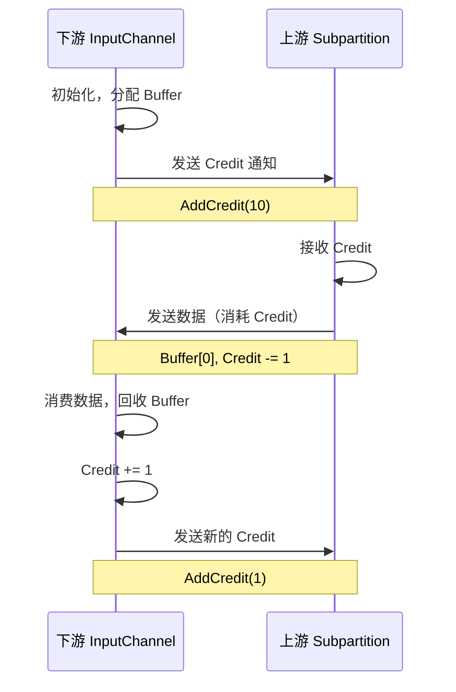
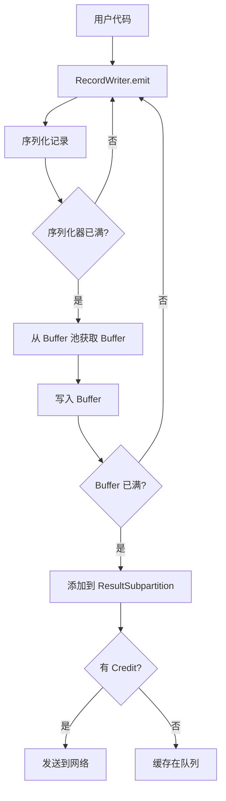
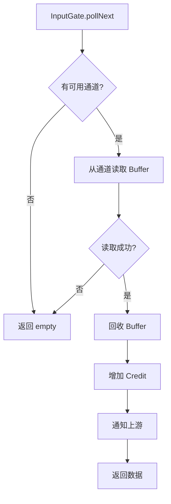

# 网络传输机制源码深度解析

## 一、机制概述

### 1.1 什么是网络传输机制

**网络传输机制**是 Flink 任务间数据交换的核心，负责将上游算子产生的数据高效地传输到下游算子。

**核心组件**：
- **ResultPartition**：数据生产端，负责缓存和发送数据
- **InputGate**：数据消费端，负责接收和读取数据
- **NetworkBuffer**：网络数据缓冲区，基于内存池管理

**数据流向**：
```
上游 Task → ResultPartition → Network → InputGate → 下游 Task
```

### 1.2 核心概念

**ResultPartition（结果分区）**
- 每个 Task 的输出对应一个 ResultPartition
- 包含多个 ResultSubpartition（对应下游的并行度）
- 支持不同的分区类型（PIPELINED、BLOCKING）

**InputGate（输入门）**
- 每个 Task 的输入对应一个 InputGate
- 包含多个 InputChannel（对应上游的并行度）
- 支持本地和远程数据读取

**NetworkBuffer（网络缓冲区）**
- 固定大小的内存块（默认 32KB）
- 基于对象池管理，避免频繁分配
- 支持零拷贝传输

## 二、核心类与接口

### 2.1 ResultPartition

#### ResultPartition
- **路径**：`flink-runtime/src/main/java/org/apache/flink/runtime/io/network/partition/ResultPartition.java`
- **职责**：管理单个 Task 的输出数据
- **核心字段**：
  - `partitionId`：分区 ID
  - `partitionType`：分区类型
  - `numSubpartitions`：子分区数量
  - `bufferPool`：Buffer 池

```java
public abstract class ResultPartition implements ResultPartitionWriter {
    
    /** 分区 ID */
    protected final ResultPartitionID partitionId;
    
    /** 分区类型 */
    protected final ResultPartitionType partitionType;
    
    /** 子分区数量 */
    protected final int numSubpartitions;
    
    /** Buffer 池 */
    protected BufferPool bufferPool;
    
    /**
     * 设置 Buffer 池
     */
    @Override
    public void setup() throws IOException {
        this.bufferPool = checkNotNull(bufferPoolFactory.get());
        setupInternal();
        partitionManager.registerResultPartition(this);
    }
    
    /**
     * 完成数据生产
     */
    @Override
    public void finish() throws IOException {
        checkInProduceState();
        isFinished = true;
    }
    
    /**
     * 释放资源
     */
    @Override
    public void release(Throwable cause) {
        if (isReleased.compareAndSet(false, true)) {
            if (cause != null) {
                this.cause = cause;
            }
            releaseInternal();
        }
    }
}
```

**ResultPartitionType（分区类型）**：
```java
public enum ResultPartitionType {
    
    /** 流水线分区：数据立即可用，支持流式处理 */
    PIPELINED(false, false, false, ConsumingConstraint.MUST_BE_PIPELINED),
    
    /** 阻塞分区：数据完全生产后才可用，支持批处理 */
    BLOCKING(true, false, false, ConsumingConstraint.CAN_BE_BLOCKING),
    
    /** 持久化阻塞分区：数据持久化到磁盘 */
    BLOCKING_PERSISTENT(true, true, false, ConsumingConstraint.CAN_BE_BLOCKING),
    
    /** 混合分区：支持流批统一 */
    HYBRID_FULL(true, true, true, ConsumingConstraint.CAN_BE_BLOCKING),
    
    /** 混合选择性分区 */
    HYBRID_SELECTIVE(true, true, true, ConsumingConstraint.CAN_BE_BLOCKING);
}
```

**对比**：

| 类型 | 数据可用时机 | 持久化 | 适用场景 |
|------|------------|--------|---------|
| PIPELINED | 立即 | 否 | 流式处理 |
| BLOCKING | 完全生产后 | 否 | 批处理 |
| BLOCKING_PERSISTENT | 完全生产后 | 是 | 大规模批处理 |
| HYBRID | 部分可用 | 是 | 流批统一 |

### 2.2 InputGate

#### InputGate
- **路径**：`flink-runtime/src/main/java/org/apache/flink/runtime/io/network/partition/consumer/InputGate.java`
- **职责**：管理单个 Task 的输入数据
- **核心方法**：
  - `getNext()`：阻塞获取下一个数据
  - `pollNext()`：非阻塞获取下一个数据
  - `getNumberOfInputChannels()`：获取输入通道数量

```java
public abstract class InputGate
        implements PullingAsyncDataInput<BufferOrEvent>, AutoCloseable {
    
    /**
     * 获取输入通道数量
     */
    public abstract int getNumberOfInputChannels();
    
    /**
     * 是否已完成
     */
    public abstract boolean isFinished();
    
    /**
     * 阻塞获取下一个 BufferOrEvent
     * @return Optional.empty() 如果已完成
     */
    public abstract Optional<BufferOrEvent> getNext() 
        throws IOException, InterruptedException;
    
    /**
     * 非阻塞获取下一个 BufferOrEvent
     * @return Optional.empty() 如果没有数据或已完成
     */
    public abstract Optional<BufferOrEvent> pollNext() 
        throws IOException, InterruptedException;
    
    /**
     * 发送任务事件到上游
     */
    public abstract void sendTaskEvent(TaskEvent event) throws IOException;
    
    /**
     * 获取可用性 Future
     */
    @Override
    public CompletableFuture<?> getAvailableFuture() {
        return availabilityHelper.getAvailableFuture();
    }
    
    /**
     * 获取指定通道
     */
    public abstract InputChannel getChannel(int channelIndex);
}
```

**InputChannel 类型**：
```java
// LocalInputChannel：本地数据读取（同一个 TaskManager）
public class LocalInputChannel extends InputChannel {
    private final ResultSubpartitionView subpartitionView;
    
    @Override
    Optional<BufferAndAvailability> getNextBuffer() {
        return subpartitionView.getNextBuffer();
    }
}

// RemoteInputChannel：远程数据读取（不同 TaskManager）
public class RemoteInputChannel extends InputChannel {
    private final PartitionRequestClient partitionRequestClient;
    
    @Override
    void requestSubpartition() {
        partitionRequestClient.requestSubpartition(
            partitionId, subpartitionIndex, this);
    }
}
```

### 2.3 NetworkBufferPool

#### NetworkBufferPool
- **路径**：`flink-runtime/src/main/java/org/apache/flink/runtime/io/network/buffer/NetworkBufferPool.java`
- **职责**：全局网络 Buffer 池，管理所有网络 Buffer
- **核心字段**：
  - `totalNumberOfMemorySegments`：总 Buffer 数量
  - `memorySegmentSize`：每个 Buffer 大小（默认 32KB）
  - `availableMemorySegments`：可用 Buffer 队列

```java
public class NetworkBufferPool
        implements BufferPoolFactory, MemorySegmentProvider {
    
    /** 总 Buffer 数量 */
    private final int totalNumberOfMemorySegments;
    
    /** Buffer 大小 */
    private final int memorySegmentSize;
    
    /** 可用 Buffer 队列 */
    private final ArrayDeque<MemorySegment> availableMemorySegments;
    
    /** 所有 Buffer 池 */
    private final Set<LocalBufferPool> allBufferPools = new HashSet<>();
    
    /**
     * 构造函数：分配所有 MemorySegment
     */
    public NetworkBufferPool(
            int numberOfSegmentsToAllocate, 
            int segmentSize,
            Duration requestSegmentsTimeout) {
        
        this.totalNumberOfMemorySegments = numberOfSegmentsToAllocate;
        this.memorySegmentSize = segmentSize;
        this.requestSegmentsTimeout = requestSegmentsTimeout;
        
        // 分配所有 Buffer
        this.availableMemorySegments = new ArrayDeque<>(numberOfSegmentsToAllocate);
        for (int i = 0; i < numberOfSegmentsToAllocate; i++) {
            availableMemorySegments.add(
                MemorySegmentFactory.allocateUnpooledOffHeapMemory(segmentSize, null));
        }
    }
    
    /**
     * 创建 LocalBufferPool
     */
    @Override
    public BufferPool createBufferPool(
            int numRequiredBuffers,
            int maxUsedBuffers) throws IOException {
        
        synchronized (factoryLock) {
            // 创建 Buffer 池
            LocalBufferPool localBufferPool = new LocalBufferPool(
                this,
                numRequiredBuffers,
                maxUsedBuffers);
            
            // 注册到全局池
            allBufferPools.add(localBufferPool);
            
            // 重新分配 Buffer
            redistributeBuffers();
            
            return localBufferPool;
        }
    }
    
    /**
     * 请求 MemorySegment
     */
    @Override
    public List<MemorySegment> requestPooledMemorySegments(int numberOfSegmentsToRequest) 
            throws IOException {
        
        synchronized (availableMemorySegments) {
            // 等待可用 Buffer
            while (availableMemorySegments.size() < numberOfSegmentsToRequest) {
                availableMemorySegments.wait(requestSegmentsTimeout.toMillis());
            }
            
            // 分配 Buffer
            List<MemorySegment> segments = new ArrayList<>(numberOfSegmentsToRequest);
            for (int i = 0; i < numberOfSegmentsToRequest; i++) {
                segments.add(availableMemorySegments.poll());
            }
            
            return segments;
        }
    }
    
    /**
     * 回收 MemorySegment
     */
    @Override
    public void recyclePooledMemorySegment(MemorySegment segment) {
        synchronized (availableMemorySegments) {
            availableMemorySegments.add(segment);
            availableMemorySegments.notify();
        }
    }
}
```

**Buffer 大小计算**：
```
总网络内存 = TaskManager 总内存 × network.memory.fraction
Buffer 数量 = 总网络内存 / Buffer 大小
默认 Buffer 大小 = 32KB
```

**配置示例**：
```yaml
taskmanager.memory.network.fraction: 0.1  # 网络内存占比
taskmanager.memory.network.min: 64mb      # 最小网络内存
taskmanager.memory.network.max: 1gb       # 最大网络内存
taskmanager.memory.segment-size: 32kb     # Buffer 大小
```

## 三、源码深度分析

### 3.1 数据发送流程

#### 3.1.1 RecordWriter 写入数据

```java
public class RecordWriter<T> {
    
    /** 序列化器 */
    private final RecordSerializer<T> serializer;
    
    /** 目标分区 */
    private final ResultPartitionWriter targetPartition;
    
    /**
     * 发送记录
     */
    public void emit(T record) throws IOException {
        // 1. 序列化记录
        serializer.serializeRecord(record);
        
        // 2. 如果序列化器已满，刷新到 Buffer
        if (serializer.isFull()) {
            flushToBuffer();
        }
    }
    
    private void flushToBuffer() throws IOException {
        // 1. 从 Buffer 池获取 Buffer
        BufferBuilder bufferBuilder = targetPartition.getBufferBuilder();
        
        // 2. 将序列化数据写入 Buffer
        SerializationResult result = serializer.copyToBufferBuilder(bufferBuilder);
        
        // 3. 如果 Buffer 已满，发送到 ResultPartition
        if (result.isFullBuffer()) {
            bufferBuilder.finish();
            targetPartition.addBufferConsumer(
                bufferBuilder.createBufferConsumer(), 
                targetSubpartition);
        }
    }
}
```

#### 3.1.2 ResultPartition 缓存数据

```java
public class PipelinedResultPartition extends ResultPartition {
    
    /** 子分区数组 */
    private final PipelinedSubpartition[] subpartitions;
    
    @Override
    public void addBufferConsumer(
            BufferConsumer bufferConsumer, 
            int targetSubpartition) {
        
        // 添加到对应的子分区
        subpartitions[targetSubpartition].add(bufferConsumer);
        
        // 通知下游数据可用
        subpartitions[targetSubpartition].notifyDataAvailable();
    }
}

public class PipelinedSubpartition extends ResultSubpartition {
    
    /** Buffer 队列 */
    private final ArrayDeque<BufferConsumer> buffers = new ArrayDeque<>();
    
    /** 可用 Credit */
    private int availableCredit = 0;
    
    @Override
    public void add(BufferConsumer bufferConsumer) {
        synchronized (buffers) {
            buffers.add(bufferConsumer);
            
            // 如果有 Credit，立即发送
            if (availableCredit > 0) {
                flush();
            }
        }
    }
    
    private void flush() {
        while (availableCredit > 0 && !buffers.isEmpty()) {
            BufferConsumer buffer = buffers.poll();
            
            // 发送数据
            partitionRequestClient.sendBuffer(buffer);
            
            // 消耗 Credit
            availableCredit--;
        }
    }
}
```

### 3.2 数据接收流程

#### 3.2.1 InputGate 读取数据

```java
public class SingleInputGate extends InputGate {
    
    /** 输入通道数组 */
    private final InputChannel[] inputChannels;
    
    /** 可用通道队列 */
    private final ArrayDeque<InputChannel> inputChannelsWithData = new ArrayDeque<>();
    
    @Override
    public Optional<BufferOrEvent> pollNext() throws IOException {
        // 1. 从可用通道队列获取通道
        InputChannel currentChannel = inputChannelsWithData.poll();
        
        if (currentChannel == null) {
            return Optional.empty();
        }
        
        // 2. 从通道读取数据
        Optional<BufferAndAvailability> bufferAndAvailability = 
            currentChannel.getNextBuffer();
        
        if (!bufferAndAvailability.isPresent()) {
            return Optional.empty();
        }
        
        BufferAndAvailability result = bufferAndAvailability.get();
        
        // 3. 如果通道还有数据，重新加入队列
        if (result.moreAvailable()) {
            inputChannelsWithData.add(currentChannel);
        }
        
        // 4. 返回 Buffer 或 Event
        return Optional.of(transformBuffer(
            result.buffer(), 
            currentChannel.getChannelInfo()));
    }
}
```

#### 3.2.2 RemoteInputChannel 接收网络数据

```java
public class RemoteInputChannel extends InputChannel {
    
    /** 接收的 Buffer 队列 */
    private final ArrayDeque<Buffer> receivedBuffers = new ArrayDeque<>();
    
    /** 可用 Credit */
    private int numCreditsAvailable;
    
    /**
     * 接收网络数据
     */
    public void onBuffer(Buffer buffer, int sequenceNumber) {
        synchronized (receivedBuffers) {
            // 1. 添加到接收队列
            receivedBuffers.add(buffer);
            
            // 2. 通知 InputGate 数据可用
            notifyChannelNonEmpty();
        }
    }
    
    @Override
    public Optional<BufferAndAvailability> getNextBuffer() {
        synchronized (receivedBuffers) {
            Buffer buffer = receivedBuffers.poll();
            
            if (buffer != null) {
                // 回收 Buffer，增加 Credit
                numCreditsAvailable++;
                
                // 通知上游可用 Credit
                notifyCreditAvailable();
                
                return Optional.of(new BufferAndAvailability(
                    buffer, 
                    !receivedBuffers.isEmpty()));
            }
            
            return Optional.empty();
        }
    }
    
    /**
     * 通知上游可用 Credit
     */
    private void notifyCreditAvailable() {
        if (numCreditsAvailable > 0) {
            partitionRequestClient.sendTaskEvent(
                new AddCredit(numCreditsAvailable, inputChannelId));
        }
    }
}
```

### 3.3 Credit-based 流控

**完整流程**：


## 四、执行流程图

### 4.1 数据发送流程



### 4.2 数据接收流程



## 五、面试高频问题

### Q1: Flink 的网络传输如何实现零拷贝？

**答案**：

Flink 通过以下机制实现零拷贝：

**1. DirectBuffer（堆外内存）**
```java
// NetworkBufferPool 分配堆外内存
MemorySegment segment = 
    MemorySegmentFactory.allocateUnpooledOffHeapMemory(segmentSize, null);
```

**优势**：
- 避免 JVM 堆内存拷贝
- 直接使用操作系统的 Page Cache
- 减少 GC 压力

**2. FileChannel.transferTo（文件传输）**
```java
// 使用 sendfile 系统调用
fileChannel.transferTo(position, count, socketChannel);
```

**3. Netty 零拷贝**
```java
// 使用 CompositeByteBuf 组合多个 Buffer
CompositeByteBuf composite = Unpooled.compositeBuffer();
composite.addComponents(buffer1, buffer2);
```

### Q2: ResultPartition 的不同类型有什么区别？

**答案**：

| 类型 | 数据可用时机 | 持久化 | 内存占用 | 适用场景 |
|------|------------|--------|---------|---------|
| PIPELINED | 立即 | 否 | 低 | 流式处理 |
| BLOCKING | 完全生产后 | 否 | 高 | 小规模批处理 |
| BLOCKING_PERSISTENT | 完全生产后 | 是 | 低 | 大规模批处理 |
| HYBRID | 部分可用 | 是 | 中 | 流批统一 |

**源码支撑**：
- [`ResultPartition`](file:///Users/wanghaofeng/IdeaProjects/flink/flink-runtime/src/main/java/org/apache/flink/runtime/io/network/partition/ResultPartition.java)
- [`InputGate`](file:///Users/wanghaofeng/IdeaProjects/flink/flink-runtime/src/main/java/org/apache/flink/runtime/io/network/partition/consumer/InputGate.java)
- [`NetworkBufferPool`](file:///Users/wanghaofeng/IdeaProjects/flink/flink-runtime/src/main/java/org/apache/flink/runtime/io/network/buffer/NetworkBufferPool.java)

## 六、最佳实践

### 6.1 优化网络 Buffer 配置

```yaml
# 增加网络内存
taskmanager.memory.network.fraction: 0.2  # 默认 0.1

# 调整 Buffer 大小
taskmanager.memory.segment-size: 64kb  # 默认 32kb

# 增加每个通道的 Buffer 数量
taskmanager.network.memory.buffers-per-channel: 4  # 默认 2
```

### 6.2 监控网络指标

```java
// 监控 Buffer 使用率
bufferUsage = usedBuffers / totalBuffers

// 监控输出队列长度
outputQueueLength = pendingBuffers.size()

// 监控网络吞吐量
networkThroughput = bytesOut / time
```

---

**文档版本**：v1.0  
**基于 Flink 版本**：Apache Flink 主分支  
**最后更新**：2026-02-05
