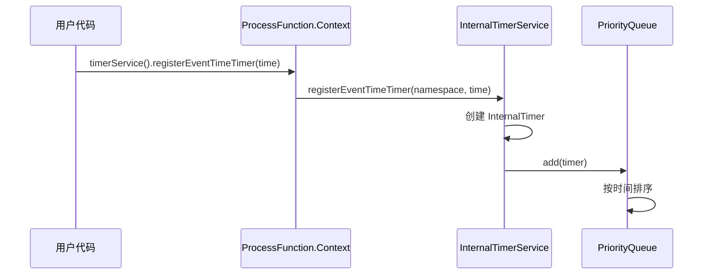
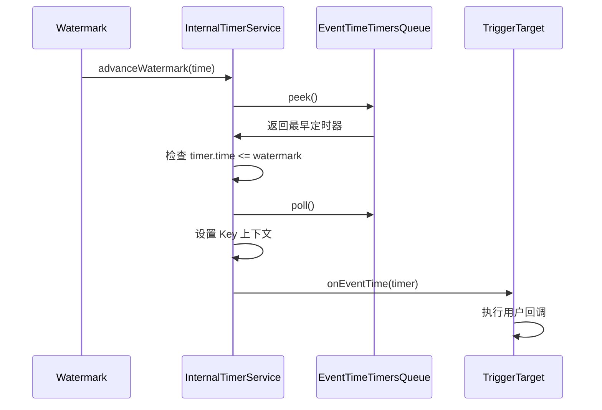
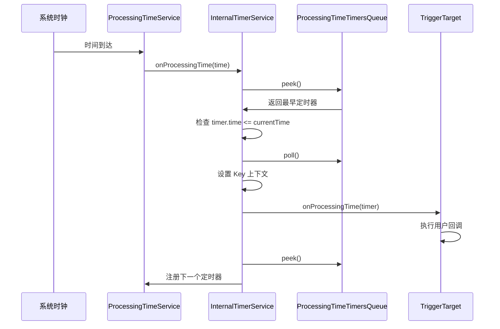
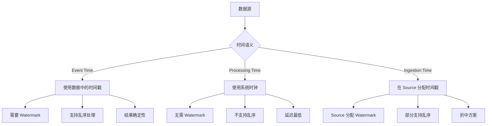
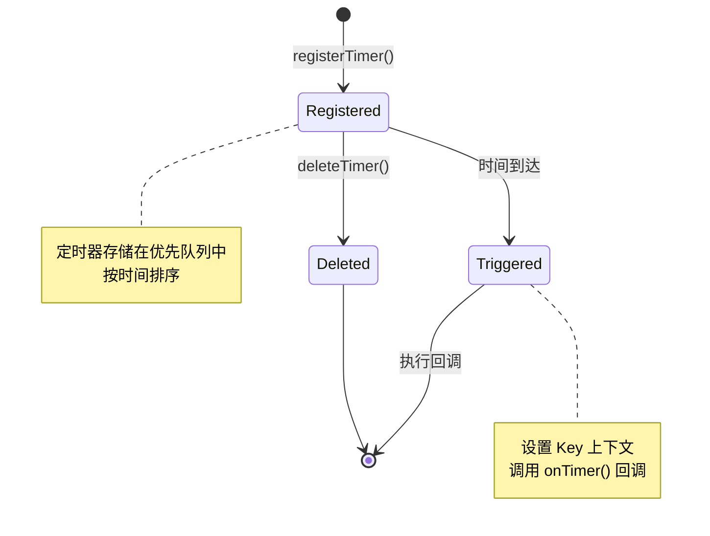

# 时间语义与定时器源码深度解析

## 一、机制概述

### 1.1 什么是时间语义

**时间语义**定义了 Flink 如何理解和处理数据的时间属性。Flink 支持三种时间语义：

**1. Event Time（事件时间）**
- 数据产生的时间
- 嵌入在数据记录中
- 支持乱序处理
- 需要 Watermark 机制

**2. Processing Time（处理时间）**
- 数据被处理的时间
- 由系统时钟决定
- 延迟最低
- 不支持乱序处理

**3. Ingestion Time（摄入时间）**
- 数据进入 Flink 的时间
- 在 Source 处分配
- 介于 Event Time 和 Processing Time 之间

### 1.2 定时器机制

**定时器（Timer）**允许用户在特定时间触发回调函数，用于实现复杂的时间相关逻辑。

**核心特性**：
- 支持 Event Time 和 Processing Time 定时器
- 定时器作用域为 Key（仅支持 KeyedStream）
- 定时器持久化到状态中
- 支持定时器的注册、删除和触发

## 二、核心类与接口

### 2.1 TimerService

#### TimerService
- **路径**：`flink-streaming-java/src/main/java/org/apache/flink/streaming/api/TimerService.java`
- **职责**：用户 API，提供定时器操作接口
- **核心方法**：
  - `currentProcessingTime()`：获取当前处理时间
  - `currentWatermark()`：获取当前 Watermark
  - `registerProcessingTimeTimer()`：注册处理时间定时器
  - `registerEventTimeTimer()`：注册事件时间定时器

```java
@PublicEvolving
public interface TimerService {
    
    /**
     * 获取当前处理时间
     */
    long currentProcessingTime();
    
    /**
     * 获取当前事件时间 Watermark
     */
    long currentWatermark();
    
    /**
     * 注册处理时间定时器
     * @param time 触发时间（处理时间）
     */
    void registerProcessingTimeTimer(long time);
    
    /**
     * 注册事件时间定时器
     * @param time 触发时间（事件时间）
     */
    void registerEventTimeTimer(long time);
    
    /**
     * 删除处理时间定时器
     */
    void deleteProcessingTimeTimer(long time);
    
    /**
     * 删除事件时间定时器
     */
    void deleteEventTimeTimer(long time);
}
```

**使用示例**：
```java
public class MyProcessFunction extends KeyedProcessFunction<String, Event, Result> {
    
    @Override
    public void processElement(Event value, Context ctx, Collector<Result> out) {
        // 获取当前时间
        long currentTime = ctx.timerService().currentProcessingTime();
        
        // 注册 1 分钟后的定时器
        ctx.timerService().registerProcessingTimeTimer(
            currentTime + 60000);
        
        // 注册事件时间定时器
        ctx.timerService().registerEventTimeTimer(
            value.getTimestamp() + 60000);
    }
    
    @Override
    public void onTimer(long timestamp, OnTimerContext ctx, Collector<Result> out) {
        // 定时器触发时的回调
        out.collect(new Result("Timer fired at: " + timestamp));
    }
}
```

### 2.2 InternalTimerService

#### InternalTimerService
- **路径**：`flink-streaming-java/src/main/java/org/apache/flink/streaming/api/operators/InternalTimerService.java`
- **职责**：内部 API，支持 Namespace 的定时器服务
- **核心特性**：
  - 支持 Namespace（如 Window）
  - 定时器按 Key 和 Namespace 分组
  - 提供批量操作接口

```java
@Internal
public interface InternalTimerService<N> {
    
    /**
     * 注册处理时间定时器（带 Namespace）
     * @param namespace 命名空间（如 Window）
     * @param time 触发时间
     */
    void registerProcessingTimeTimer(N namespace, long time);
    
    /**
     * 删除处理时间定时器
     */
    void deleteProcessingTimeTimer(N namespace, long time);
    
    /**
     * 注册事件时间定时器（带 Namespace）
     */
    void registerEventTimeTimer(N namespace, long time);
    
    /**
     * 删除事件时间定时器
     */
    void deleteEventTimeTimer(N namespace, long time);
    
    /**
     * 遍历所有事件时间定时器
     */
    void forEachEventTimeTimer(
        BiConsumerWithException<N, Long, Exception> consumer) throws Exception;
    
    /**
     * 遍历所有处理时间定时器
     */
    void forEachProcessingTimeTimer(
        BiConsumerWithException<N, Long, Exception> consumer) throws Exception;
}
```

### 2.3 InternalTimerServiceImpl

#### InternalTimerServiceImpl
- **路径**：`flink-streaming-java/src/main/java/org/apache/flink/streaming/api/operators/InternalTimerServiceImpl.java`
- **职责**：InternalTimerService 的实现类
- **核心数据结构**：
  - `processingTimeTimersQueue`：处理时间定时器队列（优先队列）
  - `eventTimeTimersQueue`：事件时间定时器队列（优先队列）
  - `keyContext`：Key 上下文

```java
public class InternalTimerServiceImpl<K, N> implements InternalTimerService<N> {
    
    /** Key 序列化器 */
    private final TypeSerializer<K> keySerializer;
    
    /** Namespace 序列化器 */
    private final TypeSerializer<N> namespaceSerializer;
    
    /** 处理时间定时器队列 */
    private final KeyGroupedInternalPriorityQueue<TimerHeapInternalTimer<K, N>> 
        processingTimeTimersQueue;
    
    /** 事件时间定时器队列 */
    private final KeyGroupedInternalPriorityQueue<TimerHeapInternalTimer<K, N>> 
        eventTimeTimersQueue;
    
    /** Key 上下文 */
    private final KeyContext keyContext;
    
    /** 处理时间服务 */
    private final ProcessingTimeService processingTimeService;
    
    /**
     * 注册处理时间定时器
     */
    @Override
    public void registerProcessingTimeTimer(N namespace, long time) {
        // 1. 创建定时器
        InternalTimer<K, N> timer = new TimerHeapInternalTimer<>(
            time, 
            (K) keyContext.getCurrentKey(), 
            namespace);
        
        // 2. 添加到队列
        if (processingTimeTimersQueue.add(timer)) {
            // 3. 如果是最早的定时器，注册系统定时器
            long nextTriggerTime = processingTimeTimersQueue.peek().getTimestamp();
            if (nextTriggerTime == time) {
                scheduleProcessingTimeTimer(time);
            }
        }
    }
    
    /**
     * 注册事件时间定时器
     */
    @Override
    public void registerEventTimeTimer(N namespace, long time) {
        // 1. 创建定时器
        InternalTimer<K, N> timer = new TimerHeapInternalTimer<>(
            time, 
            (K) keyContext.getCurrentKey(), 
            namespace);
        
        // 2. 添加到队列
        eventTimeTimersQueue.add(timer);
    }
    
    /**
     * 推进事件时间（Watermark 到达时调用）
     */
    public void advanceWatermark(long time) throws Exception {
        currentWatermark = time;
        
        // 触发所有 <= Watermark 的定时器
        InternalTimer<K, N> timer;
        while ((timer = eventTimeTimersQueue.peek()) != null 
                && timer.getTimestamp() <= time) {
            
            // 移除定时器
            eventTimeTimersQueue.poll();
            
            // 设置 Key 上下文
            keyContext.setCurrentKey(timer.getKey());
            
            // 触发回调
            triggerTarget.onEventTime(timer);
        }
    }
    
    /**
     * 处理时间定时器触发
     */
    private void onProcessingTime(long time) throws Exception {
        // 触发所有 <= time 的定时器
        InternalTimer<K, N> timer;
        while ((timer = processingTimeTimersQueue.peek()) != null 
                && timer.getTimestamp() <= time) {
            
            // 移除定时器
            processingTimeTimersQueue.poll();
            
            // 设置 Key 上下文
            keyContext.setCurrentKey(timer.getKey());
            
            // 触发回调
            triggerTarget.onProcessingTime(timer);
        }
        
        // 注册下一个定时器
        if (processingTimeTimersQueue.peek() != null) {
            long nextTime = processingTimeTimersQueue.peek().getTimestamp();
            scheduleProcessingTimeTimer(nextTime);
        }
    }
}
```

**关键点**：
- 定时器存储在优先队列中，按时间排序
- 事件时间定时器由 Watermark 推进触发
- 处理时间定时器由系统时钟触发
- 定时器触发时会设置正确的 Key 上下文

## 三、源码深度分析

### 3.1 定时器注册流程



### 3.2 事件时间定时器触发流程



### 3.3 处理时间定时器触发流程



### 3.4 定时器状态管理

**定时器快照**：
```java
public class InternalTimersSnapshot<K, N> {
    
    /** 事件时间定时器集合 */
    private final Set<InternalTimer<K, N>> eventTimeTimers;
    
    /** 处理时间定时器集合 */
    private final Set<InternalTimer<K, N>> processingTimeTimers;
    
    /**
     * Checkpoint 时保存定时器
     */
    public static <K, N> InternalTimersSnapshot<K, N> fromTimerService(
            InternalTimerServiceImpl<K, N> timerService) {
        
        Set<InternalTimer<K, N>> eventTimeTimers = new HashSet<>();
        Set<InternalTimer<K, N>> processingTimeTimers = new HashSet<>();
        
        // 保存所有事件时间定时器
        timerService.forEachEventTimeTimer((namespace, time) -> {
            eventTimeTimers.add(new TimerHeapInternalTimer<>(
                time, 
                timerService.getCurrentKey(), 
                namespace));
        });
        
        // 保存所有处理时间定时器
        timerService.forEachProcessingTimeTimer((namespace, time) -> {
            processingTimeTimers.add(new TimerHeapInternalTimer<>(
                time, 
                timerService.getCurrentKey(), 
                namespace));
        });
        
        return new InternalTimersSnapshot<>(
            eventTimeTimers, 
            processingTimeTimers);
    }
    
    /**
     * 恢复定时器
     */
    public void restoreTimers(InternalTimerServiceImpl<K, N> timerService) {
        // 恢复事件时间定时器
        for (InternalTimer<K, N> timer : eventTimeTimers) {
            timerService.registerEventTimeTimer(
                timer.getNamespace(), 
                timer.getTimestamp());
        }
        
        // 恢复处理时间定时器
        for (InternalTimer<K, N> timer : processingTimeTimers) {
            timerService.registerProcessingTimeTimer(
                timer.getNamespace(), 
                timer.getTimestamp());
        }
    }
}
```

## 四、执行流程图

### 4.1 时间语义对比



### 4.2 定时器生命周期



## 五、面试高频问题

### Q1: Flink 的三种时间语义有什么区别？各适用于什么场景？

**答案**：

| 时间语义 | 定义 | Watermark | 乱序处理 | 确定性 | 延迟 | 适用场景 |
|---------|------|-----------|---------|--------|------|---------|
| Event Time | 数据产生时间 | 需要 | 支持 | 高 | 高 | 需要精确结果的场景 |
| Processing Time | 数据处理时间 | 不需要 | 不支持 | 低 | 低 | 实时性要求高的场景 |
| Ingestion Time | 数据摄入时间 | 自动生成 | 部分支持 | 中 | 中 | 折中方案 |

**Event Time 示例**：
```java
// 使用 Event Time
env.setStreamTimeCharacteristic(TimeCharacteristic.EventTime);

DataStream<Event> stream = env.addSource(...)
    .assignTimestampsAndWatermarks(
        WatermarkStrategy
            .<Event>forBoundedOutOfOrderness(Duration.ofSeconds(5))
            .withTimestampAssigner((event, timestamp) -> event.getTimestamp())
    );
```

**Processing Time 示例**：
```java
// 使用 Processing Time（默认）
DataStream<Event> stream = env.addSource(...);

stream.keyBy(Event::getKey)
      .window(TumblingProcessingTimeWindows.of(Time.minutes(1)))
      .reduce(...);
```

**Ingestion Time 示例**：
```java
// 使用 Ingestion Time
env.setStreamTimeCharacteristic(TimeCharacteristic.IngestionTime);

DataStream<Event> stream = env.addSource(...);
// Flink 自动在 Source 处分配时间戳和 Watermark
```

**选择建议**：
- **Event Time**：金融交易、订单处理、日志分析等需要精确结果的场景
- **Processing Time**：实时监控、实时告警等对延迟敏感的场景
- **Ingestion Time**：不关心数据产生时间，但需要一定顺序保证的场景

### Q2: 定时器的工作原理是什么？如何保证定时器的可靠性？

**答案**：

**工作原理**：

**1. 定时器注册**：
```java
public void processElement(Event value, Context ctx, Collector<Result> out) {
    // 注册定时器
    long timerTime = value.getTimestamp() + 60000;  // 1分钟后
    ctx.timerService().registerEventTimeTimer(timerTime);
}
```

**内部实现**：
```java
// InternalTimerServiceImpl
public void registerEventTimeTimer(N namespace, long time) {
    // 1. 创建定时器对象
    InternalTimer<K, N> timer = new TimerHeapInternalTimer<>(
        time, 
        currentKey, 
        namespace);
    
    // 2. 添加到优先队列（按时间排序）
    eventTimeTimersQueue.add(timer);
}
```

**2. 定时器触发**：

**事件时间定时器**：
```java
// Watermark 推进时触发
public void advanceWatermark(long time) {
    while ((timer = eventTimeTimersQueue.peek()) != null 
            && timer.getTimestamp() <= time) {
        
        // 移除并触发定时器
        eventTimeTimersQueue.poll();
        keyContext.setCurrentKey(timer.getKey());
        triggerTarget.onEventTime(timer);
    }
}
```

**处理时间定时器**：
```java
// 系统时钟触发
private void onProcessingTime(long time) {
    while ((timer = processingTimeTimersQueue.peek()) != null 
            && timer.getTimestamp() <= time) {
        
        // 移除并触发定时器
        processingTimeTimersQueue.poll();
        keyContext.setCurrentKey(timer.getKey());
        triggerTarget.onProcessingTime(timer);
    }
}
```

**可靠性保证**：

**1. 定时器持久化**：
```java
// Checkpoint 时保存定时器
public void snapshotState(StateSnapshotContext context) {
    // 保存所有事件时间定时器
    InternalTimersSnapshot<K, N> snapshot = 
        InternalTimersSnapshot.fromTimerService(timerService);
    
    // 写入状态
    context.getRawKeyedOperatorState().write(snapshot);
}
```

**2. 定时器恢复**：
```java
// 恢复时重新注册定时器
public void initializeState(StateInitializationContext context) {
    if (context.isRestored()) {
        // 读取定时器快照
        InternalTimersSnapshot<K, N> snapshot = 
            context.getRawKeyedOperatorState().read();
        
        // 恢复定时器
        snapshot.restoreTimers(timerService);
    }
}
```

**3. 定时器去重**：
```java
// 同一个 Key + Namespace + Time 的定时器只会注册一次
if (processingTimeTimersQueue.add(timer)) {
    // 新定时器才会注册系统定时器
    scheduleProcessingTimeTimer(time);
}
```

**源码支撑**：
- [`TimerService`](file:///Users/wanghaofeng/IdeaProjects/flink/flink-streaming-java/src/main/java/org/apache/flink/streaming/api/TimerService.java)
- [`InternalTimerService`](file:///Users/wanghaofeng/IdeaProjects/flink/flink-streaming-java/src/main/java/org/apache/flink/streaming/api/operators/InternalTimerService.java)

### Q3: 定时器有什么限制？如何优化定时器的使用？

**答案**：

**限制**：

**1. 仅支持 KeyedStream**：
```java
// 错误：非 Keyed Stream 不支持定时器
DataStream<Event> stream = env.addSource(...);
stream.process(new ProcessFunction<Event, Result>() {
    @Override
    public void processElement(Event value, Context ctx, Collector<Result> out) {
        // 抛出 UnsupportedOperationException
        ctx.timerService().registerEventTimeTimer(time);
    }
});

// 正确：Keyed Stream 支持定时器
stream.keyBy(Event::getKey)
      .process(new KeyedProcessFunction<String, Event, Result>() {
          @Override
          public void processElement(Event value, Context ctx, Collector<Result> out) {
              // 正常工作
              ctx.timerService().registerEventTimeTimer(time);
          }
      });
```

**2. 定时器数量限制**：
- 定时器存储在内存中
- 大量定时器会占用大量内存
- 建议：合并定时器，使用粗粒度时间

**3. 定时器精度**：
- 事件时间定时器精度取决于 Watermark
- 处理时间定时器精度取决于系统调度

**优化技巧**：

**技巧 1：合并定时器**
```java
// 不好：每条数据注册一个定时器
public void processElement(Event value, Context ctx, Collector<Result> out) {
    ctx.timerService().registerEventTimeTimer(value.getTimestamp() + 60000);
}

// 好：使用固定时间间隔
public void processElement(Event value, Context ctx, Collector<Result> out) {
    // 向上取整到分钟
    long timerTime = ((value.getTimestamp() / 60000) + 1) * 60000;
    ctx.timerService().registerEventTimeTimer(timerTime);
}
```

**技巧 2：及时删除定时器**
```java
private ValueState<Long> timerState;

public void processElement(Event value, Context ctx, Collector<Result> out) {
    // 删除旧定时器
    Long oldTimer = timerState.value();
    if (oldTimer != null) {
        ctx.timerService().deleteEventTimeTimer(oldTimer);
    }
    
    // 注册新定时器
    long newTimer = value.getTimestamp() + 60000;
    ctx.timerService().registerEventTimeTimer(newTimer);
    timerState.update(newTimer);
}
```

**技巧 3：使用状态 TTL 替代定时器**
```java
// 不好：使用定时器清理过期状态
public void processElement(Event value, Context ctx, Collector<Result> out) {
    state.update(value);
    ctx.timerService().registerEventTimeTimer(
        value.getTimestamp() + TimeUnit.DAYS.toMillis(7));
}

public void onTimer(long timestamp, OnTimerContext ctx, Collector<Result> out) {
    state.clear();  // 清理过期状态
}

// 好：使用状态 TTL
StateTtlConfig ttlConfig = StateTtlConfig
    .newBuilder(Time.days(7))
    .setUpdateType(StateTtlConfig.UpdateType.OnCreateAndWrite)
    .setStateVisibility(StateTtlConfig.StateVisibility.NeverReturnExpired)
    .build();

ValueStateDescriptor<Event> descriptor = 
    new ValueStateDescriptor<>("state", Event.class);
descriptor.enableTimeToLive(ttlConfig);
```

## 六、最佳实践

### 6.1 选择合适的时间语义

```java
// 金融场景：使用 Event Time
env.setStreamTimeCharacteristic(TimeCharacteristic.EventTime);

// 实时监控：使用 Processing Time
env.setStreamTimeCharacteristic(TimeCharacteristic.ProcessingTime);
```

### 6.2 合理使用定时器

```java
// 使用粗粒度定时器
long timerTime = ((timestamp / 60000) + 1) * 60000;  // 向上取整到分钟

// 及时删除不需要的定时器
ctx.timerService().deleteEventTimeTimer(oldTimer);
```

### 6.3 监控定时器数量

```java
// 监控定时器数量
getRuntimeContext().getMetricGroup()
    .gauge("numTimers", () -> timerService.numEventTimeTimers());
```

---

**文档版本**：v1.0  
**基于 Flink 版本**：Apache Flink 主分支  
**最后更新**：2026-02-05
