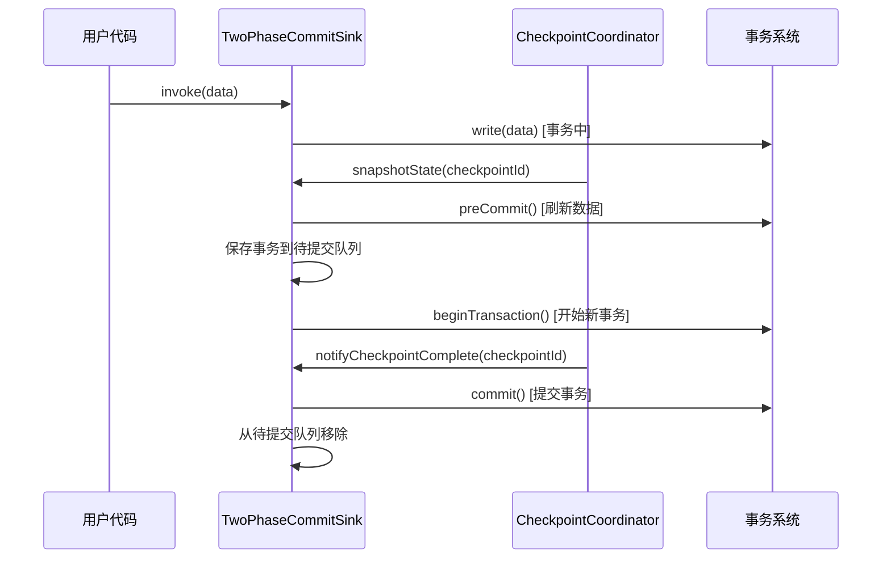
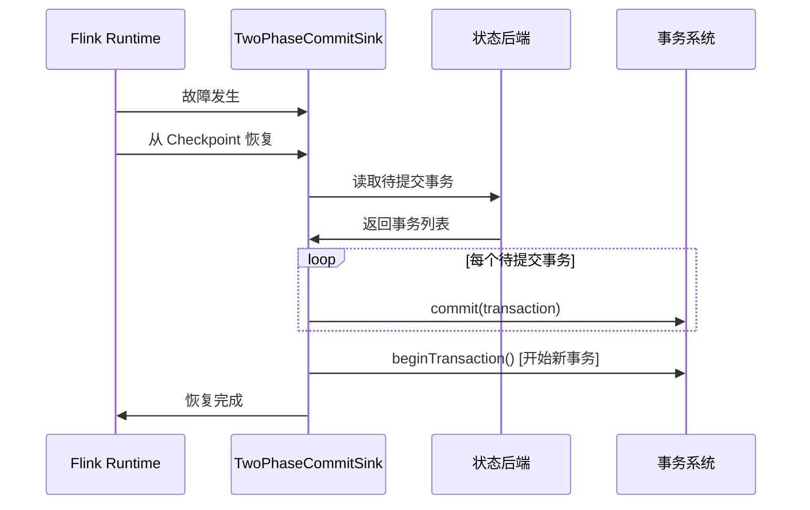
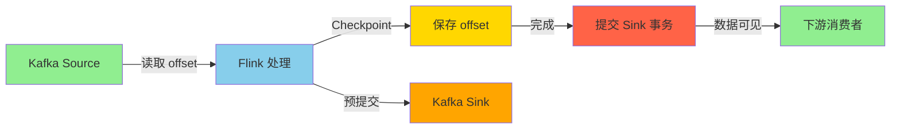

# 两阶段提交与 Exactly-Once 源码深度解析

## 一、机制概述

### 1.1 什么是两阶段提交

**两阶段提交（Two-Phase Commit, 2PC）**是一种分布式事务协议，确保多个参与者要么全部提交，要么全部回滚。

**在 Flink 中的应用**：
- 实现端到端的 Exactly-Once 语义
- 配合 Checkpoint 机制工作
- 主要用于 Sink 算子

**两个阶段**：
1. **预提交阶段（Pre-commit）**：Checkpoint 触发时，准备提交但不真正提交
2. **提交阶段（Commit）**：Checkpoint 完成后，真正提交事务

### 1.2 Exactly-Once 语义

**Exactly-Once** 保证每条数据被精确处理一次，不重复、不丢失。

**三个层次**：
1. **Flink 内部**：通过 Checkpoint 保证
2. **Source 端**：支持数据重放（如 Kafka offset）
3. **Sink 端**：通过两阶段提交或幂等性保证

## 二、核心类与接口

### 2.1 TwoPhaseCommitSinkFunction

#### TwoPhaseCommitSinkFunction
- **路径**：`flink-streaming-java/src/main/java/org/apache/flink/streaming/api/functions/sink/TwoPhaseCommitSinkFunction.java`
- **职责**：提供两阶段提交的抽象实现
- **核心方法**：
  - `beginTransaction()`：开始新事务
  - `preCommit()`：预提交事务
  - `commit()`：提交事务
  - `abort()`：中止事务

```java
public abstract class TwoPhaseCommitSinkFunction<IN, TXN, CONTEXT>
        extends RichSinkFunction<IN>
        implements CheckpointedFunction, CheckpointListener {
    
    /** 当前事务 */
    protected transient Optional<TXN> currentTransaction;
    
    /** 待提交的事务（按 Checkpoint ID 排序） */
    protected transient TreeMap<Long, TXN> pendingCommitTransactions;
    
    /** 用户上下文 */
    protected transient Optional<CONTEXT> userContext;
    
    /**
     * 开始新事务
     * @return 事务句柄
     */
    protected abstract TXN beginTransaction() throws Exception;
    
    /**
     * 预提交事务（Checkpoint 时调用）
     * @param transaction 事务句柄
     */
    protected abstract void preCommit(TXN transaction) throws Exception;
    
    /**
     * 提交事务（Checkpoint 完成后调用）
     * @param transaction 事务句柄
     */
    protected abstract void commit(TXN transaction);
    
    /**
     * 中止事务（Checkpoint 失败时调用）
     * @param transaction 事务句柄
     */
    protected abstract void abort(TXN transaction);
    
    /**
     * 写入数据到当前事务
     * @param transaction 当前事务
     * @param value 数据
     * @param context 上下文
     */
    protected abstract void invoke(TXN transaction, IN value, Context context) 
        throws Exception;
    
    /**
     * 用户代码调用的 invoke 方法
     */
    @Override
    public final void invoke(IN value, Context context) throws Exception {
        // 写入当前事务
        invoke(currentTransaction.get(), value, context);
    }
}
```

### 2.2 完整生命周期

#### 初始化阶段

```java
@Override
public void initializeState(FunctionInitializationContext context) throws Exception {
    // 1. 初始化状态
    state = context.getOperatorStateStore().getListState(
        new ListStateDescriptor<>("state", stateSerializer));
    
    // 2. 恢复待提交的事务
    pendingCommitTransactions = new TreeMap<>();
    if (context.isRestored()) {
        for (State<TXN, CONTEXT> recoveredState : state.get()) {
            // 恢复事务
            TXN transaction = recoverTransaction(recoveredState);
            pendingCommitTransactions.put(
                recoveredState.checkpointId, 
                transaction);
            
            LOG.info("Recovered transaction {} for checkpoint {}", 
                transaction, recoveredState.checkpointId);
        }
    }
    
    // 3. 恢复用户上下文
    userContext = initializeUserContext();
    
    // 4. 开始新事务
    currentTransaction = Optional.of(beginTransaction());
}
```

#### Checkpoint 阶段（预提交）

```java
@Override
public void snapshotState(FunctionSnapshotContext context) throws Exception {
    long checkpointId = context.getCheckpointId();
    
    // 1. 预提交当前事务
    preCommit(currentTransaction.get());
    
    // 2. 将事务加入待提交队列
    pendingCommitTransactions.put(checkpointId, currentTransaction.get());
    
    // 3. 保存事务信息到状态
    state.add(new State<>(
        currentTransaction.get(),
        checkpointId,
        context.getCheckpointTimestamp()));
    
    LOG.info("Pre-committed transaction {} for checkpoint {}", 
        currentTransaction.get(), checkpointId);
    
    // 4. 开始新事务
    currentTransaction = Optional.of(beginTransaction());
}
```

#### Checkpoint 完成阶段（提交）

```java
@Override
public void notifyCheckpointComplete(long checkpointId) throws Exception {
    // 1. 提交所有 <= checkpointId 的事务
    Iterator<Map.Entry<Long, TXN>> it = 
        pendingCommitTransactions.headMap(checkpointId, true)
            .entrySet().iterator();
    
    while (it.hasNext()) {
        Map.Entry<Long, TXN> entry = it.next();
        TXN transaction = entry.getValue();
        
        LOG.info("Committing transaction {} for checkpoint {}", 
            transaction, entry.getKey());
        
        // 2. 提交事务
        commit(transaction);
        
        // 3. 从待提交队列移除
        it.remove();
    }
}
```

#### Checkpoint 中止阶段

```java
@Override
public void notifyCheckpointAborted(long checkpointId) throws Exception {
    // 中止对应的事务
    TXN transaction = pendingCommitTransactions.remove(checkpointId);
    if (transaction != null) {
        LOG.warn("Aborting transaction {} for checkpoint {}", 
            transaction, checkpointId);
        abort(transaction);
    }
}
```

## 三、源码深度分析

### 3.1 Kafka Sink 实现

#### FlinkKafkaProducer

```java
public class FlinkKafkaProducer<IN> 
        extends TwoPhaseCommitSinkFunction<IN, 
                FlinkKafkaProducer.KafkaTransactionState,
                FlinkKafkaProducer.KafkaTransactionContext> {
    
    /** Kafka 生产者 */
    private transient FlinkKafkaInternalProducer<byte[], byte[]> producer;
    
    /** 事务 ID 前缀 */
    private final String transactionalIdPrefix;
    
    /**
     * 事务状态
     */
    static class KafkaTransactionState {
        final String transactionalId;
        final long producerId;
        final short producerEpoch;
        
        KafkaTransactionState(String transactionalId, 
                             long producerId, 
                             short producerEpoch) {
            this.transactionalId = transactionalId;
            this.producerId = producerId;
            this.producerEpoch = producerEpoch;
        }
    }
    
    /**
     * 开始新事务
     */
    @Override
    protected KafkaTransactionState beginTransaction() throws Exception {
        // 1. 生成事务 ID
        String transactionalId = generateTransactionalId();
        
        // 2. 创建生产者
        producer = createProducer(transactionalId);
        
        // 3. 开始 Kafka 事务
        producer.beginTransaction();
        
        LOG.debug("Started Kafka transaction {}", transactionalId);
        
        // 4. 返回事务状态
        return new KafkaTransactionState(
            transactionalId,
            producer.getProducerId(),
            producer.getProducerEpoch());
    }
    
    /**
     * 写入数据
     */
    @Override
    protected void invoke(
            KafkaTransactionState transaction, 
            IN value, 
            Context context) throws Exception {
        
        // 序列化数据
        byte[] serializedKey = keySerializer.serialize(topic, value);
        byte[] serializedValue = valueSerializer.serialize(topic, value);
        
        // 发送到 Kafka（事务中）
        ProducerRecord<byte[], byte[]> record = 
            new ProducerRecord<>(topic, serializedKey, serializedValue);
        
        producer.send(record, (metadata, exception) -> {
            if (exception != null) {
                LOG.error("Failed to send record to Kafka", exception);
            }
        });
    }
    
    /**
     * 预提交：刷新数据
     */
    @Override
    protected void preCommit(KafkaTransactionState transaction) throws Exception {
        // 刷新所有待发送的数据
        producer.flush();
        
        LOG.debug("Flushed Kafka transaction {}", transaction.transactionalId);
    }
    
    /**
     * 提交：提交 Kafka 事务
     */
    @Override
    protected void commit(KafkaTransactionState transaction) {
        try {
            // 提交 Kafka 事务
            producer.commitTransaction();
            
            LOG.info("Committed Kafka transaction {}", transaction.transactionalId);
        } catch (Exception e) {
            // 提交失败，记录错误
            LOG.error("Failed to commit Kafka transaction {}", 
                transaction.transactionalId, e);
            throw new RuntimeException(e);
        } finally {
            // 关闭生产者
            producer.close();
        }
    }
    
    /**
     * 中止：回滚 Kafka 事务
     */
    @Override
    protected void abort(KafkaTransactionState transaction) {
        try {
            // 回滚 Kafka 事务
            producer.abortTransaction();
            
            LOG.warn("Aborted Kafka transaction {}", transaction.transactionalId);
        } catch (Exception e) {
            LOG.error("Failed to abort Kafka transaction {}", 
                transaction.transactionalId, e);
        } finally {
            // 关闭生产者
            producer.close();
        }
    }
    
    /**
     * 生成事务 ID
     */
    private String generateTransactionalId() {
        return String.format(
            "%s-%d-%d",
            transactionalIdPrefix,
            getRuntimeContext().getIndexOfThisSubtask(),
            transactionCounter.incrementAndGet());
    }
}
```

### 3.2 JDBC Sink 实现

#### JdbcTwoPhaseCommitSink

```java
public class JdbcTwoPhaseCommitSink<IN> 
        extends TwoPhaseCommitSinkFunction<IN, Connection, Void> {
    
    private final String jdbcUrl;
    private final String username;
    private final String password;
    private final String insertSql;
    
    /**
     * 开始新事务
     */
    @Override
    protected Connection beginTransaction() throws Exception {
        // 1. 创建数据库连接
        Connection connection = DriverManager.getConnection(
            jdbcUrl, username, password);
        
        // 2. 关闭自动提交
        connection.setAutoCommit(false);
        
        // 3. 设置事务隔离级别
        connection.setTransactionIsolation(
            Connection.TRANSACTION_READ_COMMITTED);
        
        LOG.debug("Started JDBC transaction");
        
        return connection;
    }
    
    /**
     * 写入数据
     */
    @Override
    protected void invoke(Connection connection, IN value, Context context) 
            throws Exception {
        
        // 执行 INSERT（未提交）
        try (PreparedStatement stmt = connection.prepareStatement(insertSql)) {
            // 设置参数
            setParameters(stmt, value);
            
            // 执行
            stmt.executeUpdate();
        }
    }
    
    /**
     * 预提交：刷新数据
     */
    @Override
    protected void preCommit(Connection connection) throws Exception {
        // 刷新数据到数据库（但不提交）
        // 对于 MySQL，可以执行 FLUSH TABLES
        try (Statement stmt = connection.createStatement()) {
            stmt.execute("FLUSH TABLES");
        }
        
        LOG.debug("Pre-committed JDBC transaction");
    }
    
    /**
     * 提交：提交数据库事务
     */
    @Override
    protected void commit(Connection connection) {
        try {
            // 提交事务
            connection.commit();
            
            LOG.info("Committed JDBC transaction");
        } catch (SQLException e) {
            LOG.error("Failed to commit JDBC transaction", e);
            throw new RuntimeException(e);
        } finally {
            // 关闭连接
            closeConnection(connection);
        }
    }
    
    /**
     * 中止：回滚数据库事务
     */
    @Override
    protected void abort(Connection connection) {
        try {
            // 回滚事务
            connection.rollback();
            
            LOG.warn("Aborted JDBC transaction");
        } catch (SQLException e) {
            LOG.error("Failed to abort JDBC transaction", e);
        } finally {
            // 关闭连接
            closeConnection(connection);
        }
    }
    
    private void closeConnection(Connection connection) {
        if (connection != null) {
            try {
                connection.close();
            } catch (SQLException e) {
                LOG.error("Failed to close connection", e);
            }
        }
    }
}
```

### 3.3 幂等性实现

对于不支持事务的系统，可以通过幂等性实现 Exactly-Once：

```java
public class IdempotentSink extends RichSinkFunction<Event> {
    
    private transient RedisClient redis;
    
    @Override
    public void open(Configuration parameters) {
        // 初始化 Redis 客户端
        redis = new RedisClient("localhost", 6379);
    }
    
    @Override
    public void invoke(Event value, Context context) throws Exception {
        // 使用唯一 ID 作为 Key
        String key = "event:" + value.getId();
        
        // 检查是否已处理
        if (redis.exists(key)) {
            LOG.debug("Event {} already processed, skipping", value.getId());
            return;
        }
        
        // 处理数据
        processEvent(value);
        
        // 标记为已处理（设置过期时间）
        redis.setex(key, 86400, "processed");  // 24小时过期
    }
    
    private void processEvent(Event event) {
        // 实际的数据处理逻辑
        // 例如：写入数据库、发送消息等
    }
}
```

## 四、执行流程图

### 4.1 两阶段提交完整流程



### 4.2 故障恢复流程



### 4.3 端到端 Exactly-Once 流程



## 五、面试高频问题

### Q1: 两阶段提交如何保证 Exactly-Once？有什么限制？

**答案**：

**保证机制**：

**1. 预提交阶段**：
```java
// Checkpoint 触发时
public void snapshotState(FunctionSnapshotContext context) {
    // 1. 预提交当前事务（数据已写入但未提交）
    preCommit(currentTransaction.get());
    
    // 2. 保存事务信息
    pendingCommitTransactions.put(checkpointId, currentTransaction.get());
    
    // 3. 开始新事务
    currentTransaction = Optional.of(beginTransaction());
}
```

**2. 提交阶段**：
```java
// Checkpoint 完成后
public void notifyCheckpointComplete(long checkpointId) {
    // 提交所有 <= checkpointId 的事务
    for (Entry<Long, TXN> entry : pendingCommitTransactions.entrySet()) {
        if (entry.getKey() <= checkpointId) {
            commit(entry.getValue());
        }
    }
}
```

**3. 故障恢复**：
```java
// 恢复时
public void initializeState(FunctionInitializationContext context) {
    if (context.isRestored()) {
        // 重新提交未完成的事务
        for (State<TXN, CONTEXT> state : recoveredStates) {
            TXN transaction = recoverTransaction(state);
            commit(transaction);  // 幂等提交
        }
    }
}
```

**限制**：

**1. 外部系统必须支持事务**：
```java
// 支持：Kafka、MySQL、PostgreSQL、Oracle
// 不支持：Redis、HBase、Elasticsearch（无事务）
```

**2. 事务超时问题**：
```java
// Kafka 事务超时配置
properties.setProperty("transaction.timeout.ms", "900000");  // 15分钟

// 必须 > Checkpoint 间隔 + Checkpoint 超时
```

**3. 性能开销**：
- 每个 Checkpoint 都需要预提交
- 维护待提交事务队列
- 事务提交有额外延迟

**4. 并行度限制**：
```java
// 每个并行度需要独立的事务 ID
String transactionalId = String.format(
    "%s-%d", prefix, subtaskIndex);
```

### Q2: 如果不支持事务，如何实现 Exactly-Once？

**答案**：

**方案 1：幂等性写入**

```java
public class IdempotentSink extends RichSinkFunction<Event> {
    
    @Override
    public void invoke(Event value, Context context) {
        // 使用唯一 ID，重复写入会覆盖
        String sql = "INSERT INTO events (id, data, timestamp) " +
                     "VALUES (?, ?, ?) " +
                     "ON DUPLICATE KEY UPDATE " +
                     "data = VALUES(data), timestamp = VALUES(timestamp)";
        
        try (PreparedStatement stmt = connection.prepareStatement(sql)) {
            stmt.setString(1, value.getId());  // 唯一 ID
            stmt.setString(2, value.getData());
            stmt.setLong(3, value.getTimestamp());
            stmt.executeUpdate();
        }
    }
}
```

**关键点**：
- 数据必须有唯一 ID
- 使用 UPSERT 操作
- 重复写入不影响结果

**方案 2：去重表**

```java
public class DeduplicatedSink extends RichSinkFunction<Event> {
    
    @Override
    public void invoke(Event value, Context context) {
        String eventId = value.getId();
        
        // 1. 检查是否已处理
        String checkSql = "SELECT 1 FROM processed_events WHERE id = ?";
        try (PreparedStatement stmt = connection.prepareStatement(checkSql)) {
            stmt.setString(1, eventId);
            ResultSet rs = stmt.executeQuery();
            
            if (rs.next()) {
                // 已处理，跳过
                return;
            }
        }
        
        // 2. 处理数据
        processEvent(value);
        
        // 3. 标记为已处理
        String insertSql = "INSERT INTO processed_events (id, timestamp) VALUES (?, ?)";
        try (PreparedStatement stmt = connection.prepareStatement(insertSql)) {
            stmt.setString(1, eventId);
            stmt.setLong(2, System.currentTimeMillis());
            stmt.executeUpdate();
        }
    }
}
```

**方案 3：At-Least-Once + 下游去重**

```java
// Flink 使用 At-Least-Once
env.getCheckpointConfig().setCheckpointingMode(
    CheckpointingMode.AT_LEAST_ONCE);

// 下游使用去重逻辑
stream.keyBy(Event::getId)
      .process(new DeduplicationFunction());
```

### Q3: 两阶段提交的事务超时如何处理？

**答案**：

**问题场景**：
```
Checkpoint 间隔：60秒
Checkpoint 超时：10分钟
事务超时：5分钟  ← 问题：小于 Checkpoint 超时
```

**解决方案**：

**1. 调整事务超时**：
```java
// Kafka
properties.setProperty("transaction.timeout.ms", "900000");  // 15分钟

// MySQL
connection.createStatement().execute(
    "SET SESSION innodb_lock_wait_timeout = 3600");  // 1小时
```

**配置原则**：
```
事务超时 > Checkpoint 超时 + Checkpoint 间隔
```

**2. 减少 Checkpoint 间隔**：
```java
// 减少 Checkpoint 间隔
env.enableCheckpointing(30000);  // 30秒

// 减少 Checkpoint 超时
env.getCheckpointConfig().setCheckpointTimeout(300000);  // 5分钟
```

**3. 使用增量 Checkpoint**：
```java
// 启用增量 Checkpoint，减少 Checkpoint 时间
env.setStateBackend(new EmbeddedRocksDBStateBackend(true));
```

**4. 监控事务超时**：
```java
// 监控事务持续时间
long transactionStartTime = System.currentTimeMillis();

getRuntimeContext().getMetricGroup()
    .gauge("transactionDuration", 
        () -> System.currentTimeMillis() - transactionStartTime);
```

## 六、最佳实践

### 6.1 选择合适的 Exactly-Once 方案

```java
// 支持事务：使用两阶段提交
new FlinkKafkaProducer<>(...);

// 不支持事务：使用幂等性
new IdempotentSink(...);

// 性能优先：使用 At-Least-Once + 下游去重
env.getCheckpointConfig().setCheckpointingMode(
    CheckpointingMode.AT_LEAST_ONCE);
```

### 6.2 合理配置事务超时

```yaml
# Kafka
transaction.timeout.ms: 900000  # 15分钟

# Flink
execution.checkpointing.interval: 60s
execution.checkpointing.timeout: 10min
```

### 6.3 监控和告警

```java
// 监控待提交事务数量
getRuntimeContext().getMetricGroup()
    .gauge("pendingTransactions", 
        () -> pendingCommitTransactions.size());

// 监控提交延迟
long commitDelay = System.currentTimeMillis() - checkpointTimestamp;
getRuntimeContext().getMetricGroup()
    .histogram("commitDelay").update(commitDelay);
```

---

**文档版本**：v1.0  
**基于 Flink 版本**：Apache Flink 主分支  
**最后更新**：2026-02-05
