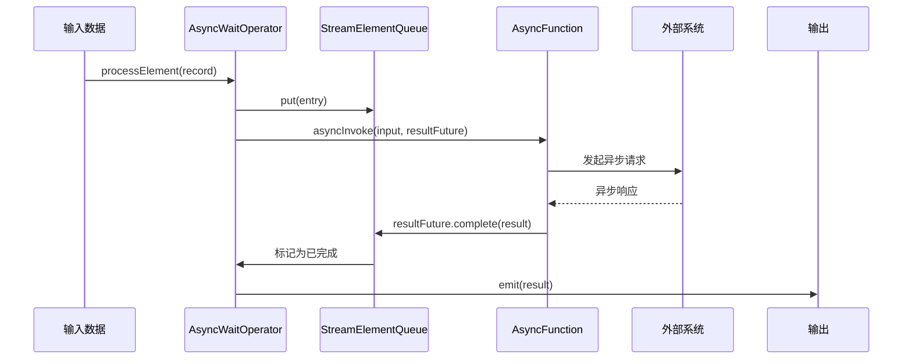
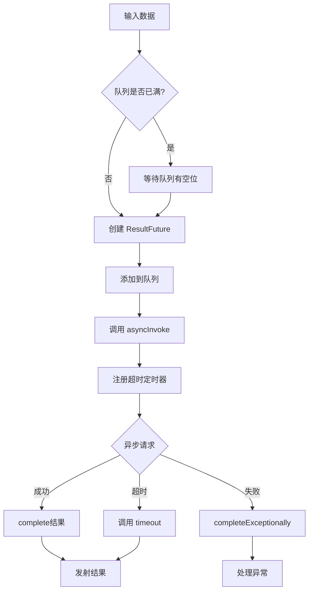
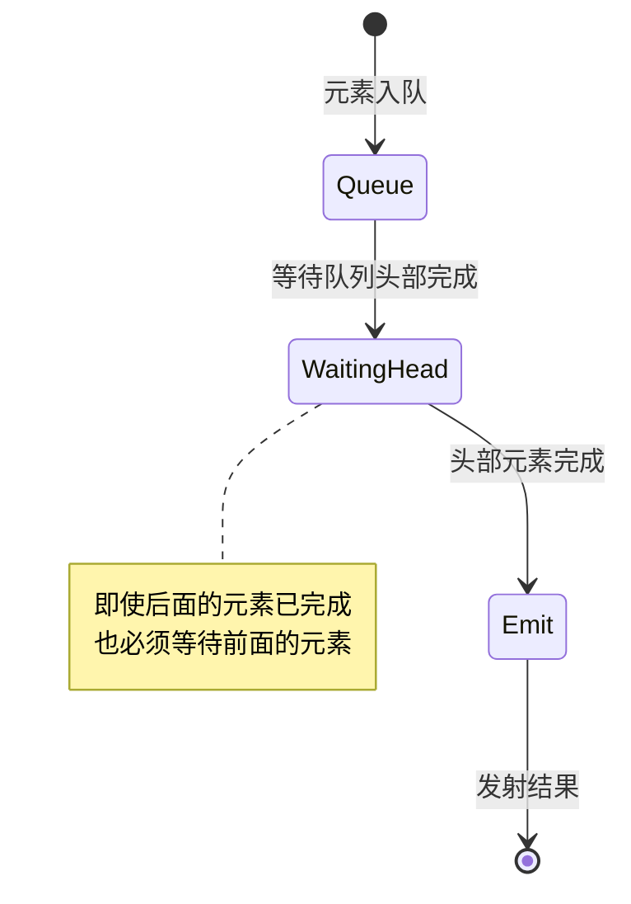

# 异步 I/O 机制源码深度解析

## 一、机制概述

### 1.1 什么是异步 I/O

**异步 I/O（Async I/O）**允许在等待外部系统响应时不阻塞处理线程，从而提高吞吐量。

**传统同步 I/O 的问题**：
```java
// 同步调用：阻塞等待
for (Event event : events) {
    Result result = database.query(event.getId());  // 阻塞 10ms
    collector.collect(result);
}
// 吞吐量：100 条/秒
```

**异步 I/O 的优势**：
```java
// 异步调用：并发请求
for (Event event : events) {
    database.asyncQuery(event.getId(), callback);  // 不阻塞
}
// 吞吐量：10000 条/秒（100倍提升）
```

### 1.2 核心概念

**AsyncFunction**：
- 用户实现的异步函数接口
- 发起异步请求
- 处理异步响应

**ResultFuture**：
- 异步结果的容器
- 完成时调用 `complete()`
- 支持超时处理

**AsyncWaitOperator**：
- 异步 I/O 的运行时算子
- 管理异步请求队列
- 控制并发度和顺序

## 二、核心类与接口

### 2.1 AsyncFunction

#### AsyncFunction
- **路径**：`flink-streaming-java/src/main/java/org/apache/flink/streaming/api/functions/async/AsyncFunction.java`
- **职责**：用户实现的异步函数接口
- **核心方法**：
  - `asyncInvoke()`：发起异步请求
  - `timeout()`：处理超时（可选）

```java
@PublicEvolving
public interface AsyncFunction<IN, OUT> extends Function, Serializable {
    
    /**
     * 触发异步操作
     * @param input 输入数据
     * @param resultFuture 结果 Future
     */
    void asyncInvoke(IN input, ResultFuture<OUT> resultFuture) throws Exception;
    
    /**
     * 处理超时（可选）
     * @param input 输入数据
     * @param resultFuture 结果 Future
     */
    default void timeout(IN input, ResultFuture<OUT> resultFuture) throws Exception {
        // 默认实现：抛出超时异常
        resultFuture.completeExceptionally(
            new TimeoutException("Async function call has timed out."));
    }
}
```

**使用示例**：
```java
public class AsyncDatabaseRequest 
        extends RichAsyncFunction<String, Tuple2<String, String>> {
    
    private transient DatabaseClient client;
    
    @Override
    public void open(Configuration parameters) {
        // 初始化异步客户端
        client = new DatabaseClient("localhost", 3306);
    }
    
    @Override
    public void asyncInvoke(
            String key, 
            ResultFuture<Tuple2<String, String>> resultFuture) {
        
        // 发起异步查询
        CompletableFuture<String> future = client.asyncQuery(key);
        
        // 处理异步结果
        future.whenComplete((result, exception) -> {
            if (exception != null) {
                // 异常处理
                resultFuture.completeExceptionally(exception);
            } else {
                // 正常完成
                resultFuture.complete(
                    Collections.singleton(new Tuple2<>(key, result)));
            }
        });
    }
    
    @Override
    public void timeout(
            String key, 
            ResultFuture<Tuple2<String, String>> resultFuture) {
        
        // 超时处理：返回默认值
        resultFuture.complete(
            Collections.singleton(new Tuple2<>(key, "timeout")));
    }
    
    @Override
    public void close() {
        // 关闭客户端
        if (client != null) {
            client.close();
        }
    }
}
```

### 2.2 AsyncDataStream

#### AsyncDataStream
- **路径**：`flink-streaming-java/src/main/java/org/apache/flink/streaming/api/datastream/AsyncDataStream.java`
- **职责**：异步 I/O 的入口 API
- **核心方法**：
  - `unorderedWait()`：无序输出
  - `orderedWait()`：有序输出

```java
@PublicEvolving
public class AsyncDataStream {
    
    /**
     * 无序异步 I/O
     * @param input 输入流
     * @param func 异步函数
     * @param timeout 超时时间
     * @param timeUnit 时间单位
     * @param capacity 最大并发请求数
     */
    public static <IN, OUT> SingleOutputStreamOperator<OUT> unorderedWait(
            DataStream<IN> input,
            AsyncFunction<IN, OUT> func,
            long timeout,
            TimeUnit timeUnit,
            int capacity) {
        
        return addOperator(
            input,
            func,
            timeout,
            timeUnit,
            capacity,
            OutputMode.UNORDERED);
    }
    
    /**
     * 有序异步 I/O
     * @param input 输入流
     * @param func 异步函数
     * @param timeout 超时时间
     * @param timeUnit 时间单位
     * @param capacity 最大并发请求数
     */
    public static <IN, OUT> SingleOutputStreamOperator<OUT> orderedWait(
            DataStream<IN> input,
            AsyncFunction<IN, OUT> func,
            long timeout,
            TimeUnit timeUnit,
            int capacity) {
        
        return addOperator(
            input,
            func,
            timeout,
            timeUnit,
            capacity,
            OutputMode.ORDERED);
    }
    
    private static <IN, OUT> SingleOutputStreamOperator<OUT> addOperator(
            DataStream<IN> input,
            AsyncFunction<IN, OUT> func,
            long timeout,
            TimeUnit timeUnit,
            int capacity,
            OutputMode mode) {
        
        // 创建异步等待算子
        AsyncWaitOperator<IN, OUT> operator = 
            new AsyncWaitOperator<>(
                func,
                timeout,
                capacity,
                mode);
        
        return input.transform(
            "async wait operator",
            outTypeInfo,
            operator);
    }
}
```

**使用示例**：
```java
// 无序异步 I/O（吞吐量优先）
DataStream<Tuple2<String, String>> result = 
    AsyncDataStream.unorderedWait(
        input,
        new AsyncDatabaseRequest(),
        1000,  // 1秒超时
        TimeUnit.MILLISECONDS,
        100);  // 最多100个并发请求

// 有序异步 I/O（顺序优先）
DataStream<Tuple2<String, String>> result = 
    AsyncDataStream.orderedWait(
        input,
        new AsyncDatabaseRequest(),
        1000,
        TimeUnit.MILLISECONDS,
        100);
```

### 2.3 AsyncWaitOperator

#### AsyncWaitOperator
- **路径**：`flink-streaming-java/src/main/java/org/apache/flink/streaming/api/operators/async/AsyncWaitOperator.java`
- **职责**：异步 I/O 的运行时算子
- **核心组件**：
  - `queue`：异步请求队列
  - `executor`：异步执行器
  - `emitter`：结果发射器

```java
public class AsyncWaitOperator<IN, OUT>
        extends AbstractUdfStreamOperator<OUT, AsyncFunction<IN, OUT>>
        implements OneInputStreamOperator<IN, OUT> {
    
    /** 超时时间 */
    private final long timeout;
    
    /** 队列容量 */
    private final int capacity;
    
    /** 输出模式 */
    private final OutputMode outputMode;
    
    /** 异步请求队列 */
    private transient StreamElementQueue<OUT> queue;
    
    /** 结果发射器 */
    private transient Emitter<OUT> emitter;
    
    /** 时间戳提取器 */
    private transient TimestampedCollector<OUT> timestampedCollector;
    
    @Override
    public void open() throws Exception {
        super.open();
        
        // 1. 创建队列
        this.queue = createQueue(outputMode, capacity);
        
        // 2. 创建发射器
        this.emitter = new Emitter<>(
            queue,
            output,
            getProcessingTimeService());
        
        // 3. 创建时间戳收集器
        this.timestampedCollector = new TimestampedCollector<>(output);
    }
    
    @Override
    public void processElement(StreamRecord<IN> element) throws Exception {
        // 1. 检查队列是否已满
        while (queue.size() >= capacity) {
            // 等待队列有空位
            emitter.emitCompleted();
        }
        
        // 2. 创建结果 Future
        StreamRecordQueueEntry<OUT> entry = 
            new StreamRecordQueueEntry<>(element);
        
        // 3. 添加到队列
        queue.put(entry);
        
        // 4. 调用用户函数
        userFunction.asyncInvoke(
            element.getValue(),
            entry);
        
        // 5. 注册超时定时器
        long timeoutTimestamp = 
            getProcessingTimeService().getCurrentProcessingTime() + timeout;
        
        getProcessingTimeService().registerTimer(
            timeoutTimestamp,
            timestamp -> timeout(entry));
    }
    
    /**
     * 处理超时
     */
    private void timeout(StreamRecordQueueEntry<OUT> entry) throws Exception {
        if (!entry.isDone()) {
            // 调用用户超时处理
            userFunction.timeout(
                entry.getInputRecord().getValue(),
                entry);
        }
    }
    
    /**
     * 发射完成的结果
     */
    private class Emitter<T> {
        
        void emitCompleted() throws Exception {
            // 从队列头部获取已完成的元素
            while (queue.hasCompletedElements()) {
                StreamElementQueueEntry<T> entry = queue.poll();
                
                if (entry != null) {
                    // 发射结果
                    output(entry);
                }
            }
        }
        
        private void output(StreamElementQueueEntry<T> entry) {
            if (entry.hasResult()) {
                // 发射正常结果
                Collection<T> results = entry.getResult();
                for (T result : results) {
                    timestampedCollector.collect(result);
                }
            } else if (entry.hasException()) {
                // 处理异常
                throw new RuntimeException(entry.getException());
            }
        }
    }
}
```

### 2.4 StreamElementQueue

#### OrderedStreamElementQueue（有序队列）

```java
public class OrderedStreamElementQueue<OUT> implements StreamElementQueue<OUT> {
    
    /** 队列 */
    private final Queue<StreamElementQueueEntry<OUT>> queue;
    
    /** 容量 */
    private final int capacity;
    
    @Override
    public void put(StreamElementQueueEntry<OUT> entry) {
        queue.add(entry);
    }
    
    @Override
    public boolean hasCompletedElements() {
        // 只有队列头部元素完成才返回 true
        StreamElementQueueEntry<OUT> head = queue.peek();
        return head != null && head.isDone();
    }
    
    @Override
    public StreamElementQueueEntry<OUT> poll() {
        // 只能从头部取出
        return queue.poll();
    }
}
```

#### UnorderedStreamElementQueue（无序队列）

```java
public class UnorderedStreamElementQueue<OUT> implements StreamElementQueue<OUT> {
    
    /** 未完成的元素集合 */
    private final Set<StreamElementQueueEntry<OUT>> uncompletedQueue;
    
    /** 已完成的元素队列 */
    private final Queue<StreamElementQueueEntry<OUT>> completedQueue;
    
    @Override
    public void put(StreamElementQueueEntry<OUT> entry) {
        uncompletedQueue.add(entry);
        
        // 注册完成回调
        entry.onComplete(() -> {
            uncompletedQueue.remove(entry);
            completedQueue.add(entry);
        });
    }
    
    @Override
    public boolean hasCompletedElements() {
        // 只要有已完成的元素就返回 true
        return !completedQueue.isEmpty();
    }
    
    @Override
    public StreamElementQueueEntry<OUT> poll() {
        // 从已完成队列取出
        return completedQueue.poll();
    }
}
```

## 三、源码深度分析

### 3.1 异步请求流程



### 3.2 有序 vs 无序输出

**有序输出（Ordered）**：
```
输入：A B C D E
异步完成顺序：B D A C E
输出：A B C D E（保持输入顺序）
```

**无序输出（Unordered）**：
```
输入：A B C D E
异步完成顺序：B D A C E
输出：B D A C E（按完成顺序）
```

**性能对比**：
- **有序**：延迟高（需等待前面的元素），吞吐量低
- **无序**：延迟低（立即输出），吞吐量高

### 3.3 超时处理

```java
// 注册超时定时器
long timeoutTimestamp = currentTime + timeout;
processingTimeService.registerTimer(
    timeoutTimestamp,
    timestamp -> {
        if (!entry.isDone()) {
            // 调用用户超时处理
            userFunction.timeout(input, resultFuture);
        }
    });
```

**超时处理选项**：
1. **抛出异常**（默认）
2. **返回默认值**
3. **重试请求**
4. **记录日志并跳过**

## 四、执行流程图

### 4.1 异步 I/O 完整流程



### 4.2 有序队列处理流程



## 五、面试高频问题

### Q1: 异步 I/O 如何提高吞吐量？有什么限制？

**答案**：

**提高吞吐量的原理**：

**同步 I/O**：
```java
// 串行处理，每次等待 10ms
for (int i = 0; i < 1000; i++) {
    String result = database.query(key);  // 阻塞 10ms
    collector.collect(result);
}
// 总耗时：1000 × 10ms = 10秒
// 吞吐量：100 条/秒
```

**异步 I/O**：
```java
// 并发处理，最多100个并发请求
AsyncDataStream.unorderedWait(
    stream,
    new AsyncDatabaseRequest(),
    1000,  // 超时
    TimeUnit.MILLISECONDS,
    100);  // 并发度

// 总耗时：1000 / 100 × 10ms = 100ms
// 吞吐量：10000 条/秒（100倍提升）
```

**性能提升计算**：
```
吞吐量提升 = 并发度 / (1 + 网络延迟 / 处理时间)

示例：
并发度 = 100
网络延迟 = 10ms
处理时间 = 0.1ms
吞吐量提升 = 100 / (1 + 10/0.1) = 100 / 101 ≈ 100倍
```

**限制**：

**1. 外部系统必须支持异步**：
```java
// 支持：Redis（Lettuce）、HTTP（AsyncHttpClient）、数据库（异步驱动）
// 不支持：JDBC（同步）、某些老旧系统
```

**2. 并发度限制**：
```java
// 并发度过高会导致：
// - 外部系统过载
// - 内存占用过高
// - 超时增加

// 建议：根据外部系统能力设置
AsyncDataStream.unorderedWait(..., 100);  // 100个并发
```

**3. 顺序保证**：
```java
// 有序模式：牺牲吞吐量
AsyncDataStream.orderedWait(...);

// 无序模式：牺牲顺序
AsyncDataStream.unorderedWait(...);
```

### Q2: 有序和无序异步 I/O 有什么区别？如何选择？

**答案**：

**有序异步 I/O（Ordered）**：

```java
AsyncDataStream.orderedWait(
    stream,
    new AsyncDatabaseRequest(),
    1000,
    TimeUnit.MILLISECONDS,
    100);
```

**特点**：
- 输出顺序与输入顺序一致
- 需要等待前面的元素完成
- 延迟高，吞吐量低

**适用场景**：
- 需要保持顺序的业务逻辑
- 下游算子依赖顺序
- 窗口计算需要有序数据

**无序异步 I/O（Unordered）**：

```java
AsyncDataStream.unorderedWait(
    stream,
    new AsyncDatabaseRequest(),
    1000,
    TimeUnit.MILLISECONDS,
    100);
```

**特点**：
- 输出顺序按完成顺序
- 不需要等待前面的元素
- 延迟低，吞吐量高

**适用场景**：
- 不需要保持顺序
- 独立的查询操作
- 吞吐量优先

**性能对比**：

| 指标 | 有序 | 无序 |
|------|------|------|
| 吞吐量 | 低 | 高 |
| 延迟 | 高 | 低 |
| 顺序保证 | 是 | 否 |
| 内存占用 | 高（需缓存） | 低 |

**选择建议**：
```java
// 默认使用无序（性能更好）
AsyncDataStream.unorderedWait(...);

// 仅在必要时使用有序
if (needsOrdering) {
    AsyncDataStream.orderedWait(...);
}
```

### Q3: 如何处理异步 I/O 的超时和异常？

**答案**：

**超时处理**：

**方案 1：返回默认值**
```java
@Override
public void timeout(
        String input, 
        ResultFuture<String> resultFuture) {
    
    // 返回默认值
    resultFuture.complete(
        Collections.singleton("default_value"));
}
```

**方案 2：重试**
```java
public class RetryAsyncFunction extends RichAsyncFunction<String, String> {
    
    private static final int MAX_RETRIES = 3;
    
    @Override
    public void asyncInvoke(
            String input, 
            ResultFuture<String> resultFuture) {
        
        asyncInvokeWithRetry(input, resultFuture, 0);
    }
    
    private void asyncInvokeWithRetry(
            String input, 
            ResultFuture<String> resultFuture,
            int retryCount) {
        
        client.asyncQuery(input).whenComplete((result, exception) -> {
            if (exception != null && retryCount < MAX_RETRIES) {
                // 重试
                asyncInvokeWithRetry(input, resultFuture, retryCount + 1);
            } else if (exception != null) {
                // 重试次数用尽
                resultFuture.completeExceptionally(exception);
            } else {
                // 成功
                resultFuture.complete(Collections.singleton(result));
            }
        });
    }
    
    @Override
    public void timeout(
            String input, 
            ResultFuture<String> resultFuture) {
        
        // 超时也重试
        asyncInvokeWithRetry(input, resultFuture, 0);
    }
}
```

**方案 3：记录日志并跳过**
```java
@Override
public void timeout(
        String input, 
        ResultFuture<String> resultFuture) {
    
    // 记录日志
    LOG.warn("Async request timeout for input: {}", input);
    
    // 返回空结果（跳过）
    resultFuture.complete(Collections.emptyList());
}
```

**异常处理**：

```java
@Override
public void asyncInvoke(
        String input, 
        ResultFuture<String> resultFuture) {
    
    client.asyncQuery(input).whenComplete((result, exception) -> {
        if (exception != null) {
            // 异常处理
            if (exception instanceof TimeoutException) {
                // 超时异常
                resultFuture.complete(
                    Collections.singleton("timeout"));
            } else if (exception instanceof IOException) {
                // 网络异常：重试
                retryRequest(input, resultFuture);
            } else {
                // 其他异常：失败
                resultFuture.completeExceptionally(exception);
            }
        } else {
            // 成功
            resultFuture.complete(Collections.singleton(result));
        }
    });
}
```

**监控**：
```java
// 监控超时次数
getRuntimeContext().getMetricGroup()
    .counter("asyncTimeouts").inc();

// 监控异常次数
getRuntimeContext().getMetricGroup()
    .counter("asyncExceptions").inc();

// 监控平均延迟
long latency = System.currentTimeMillis() - startTime;
getRuntimeContext().getMetricGroup()
    .histogram("asyncLatency").update(latency);
```

## 六、最佳实践

### 6.1 选择合适的并发度

```java
// 根据外部系统能力设置
// 数据库：10-50
// Redis：50-100
// HTTP API：100-200

AsyncDataStream.unorderedWait(
    stream,
    new AsyncDatabaseRequest(),
    1000,
    TimeUnit.MILLISECONDS,
    50);  // 数据库并发度
```

### 6.2 设置合理的超时时间

```java
// 超时时间 = P99 延迟 × 2
// 例如：P99 = 500ms，超时 = 1000ms

AsyncDataStream.unorderedWait(
    stream,
    new AsyncDatabaseRequest(),
    1000,  // 1秒超时
    TimeUnit.MILLISECONDS,
    100);
```

### 6.3 使用连接池

```java
public class AsyncDatabaseRequest extends RichAsyncFunction<String, String> {
    
    private transient HikariDataSource dataSource;
    
    @Override
    public void open(Configuration parameters) {
        // 初始化连接池
        HikariConfig config = new HikariConfig();
        config.setJdbcUrl("jdbc:mysql://localhost:3306/db");
        config.setMaximumPoolSize(50);  // 连接池大小 = 并发度
        dataSource = new HikariDataSource(config);
    }
}
```

### 6.4 监控和调优

```java
// 监控关键指标
getRuntimeContext().getMetricGroup()
    .gauge("queueSize", () -> queue.size());

getRuntimeContext().getMetricGroup()
    .histogram("asyncLatency").update(latency);

getRuntimeContext().getMetricGroup()
    .counter("asyncTimeouts").inc();
```

---

**文档版本**：v1.0  
**基于 Flink 版本**：Apache Flink 主分支  
**最后更新**：2026-02-05
